# 01 用户手册

面向日常业务用户。覆盖从上传数据、构建图表、搭建看板到分享协作的完整流程。使用建议：先完成 [快速开始](../docs/快速开始.md) 拿到第一个看板，再阅读本文的进阶内容。

## 一、界面总览

登录后左侧为一级菜单，从上到下依次为：

| 菜单 | 用途 |
|------|------|
| 数据源 | 管理外部数据库连接与 Excel/CSV 文件数据源 |
| 数据集 | 管理已上传/已构建的数据集（图表与看板的数据基础） |
| 图表中心 | 创建与管理可视化图表 |
| 看板中心 | 把图表编排成看板，支持筛选联动 |
| 系统管理 | 用户 / 角色 / 审计 / 开放 API / 访问令牌（管理员可见） |

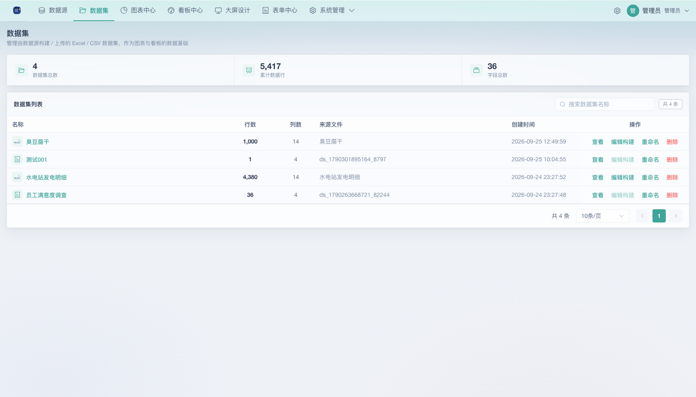

各页面右上角为高频操作按钮（如「新建数据源」「新建图表」「新建看板」）。

## 二、上传数据

上传 Excel / CSV 文件统一在「**数据源**」页完成：点「新建数据源」→「上传 Excel / CSV 文件」，弹出三步向导，创建成功后即为一个可直接建图的数据集。

### 2.1 操作入口

- 数据源列表页「**新建数据源**」下拉中的「上传 Excel / CSV 文件」

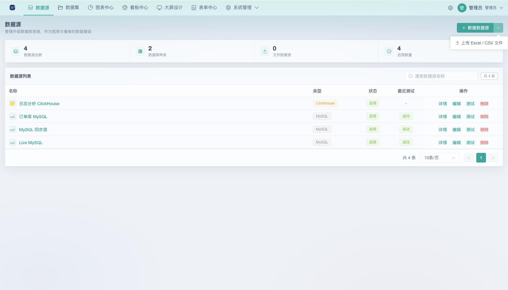

### 2.2 三步创建

**第 1 步：选择文件**

- 支持 `.xlsx` / `.xls` / `.csv` 格式，单文件不超过 **20MB**、不超过 **20 万行**
- 第一行作为列名
- 数据集名称可选，默认使用文件名，最长 100 字符
- 点击「下一步：解析并预览」

**第 2 步：确认字段**

- 展示解析出的前 50 行预览与行数
- 每个字段可手动校正类型：`文本 / 整数 / 小数 / 日期 / 布尔`
- 「内部字段名」为系统生成的英文标识（用于 API 与构建器），「字段名」为可读展示名
- 点击「创建数据集」

**第 3 步：完成**

- 展示数据集名称与行数，可一键「去创建图表」或返回列表

> 类型识别示例：全数字列为「整数」，含小数点列为「小数」，标准日期串为「日期」；识别为文本时会在预览中发现，可手动改。

## 三、数据集详情

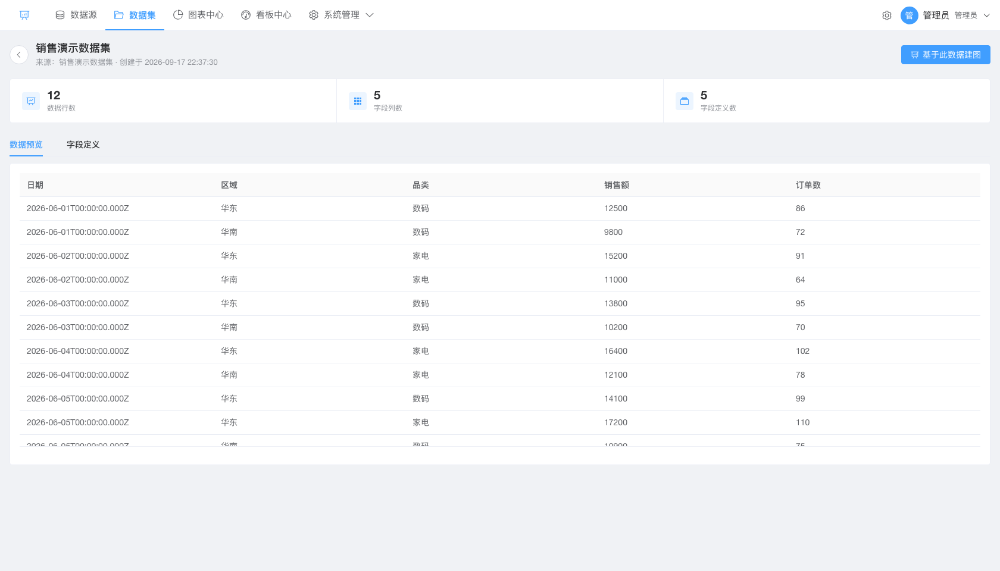

点击数据集名称进入详情页，含三个标签页：

- **数据预览**：按行展示前若干条数据，每页 50 行
- **字段定义**：可修改字段「展示名称」（回车保存），类型以标签展示
- **指标库**：创建原子 / 复合 / 衍生命名指标，供图表复用（见「四、构建图表」中 §4.5）

详情页提供「基于此数据建图」快捷入口，直接带着该数据集跳转到图表构建器。

## 四、构建图表

### 4.1 入口

图表中心点「新建图表」，或数据集详情页「基于此数据建图」。

### 4.2 构建步骤

1. **选择数据集**：顶部下拉选择数据集（显示行数）；没有数据集时先去「数据源」页上传
2. **配置维度和指标**：
   - 从「可用字段」把字段拖入「维度（分类 / X 轴）」与「指标（数值 / Y 轴）」，或点击字段快捷添加
   - **仅数值字段可作为指标**：文本 / 日期字段只能作为维度（快捷添加或拖入指标区会被自动拦截）；维度区支持多维度组合
   - 指标可选聚合方式：`求和 / 平均值 / 计数 / 去重计数 / 最大值 / 最小值`
   - 日期字段作为维度时可选择粒度：`日 / 月 / 年`
   - 指标行的「+」下拉可添加计算指标：`公式指标`（自定义表达式，支持引用其他指标 key）、`衍生指标`（本期(同比) / 上期(环比) 变化量 / 变化率）；相邻指标间有分隔线便于区分
3. **选择图表类型**：右侧图表库按 9 大类分类（见下节），选择后立即在中间预览
4. **显示选项**：显示数量（1–500，默认 20）；排序字段（不排序 / 按指标 / 按维度）+ 升降序
5. **保存**：填写图表名称后点「保存图表」

### 4.3 图表类型

构建器内置 **9 大类 60+ 种图表**：

| 分类 | 代表图表 |
|------|---------|
| 柱形图 | 单柱图、簇状柱形图、堆积柱形图、瀑布图、帕累托图、子弹图 |
| 条形图 | 单条图、簇状条形图、堆积条形图、蝴蝶图 |
| 折线图与面积图 | 单线图、多线图、堆积面积图、百分比堆积面积 |
| 饼图与漏斗图 | 饼图、环形图、旭日图、南丁格尔玫瑰图、漏斗图、水平漏斗图 |
| 气泡图与散点图 | 散点图、气泡图 |
| 指标与进度 | 指标卡、进度条、圆形进度条、多环进度条、流体进度条、仪表板 |
| 地图 | 中国行政区地图（含气泡/符号）、世界地图 |
| 表格 | 表格 |
| 其他 | 热力图、箱线图、雷达图、K 线图、矩尺树图、桑基图、和弦图、日历图等 |

部分图表需要特殊字段映射（如热力图需 2 维 1 指标、散点图需 X 维度 + Y 数值），构建器会自动提示所需的维度/指标数量。

### 4.4 图表列表与管理

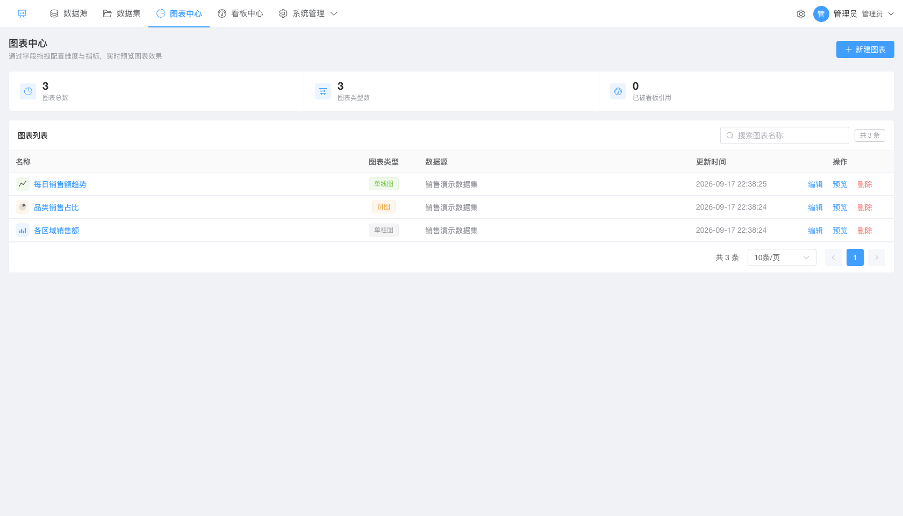

- 列表展示：名称、图表类型标签、数据源（失效显示「已失效」）、更新时间
- 操作：**编辑**（进构建器）、**预览**（弹窗查看）、**删除**（二次确认）
- 顶部搜索按名称模糊搜索，右侧统计：图表总数 / 图表类型数 / 已被看板引用

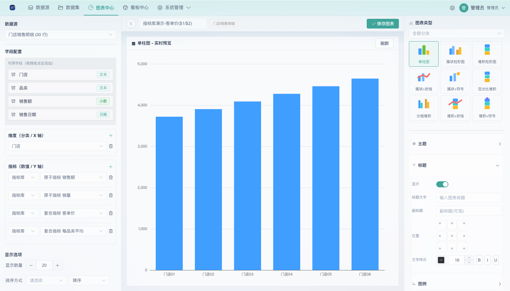

### 4.5 指标库

指标库是**数据集级**的命名指标集合，可在同一数据集的不同图表或看板中反复引用，避免重复定义聚合口径。入口在数据集详情页的「**指标库**」标签页。

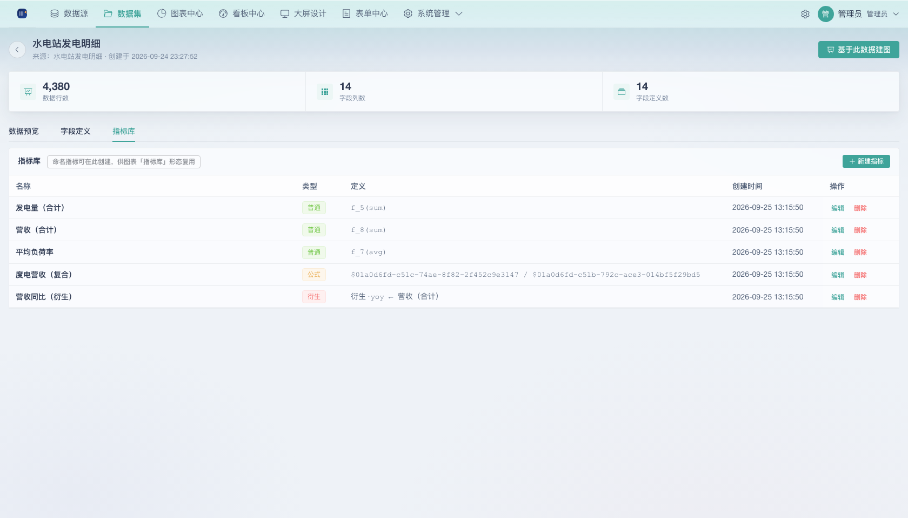

**创建指标**（点「新建指标」）：

- **原子指标**：选择一个字段 + 聚合方式（求和 / 平均 / 计数 / 去重计数 / 最大 / 最小），如「销售额 = 求和(amount)」
- **复合指标**：用公式对原子指标四则运算，如「客单价 = $6 / $7」。`$数字ID` 引用下方「引用指标」中的原子指标，支持 `+ - * / ( )` 与 `%`，整数相除自动转小数；只能引用原子指标，公式内不允许出现字母（防注入）
- **衍生指标**：基于原子指标计算 本期(同比) / 上期(环比) 变化量 / 变化率

编辑时**类型不可修改**（如需变更请删除后重建）；删除即从指标库移除。公式语法可随时点「公式怎么写？」打开帮助弹窗查看规则与常用示例。

**在图表中复用**：图表构建器指标区点 `+` 添加一行，把行内形态类型切换为「**指标库**」，再在下拉中选择该数据集的命名指标即可（如复用「客单价」）。

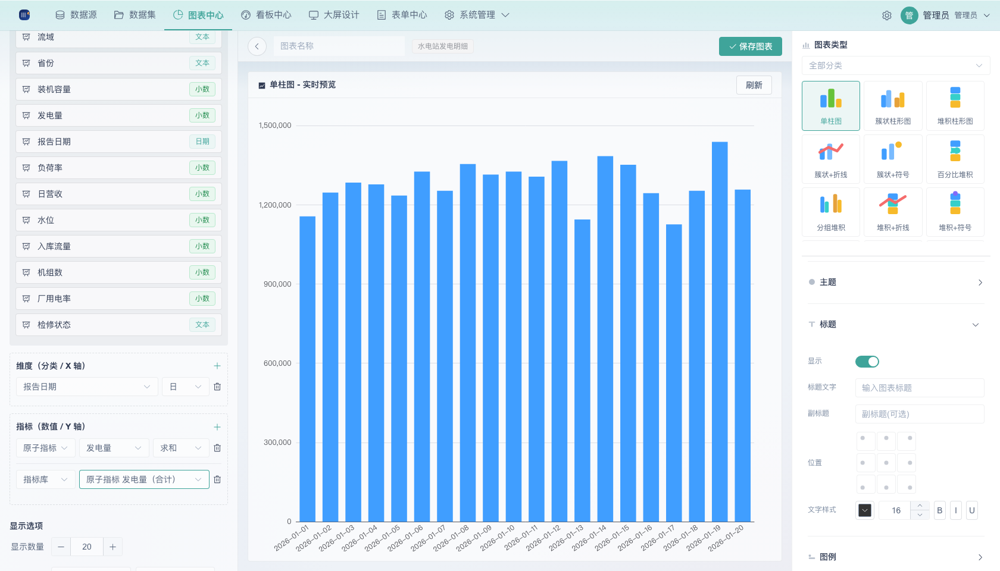

## 五、搭建看板

### 5.1 新建看板

看板中心点「新建看板」，输入名称；或直接新建后自动命名「未命名看板-XXXX」并进入编辑页。

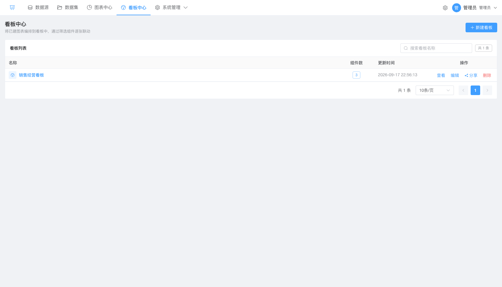

### 5.2 编辑看板

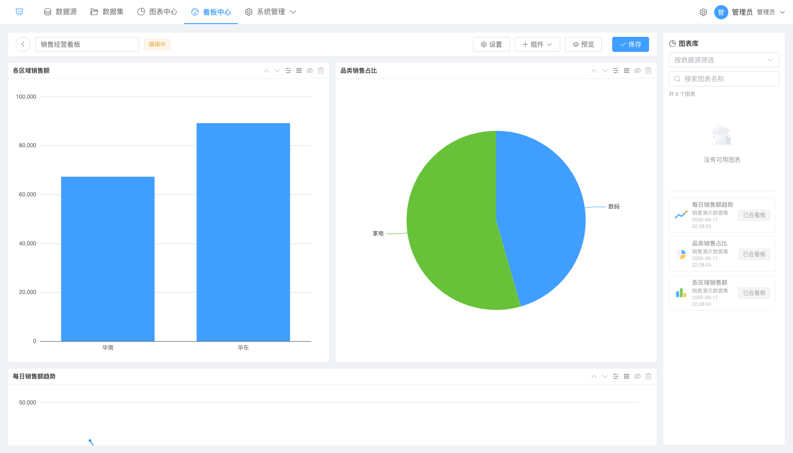

- **添加图表**：右侧图表库把已保存图表拖入画布，自动 flow-grid 排布
- 组件下拉：添加**文本**（支持 Markdown/HTML）、**筛选**（选择数据源 + 筛选字段）、**容器**
- 顶部「设置」可调整卡片间距与卡片样式
- 保存后进入查看模式

### 5.3 查看与预览

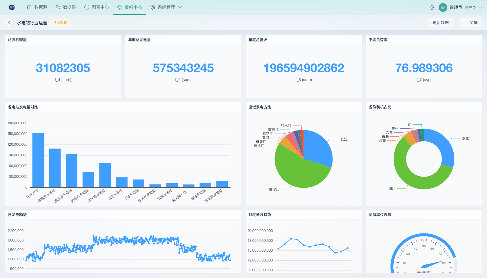

- 顶部「刷新数据」手动刷新全部图表、「全屏」铺满展示
- 筛选组件切换时，**所有同数据源图表自动联动**

## 六、分享与协作

### 6.1 创建分享

看板列表「操作」列点「分享」（需要 `dashboard:share` 权限）：默认需设置访问密码（4–64 位），也可关闭「密码」开关生成无需密码、公开可读的分享链接 `/s/{token}`。

- 分享页为**只读**：无需登录；带密码的分享输入密码后查看，公开分享打开即看
- 已创建的分享可在「密码/公开」标签中识别访问方式，可随时停用/删除分享（再次启用的链接不换 token 语义，见部署手册注意项）

### 6.2 分享页体验

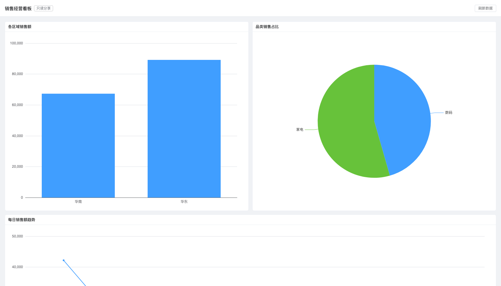

登录用户访问分享页也可在右上角「返回系统」回到平台；分享链接过期时间默认为永久（创建时暂不支持自定义过期，见已知限制）。

## 七、个人访问令牌

登录用户可在「系统管理 → 访问令牌」创建个人 PAT（个人访问令牌），供外部系统调用开放 API（`/api/open/v1`），权限范围等同本人账号。详见 [开放 API 集成指南](04-开放API集成指南.md)。

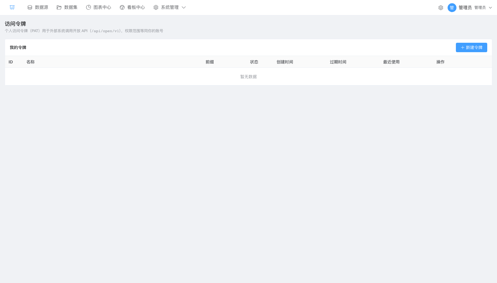

## 八、常见操作速查

| 我要… | 操作 |
|-------|------|
| 上传一份明细数据 | 数据源页 → 新建数据源 → 上传 Excel / CSV → 文件 → 确认字段 → 创建 |
| 改字段显示名 | 数据集详情 → 字段定义 → 修改展示名称回车保存 |
| 快速看一眼图表 | 图表中心 → 预览 |
| 让多张图联动筛选 | 看板编辑 → 添加筛选组件 → 选择数据源+字段 → 预览切换 |
| 把看板给外部只看 | 看板列表 → 分享 → 设置密码 → 复制链接 |
| 分享链接干嘛非要密码 | 密码最少 4 位；分享创建后可通过停用/启用控制有效性 |