# 01 用户手册

面向日常业务用户。覆盖从上传数据、构建图表、搭建看板到分享协作的完整流程。使用建议：先完成 [快速开始](../docs/快速开始.md) 拿到第一个看板，再阅读本文的进阶内容。

# 01 User Manual

For everyday business users. It covers the full path from uploading data and building charts to assembling dashboards and sharing them. Suggested reading order: work through [Quick start](../docs/快速开始.md) to get your first dashboard, then come back for the advanced material here.

## 一、界面总览

登录后顶部为一级菜单，从左到右依次为：

## 1. Interface overview

After you sign in, the top bar holds the first-level menu, from left to right:

| 菜单 | 用途 |
|------|------|
| 数据源 | 管理外部数据库连接与 Excel/CSV 文件数据源 |
| 数据集 | 管理已上传/已构建的数据集（图表与看板的数据基础） |
| 图表中心 | 创建与管理可视化图表 |
| 看板中心 | 把图表编排成看板，支持筛选联动 |
| 大屏设计 | 自由画布式可视化大屏（驾驶舱/展示墙），详见 [大屏设计器使用手册](07-大屏设计器使用手册.md) |
| 表单中心 | 在线表单设计与填报数据收集，详见 [表单中心使用手册](08-表单中心使用手册.md) |
| 系统管理 | 用户 / 角色 / 审计 / 开放 API / 访问令牌（管理员可见） |

| Menu | Purpose |
|------|------|
| Data sources | Manage external database connections and Excel/CSV file data sources |
| Datasets | Manage uploaded and built datasets (the data foundation for charts and dashboards) |
| Charts | Create and manage visualizations |
| Dashboards | Arrange charts into dashboards, with cross-filtering |
| Big screens | Free-canvas visualization screens (cockpits, video walls) — see the [Big-screen designer manual](07-大屏设计器使用手册.md) |
| Forms | Design online forms and collect entries — see the [Form center manual](08-表单中心使用手册.md) |
| Administration | Users, roles, audit, Open API, access tokens (visible to administrators) |

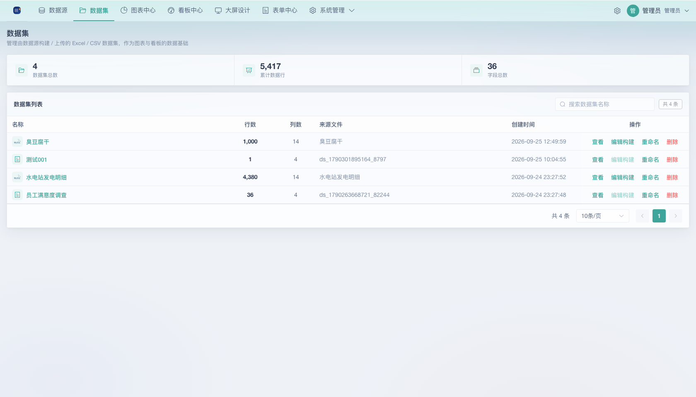

各页面右上角为高频操作按钮（如「新建数据源」「新建图表」「新建看板」）。

The top-right corner of each page carries the high-frequency action buttons (such as "New data source", "New chart", "New dashboard").

## 二、上传数据

上传 Excel / CSV 文件统一在「**数据源**」页完成：点「新建数据源」→「上传 Excel / CSV 文件」，弹出三步向导，创建成功后即为一个可直接建图的数据集。

## 2. Uploading data

Excel and CSV uploads all happen on the **Data sources** page: click "New data source" → "Upload Excel / CSV file". A three-step wizard opens, and once it finishes you have a dataset that is ready to chart.

### 2.1 操作入口

- 数据源列表页「**新建数据源**」下拉中的「上传 Excel / CSV 文件」

### 2.1 Where to start

- "Upload Excel / CSV file" in the "New data source" dropdown on the data source list page

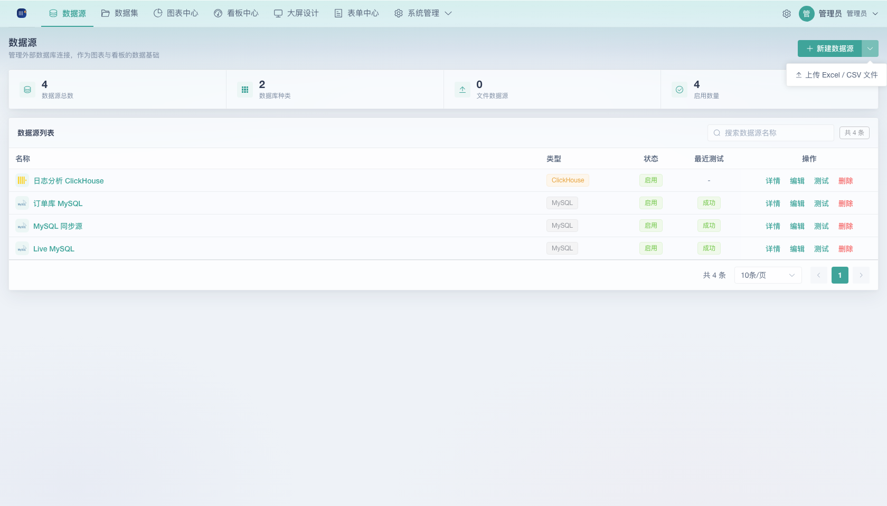

### 2.2 三步创建

**第 1 步：选择文件**

- 支持 `.xlsx` / `.xls` / `.csv` 格式，单文件不超过 **20MB**、不超过 **20 万行**
- 第一行作为列名
- 数据集名称可选，默认使用文件名，最长 100 字符
- 点击「下一步：解析并预览」

### 2.2 The three-step wizard

**Step 1: Select file**

- Supports `.xlsx` / `.xls` / `.csv`, up to **20MB** and **200,000 rows** per file
- The first row is used as the header row
- The dataset name is optional and defaults to the file name, up to 100 characters
- Click "Next: parse and preview"

**第 2 步：确认字段**

- 展示解析出的前 50 行预览与行数
- 每个字段可手动校正类型：`文本 / 整数 / 小数 / 日期 / 布尔`
- 「内部字段名」为系统生成的英文标识（用于 API 与构建器），「字段名」为可读展示名
- 点击「创建数据集」

**Step 2: Confirm fields**

- Shows a preview of the first 50 parsed rows together with the row count
- You can correct each field's type by hand: `Text / Integer / Decimal / Date / Boolean`
- "Internal name" is the English identifier the system generates (used by the API and the builder); "Display name" is the readable label
- Click "Create dataset"

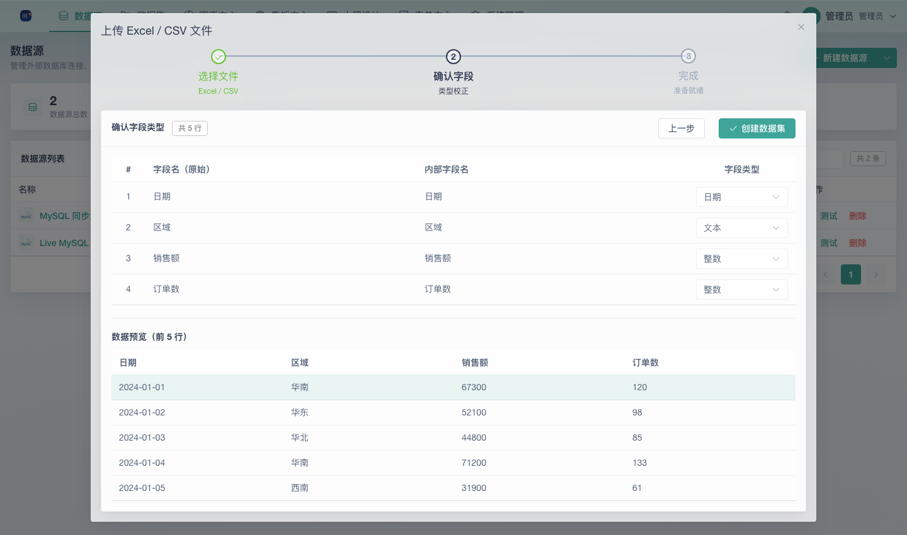

**第 3 步：完成**

- 展示数据集名称与行数，可一键「去创建图表」或返回列表

**Step 3: Done**

- Shows the dataset name and row count, with a one-click "Create a chart" shortcut or a way back to the list

> 类型识别示例：全数字列为「整数」，含小数点列为「小数」，标准日期串为「日期」；识别为文本时会在预览中发现，可手动改。

> Type detection example: an all-numeric column is detected as "Integer", a column with decimal points as "Decimal", and a standard date string as "Date". Anything that lands on Text shows up that way in the preview, and you can change it by hand.

## 三、数据集详情

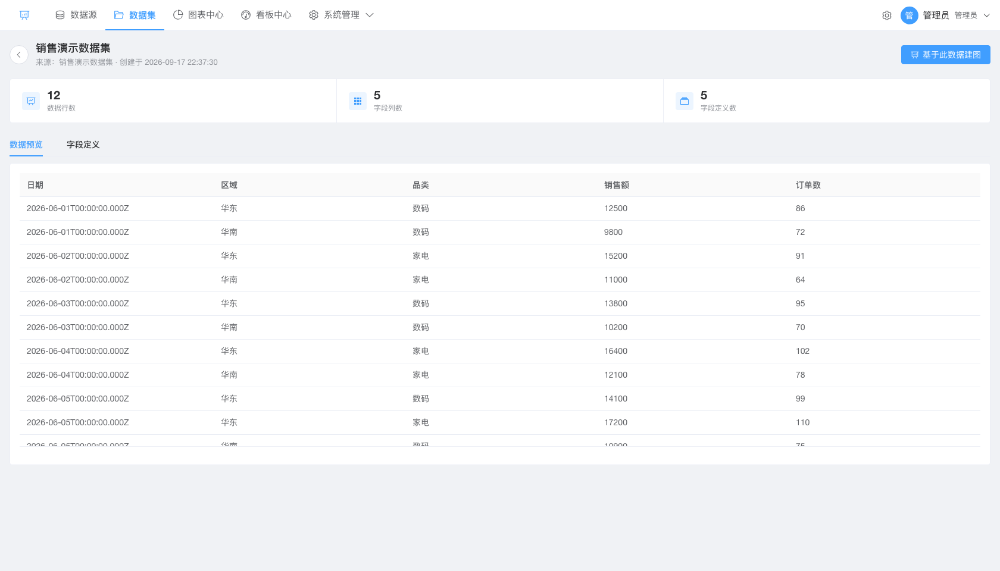

点击数据集名称进入详情页，含三个标签页：

Click a dataset name to open its detail page, which has three tabs:

- **数据预览**：按行展示前若干条数据，每页 50 行
- **字段定义**：可修改字段「展示名称」（回车保存），类型以标签展示
- **指标库**：创建原子 / 复合 / 衍生命名指标，供图表复用（见「四、构建图表」中 §4.5）

- **Data preview**: the data row by row, 50 rows per page
- **Field definitions**: you can change a field's display name (press Enter to save); the type is shown as a tag
- **Metric library**: create named atomic, composite and derived metrics for charts to reuse (see §4.5 under "4. Building charts")

详情页提供「基于此数据建图」快捷入口，直接带着该数据集跳转到图表构建器。

The detail page offers a "Build a chart from this" shortcut that jumps straight into the chart builder with that dataset preselected.

## 四、构建图表

## 4. Building charts

### 4.1 入口

图表中心点「新建图表」，或数据集详情页「基于此数据建图」。

### 4.1 Entry points

In Charts, click "New chart"; or use "Build a chart from this" on a dataset detail page.

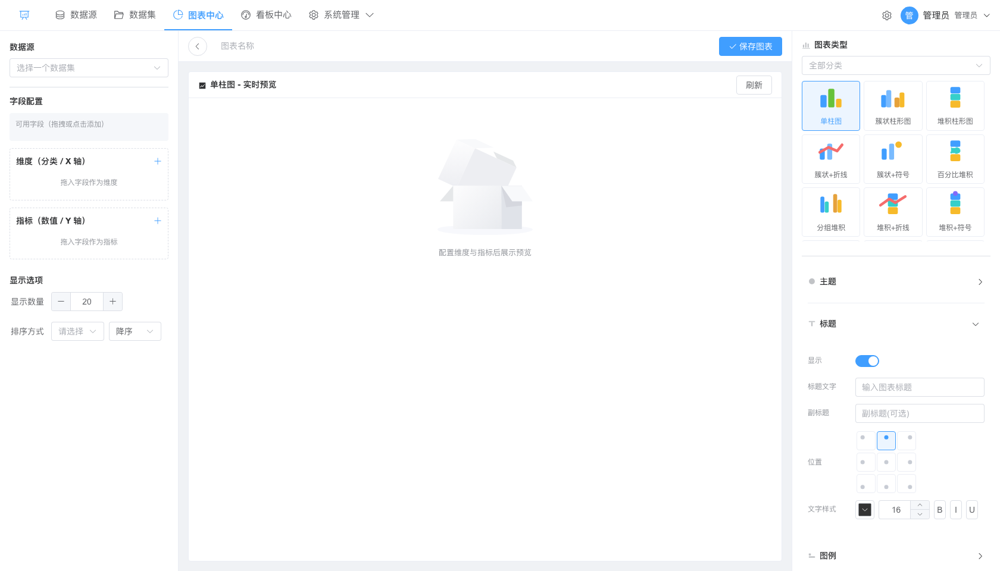

### 4.2 构建步骤

1. **选择数据集**：顶部下拉选择数据集（显示行数）；没有数据集时先去「数据源」页上传
2. **配置维度和指标**：
   - 从「可用字段」把字段拖入「维度（分类 / X 轴）」与「指标（数值 / Y 轴）」，或点击字段快捷添加
   - **仅数值字段可作为指标**：文本 / 日期字段只能作为维度（快捷添加或拖入指标区会被自动拦截）；维度区支持多维度组合
   - 指标可选聚合方式：`求和 / 平均值 / 计数 / 去重计数 / 最大值 / 最小值`
   - 日期字段作为维度时可选择粒度：`日 / 月 / 年`
   - 指标行的「+」下拉可添加计算指标：`公式指标`（自定义表达式，支持引用其他指标 key）、`衍生指标`（本期(同比) / 上期(环比) 变化量 / 变化率）；相邻指标间有分隔线便于区分
3. **选择图表类型**：右侧图表库按 9 大类分类（见下节），选择后立即在中间预览
4. **显示选项**：显示数量（1–500，默认 20）；排序字段（不排序 / 按指标 / 按维度）+ 升降序
5. **保存**：填写图表名称后点「保存图表」

### 4.2 Build steps

1. **Select a dataset**: pick one from the dropdown at the top (the row count is shown). If you have no datasets yet, upload one from the Data sources page first.
2. **Configure dimensions and metrics**:
   - Drag fields from "Available fields" into "Dimensions (category / X axis)" and "Metrics (numeric / Y axis)", or click a field to add it in one step
   - **Only numeric fields can be metrics**: text and date fields can only be dimensions (quick-add or dropping them into the metric area is blocked automatically). The dimension area accepts several dimensions at once.
   - Each metric picks an aggregation: `Sum / Average / Count / Distinct count / Max / Min`
   - A date field used as a dimension can pick a granularity: `Day / Month / Year`
   - The "+" dropdown on a metric row adds computed metrics: a `Formula metric` (a custom expression that can reference other metric keys) and a `Derived metric` (current-period YoY / previous-period MoM change amount / change rate). Adjacent metrics are separated by a divider so they are easy to tell apart.
3. **Choose a chart type**: the library on the right is grouped into 9 categories (see the next section), and the preview in the middle updates as soon as you pick one.
4. **Display options**: display count (1–500, default 20); sort by (no sorting / by metric / by dimension) plus ascending or descending.
5. **Save**: give the chart a name, then click "Save chart".

### 4.3 图表类型

构建器内置 **9 大类 53 种图表**：

### 4.3 Chart types

The builder ships with **53 chart types across 9 categories**:

| 分类 | 代表图表 |
|------|---------|
| 柱形图 | 单柱图、簇状柱形图、堆积柱形图、瀑布图、帕累托图、子弹图 |
| 条形图 | 单条图、簇状条形图、堆积条形图、蝴蝶图 |
| 折线图与面积图 | 单线图、多线图、堆积面积图、百分比堆积面积 |
| 饼图与漏斗图 | 饼图、环形图、旭日图、南丁格尔玫瑰图、漏斗图、水平漏斗图 |
| 气泡图与散点图 | 散点图、气泡图 |
| 指标与进度 | 指标卡、进度条、圆形进度条、多环进度条、流体进度条、仪表板 |
| 地图 | 中国行政区地图（含气泡/符号）、世界地图 |
| 表格 | 表格 |
| 其他 | 热力图、箱线图、雷达图、K 线图、矩尺树图、桑基图、和弦图、日历图等 |

| Category | Representative charts |
|------|---------|
| Bar | Bar, clustered bar, stacked bar, waterfall, Pareto, bullet chart |
| Horizontal bar | Horizontal bar, clustered horizontal bar, stacked horizontal bar, butterfly |
| Line & area | Line, multi-line, stacked area, percent stacked area |
| Pie & funnel | Pie, donut, sunburst, Nightingale rose, funnel, horizontal funnel |
| Scatter & bubble | Scatter, bubble |
| Metric & progress | Metric card, progress bar, circular progress, multi-ring progress, fluid progress, filled gauge |
| Map | China administrative map (with bubble / symbol), world map |
| Table | Table |
| Other | Heatmap, box plot, radar, candlestick, treemap, Sankey, chord, calendar, and more |

部分图表需要特殊字段映射（如热力图需 2 维 1 指标、散点图需 X 维度 + Y 数值），构建器会自动提示所需的维度/指标数量。

Some charts need a specific field mapping (a heatmap wants 2 dimensions and 1 metric; a scatter plot wants an X dimension plus a Y numeric value). The builder tells you how many dimensions and metrics each one needs.

### 4.4 图表列表与管理

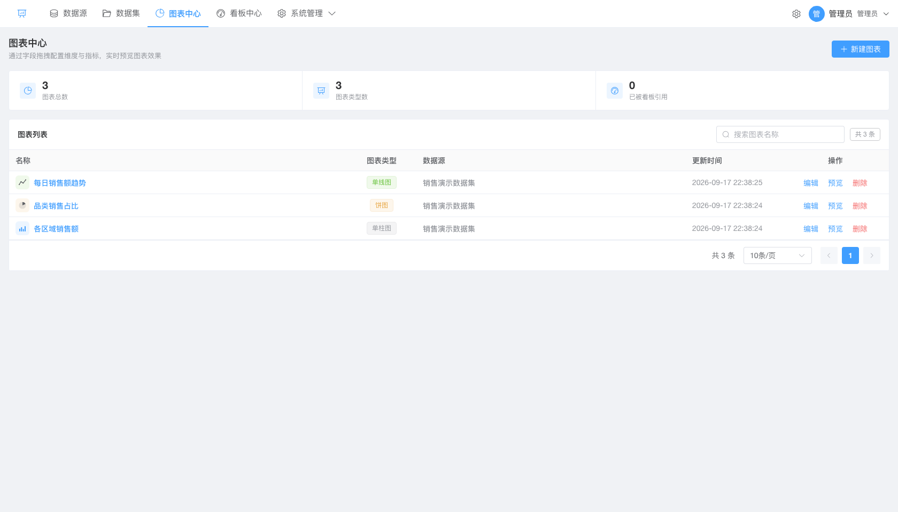

- 列表展示：名称、图表类型标签、数据源（失效显示「已失效」）、更新时间
- 操作：**编辑**（进构建器）、**预览**（弹窗查看）、**删除**（二次确认）
- 顶部搜索按名称模糊搜索，右侧统计：图表总数 / 图表类型数 / 已被看板引用

### 4.4 Chart list and management

- The list shows the name, a chart type tag, the data source (marked "Unavailable" when it is broken), and the update time
- Actions: **Edit** (opens the builder), **Preview** (opens a dialog), **Delete** (asks you to confirm)
- The search box at the top does a fuzzy match on names; the stats on the right show total charts / chart types / charts referenced by dashboards

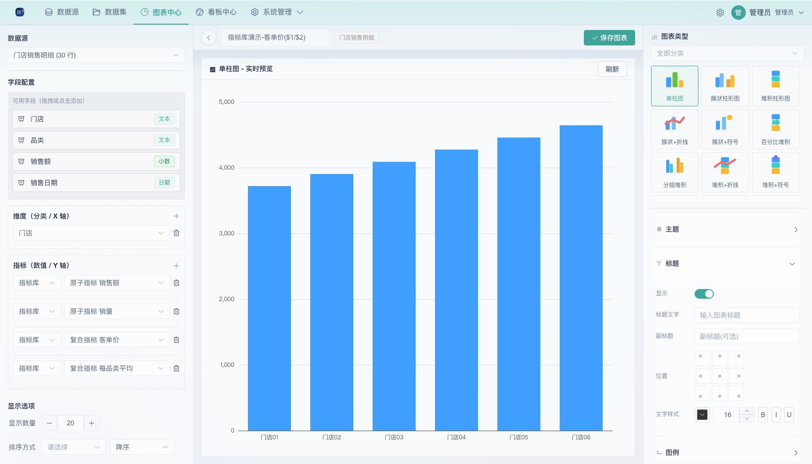

### 4.5 指标库

指标库是**数据集级**的命名指标集合，可在同一数据集的不同图表或看板中反复引用，避免重复定义聚合口径。入口在数据集详情页的「**指标库**」标签页。

### 4.5 Metric library

The metric library is a **dataset-level** collection of named metrics. You can reference the same metric from different charts and dashboards over one dataset, so you define each aggregation only once. You reach it from the **Metric library** tab on the dataset detail page.

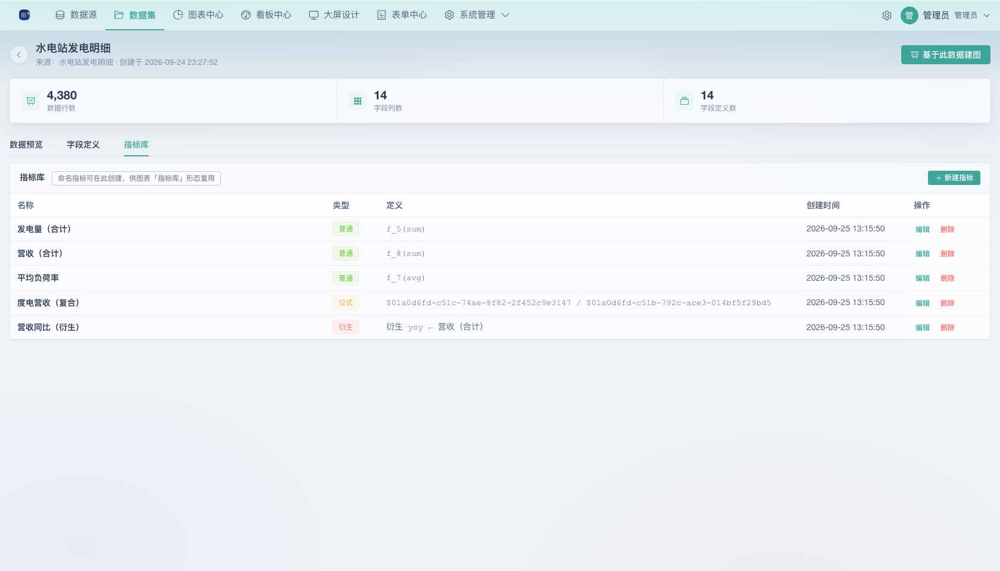

**创建指标**（点「新建指标」）：

**Create a metric** (click "New metric"):

- **原子指标**：选择一个字段 + 聚合方式（求和 / 平均 / 计数 / 去重计数 / 最大 / 最小），如「销售额 = 求和(amount)」
- **复合指标**：用公式对原子指标四则运算，如「客单价 = $6 / $7」。`$数字ID` 引用下方「引用指标」中的原子指标，支持 `+ - * / ( )` 与 `%`，整数相除自动转小数；只能引用原子指标，公式内不允许出现字母（防注入）
- **衍生指标**：基于原子指标计算 本期(同比) / 上期(环比) 变化量 / 变化率

- **Atomic metric**: pick one field plus an aggregation (sum / average / count / distinct count / max / min), for example "Revenue = Sum(amount)"
- **Composite metric**: apply arithmetic across atomic metrics with a formula, for example "Average order value = $6 / $7". `$<id>` references an atomic metric from the "Referenced metrics" list below. Supports `+ - * / ( )` and `%`; integer division is promoted to a decimal automatically. Only atomic metrics can be referenced, and no letters are allowed inside a formula (this prevents injection).
- **Derived metric**: computed from atomic metrics — current-period YoY / previous-period MoM change amount / change rate

编辑时**类型不可修改**（如需变更请删除后重建）；删除即从指标库移除。公式语法可随时点「公式怎么写？」打开帮助弹窗查看规则与常用示例。

When you edit a metric its **type cannot be changed** (delete it and create a new one if you need a different type); deleting removes it from the library. You can open the formula help dialog at any time with "How do I write a formula?" to see the rules and the common examples.

**在图表中复用**：图表构建器指标区点 `+` 添加一行，把行内形态类型切换为「**指标库**」，再在下拉中选择该数据集的命名指标即可（如复用「客单价」）。

**Reuse in a chart**: in the chart builder's metric area, click `+` to add a row, switch that row's metric type to **Metric library**, then pick one of the dataset's named metrics from the dropdown (for example, reuse "Average order value").

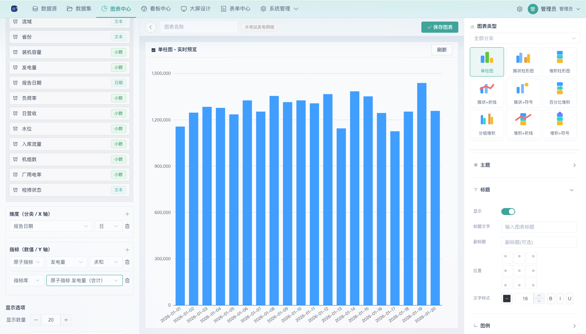

## 五、搭建看板

## 5. Building dashboards

### 5.1 新建看板

看板中心点「新建看板」，输入名称；或直接新建后自动命名「未命名看板-XXXX」并进入编辑页。

### 5.1 Creating a dashboard

In Dashboards, click "New dashboard" and enter a name; or just create one and it is named "Untitled dashboard-XXXX" for you before you land in the editor.

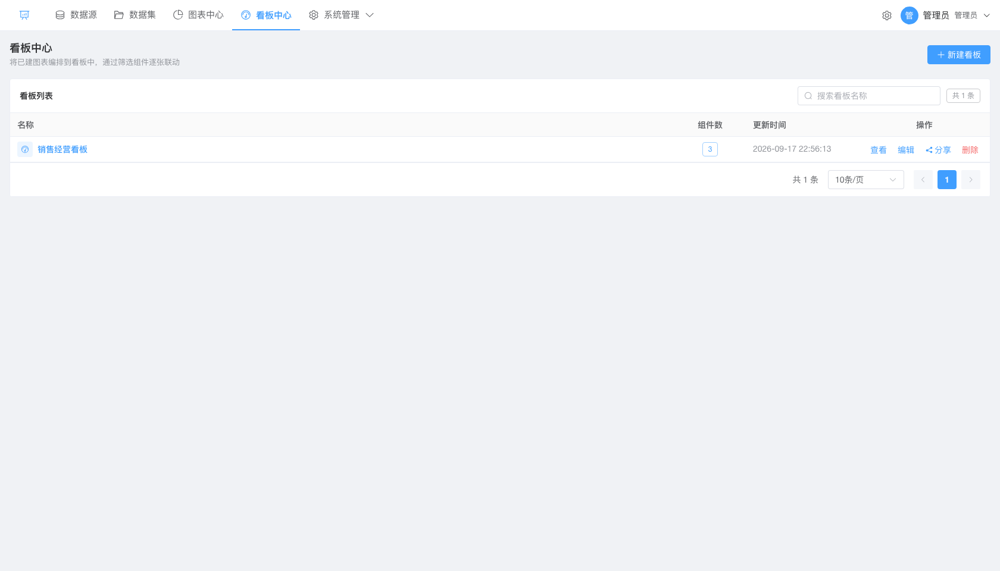

### 5.2 编辑看板

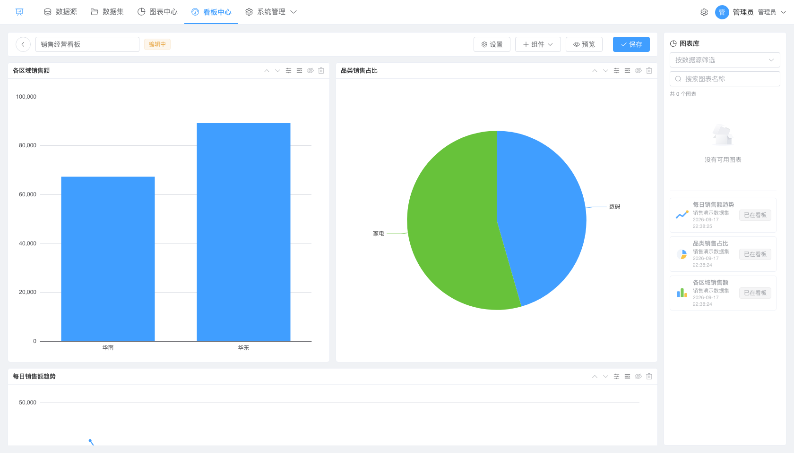

- **添加图表**：右侧图表库把已保存图表拖入画布，自动 flow-grid 排布
- 组件下拉：添加**文本**（支持 Markdown/HTML）、**筛选**（选择数据源 + 筛选字段）、**容器**
- 顶部「设置」可调整卡片间距与卡片样式
- 保存后进入查看模式

### 5.2 Editing a dashboard

- **Add charts**: drag saved charts from the library on the right onto the canvas; they are laid out automatically with flow-grid
- The components dropdown adds **Text** (Markdown and HTML are supported), **Filter** (choose a data source and the field to filter on), and **Container**
- "Settings" at the top adjusts card spacing and card style
- Saving takes you into view mode

### 5.3 查看与预览

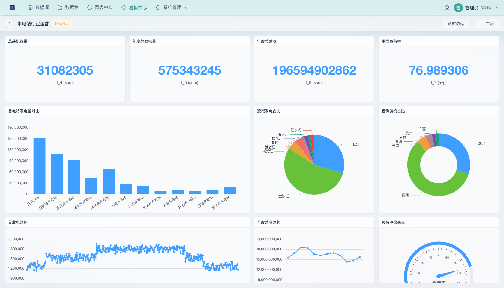

- 顶部「刷新数据」手动刷新全部图表、「全屏」铺满展示
- 筛选组件切换时，**所有同数据源图表自动联动**

### 5.3 Viewing and previewing

- "Refresh data" at the top refreshes every chart by hand, and "Fullscreen" makes the dashboard fill the display
- When you change a filter component, **every chart on the same data source follows automatically**

## 六、分享与协作

## 6. Sharing and collaboration

### 6.1 创建分享

看板列表「操作」列点「分享」（需要 `dashboard:share` 权限）：默认需设置访问密码（4–64 位），也可关闭「密码」开关生成无需密码、公开可读的分享链接 `/s/{token}`。

### 6.1 Creating a share

In the dashboard list, click "Share" in the Actions column (this needs the `dashboard:share` permission). By default you set an access password (4–64 characters); you can also switch "Password" off to get a share link `/s/{token}` that anyone can read without a password.

- 分享页为**只读**：无需登录；带密码的分享输入密码后查看，公开分享打开即看
- 已创建的分享可在「密码/公开」标签中识别访问方式，可随时停用/删除分享（再次启用的链接不换 token 语义，见部署手册注意项）

- The share page is **read-only** and needs no sign-in: a password-protected share asks for the password first, while a public one opens straight away
- Existing shares show their access mode in the "Password / Public" column, and you can disable or delete a share at any time (re-enabling does not rotate the token, so the link keeps working the same way — see the notes in the deployment manual)

### 6.2 分享页体验

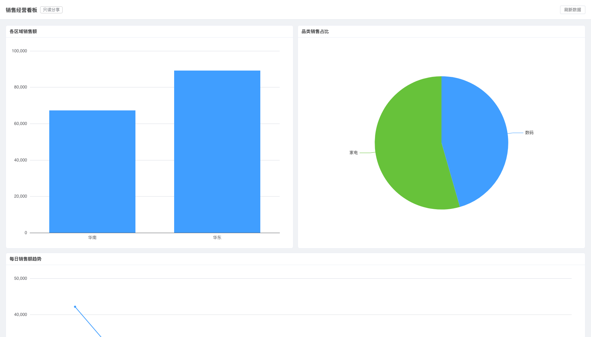

登录用户访问分享页也可在右上角「返回系统」回到平台；分享链接过期时间默认为永久（创建时暂不支持自定义过期，见已知限制）。

### 6.2 The share page

A signed-in user can also click "Back to system" in the top-right corner of a share page to return to the platform. Share links never expire by default (the create dialog does not support a custom expiry yet — see the known limitations).

## 七、个人访问令牌

## 7. Personal access tokens

登录用户可在「系统管理 → 访问令牌」创建个人 PAT（个人访问令牌），供外部系统调用开放 API（`/api/open/v1`），权限范围等同本人账号。详见 [开放 API 集成指南](04-开放API集成指南.md)。

A signed-in user can create a personal PAT (personal access token) under "Administration → Access tokens" so external systems can call the Open API (`/api/open/v1`); its permissions are exactly those of the user's own account. See the [Open API integration guide](04-开放API集成指南.md) for details.

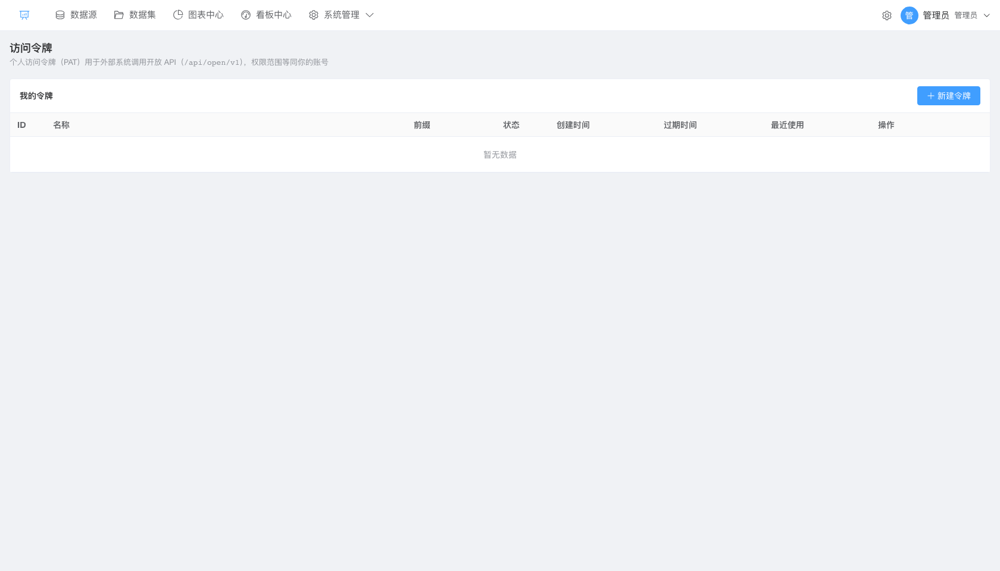

## 八、常见操作速查

## 8. Quick reference

| 我要… | 操作 |
|-------|------|
| 上传一份明细数据 | 数据源页 → 新建数据源 → 上传 Excel / CSV → 文件 → 确认字段 → 创建 |
| 改字段显示名 | 数据集详情 → 字段定义 → 修改展示名称回车保存 |
| 快速看一眼图表 | 图表中心 → 预览 |
| 让多张图联动筛选 | 看板编辑 → 添加筛选组件 → 选择数据源+字段 → 预览切换 |
| 把看板给外部只看 | 看板列表 → 分享 → 设置密码 → 复制链接 |
| 分享链接干嘛非要密码 | 密码最少 4 位；分享创建后可通过停用/启用控制有效性 |
| 搭一屏可视化大屏/驾驶舱 | 大屏设计 → 模板管理创建，或空白新建后从组件库拖拽，见 [大屏设计器使用手册](07-大屏设计器使用手册.md) |

| I want to… | Steps |
|-------|------|
| Upload a dataset | Data sources → New data source → Upload Excel / CSV → File → Confirm fields → Create |
| Rename a field | Dataset detail → Field definitions → change the display name and press Enter to save |
| Take a quick look at a chart | Charts → Preview |
| Cross-filter several charts together | Edit dashboard → add a filter component → pick the data source and field → switch values in the preview |
| Give a dashboard to outsiders, view only | Dashboard list → Share → set a password → copy the link |
| Find out why a share link needs a password | The password needs at least 4 characters; once a share exists you control whether it works by disabling or enabling it |
| Build a big screen or cockpit | Big screens → create one from a template, or start blank and drag from the component library; see the [Big-screen designer manual](07-大屏设计器使用手册.md) |
