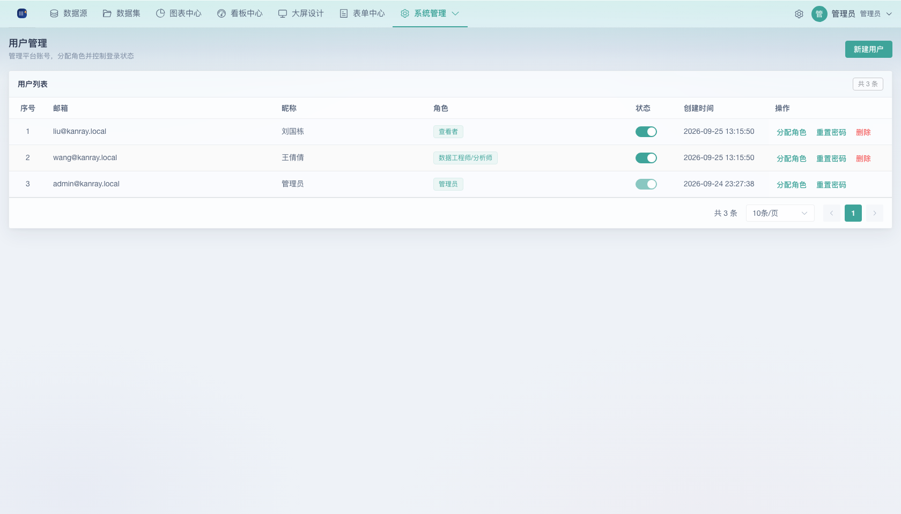
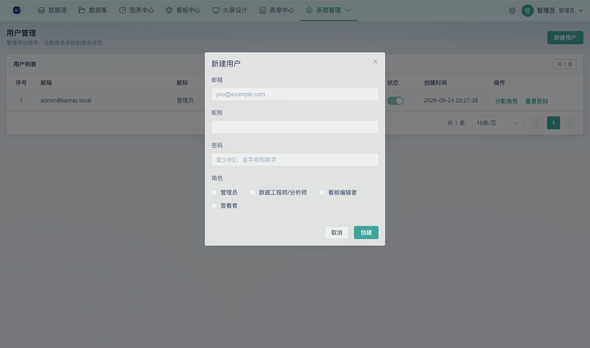
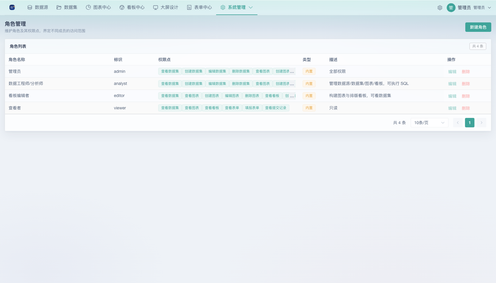
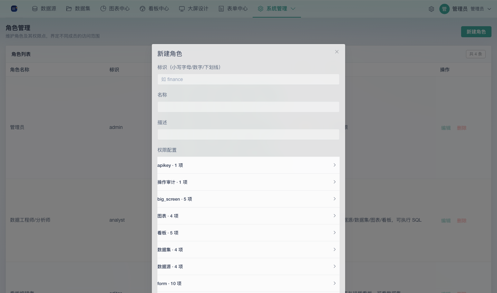
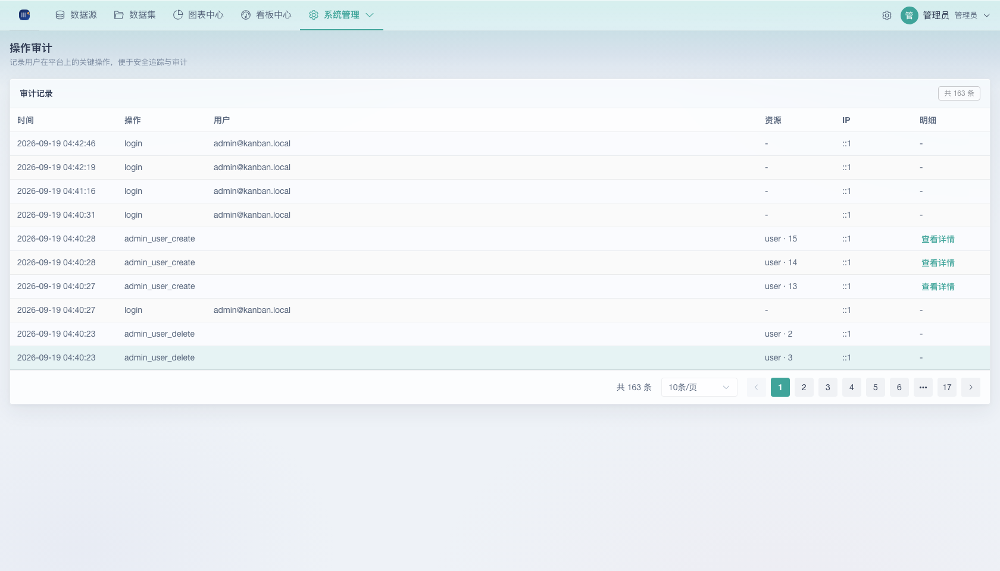
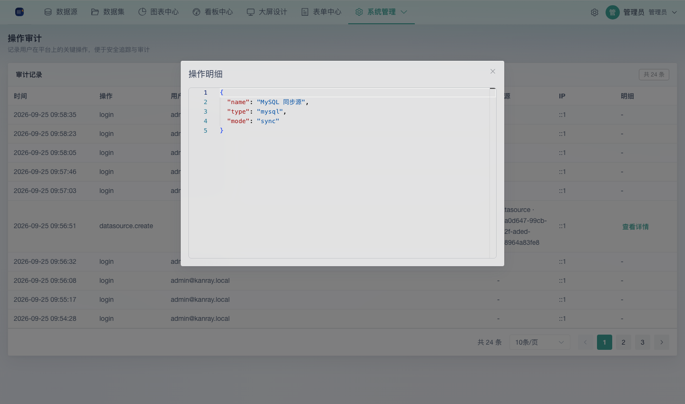
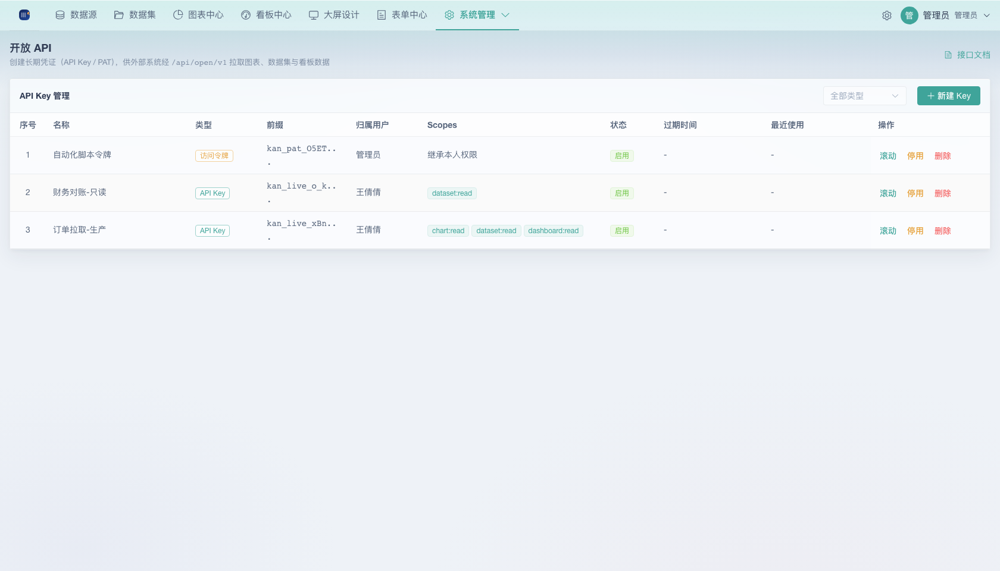

# 02 管理员手册

面向系统管理员。覆盖账号、角色权限、操作审计、开放 API 凭证等管理功能。所有入口位于左侧「**系统管理**」，子菜单按权限可见。

## 一、系统管理总揽

| 子菜单 | 所需权限 | 职责 |
|--------|---------|------|
| 用户管理 | `user:read` | 新建用户、分配角色、重置密码、启停账号 |
| 角色管理 | `role:read` | 维护角色及其权限点 |
| 操作审计 | `audit:read` | 查看关键操作记录 |
| 开放 API | `apikey:manage` | 创建/管理 API Key 与访问令牌 |
| 访问令牌 | 登录即可 | 个人 PAT 自主管理 |

## 二、用户管理

### 2.1 新建用户

弹窗字段：

- **邮箱**：必填，格式校验
- **昵称**：必填，最长 50 字符
- **密码**：至少 8 位且同时包含字母和数字
- **角色**：可多选（勾选系统内已存在角色）

### 2.2 分配角色

每个用户可绑定一个或多个角色，权限取并集。内置角色与自定义角色均可分配。

### 2.3 重置密码

管理员可为用户设置新密码（同样要求至少 8 位字母+数字）。用户侧无自助找回，忘记密码找管理员重置。

### 2.4 启停与删除

- 状态列使用开关启停账号；**被禁用的账号登录时报「账号已被禁用」**，但不删除其数据
- 列表**ID=1 的种子管理员（自己）不可停用/删除**
- 删除用户会移除账号与登录态，需二次确认

## 三、角色与权限

### 3.1 内置角色

| 角色 | 标识 | 说明 |
|------|------|------|
| 管理员 | `admin` | 平台全量权限（系统内置，不可编辑/删除） |
| 数据工程师/分析师 | `analyst` | 数据源、数据集、图表、看板等数据侧权限 |
| 看板编辑者 | `dashboard_editor` | 看板相关权限 |
| 查看者 | `viewer` | 只读权限 |

内置角色带「内置」标签，**编辑与删除按钮禁用**。

### 3.2 自定义角色

新建/编辑角色：

- **标识（code）**：2–32 位小写字母/数字/下划线，编辑时锁定
- **名称**：最长 50 字符
- **描述**：最长 200 字符
- **权限配置**：按权限组勾选

### 3.3 权限组结构

| 组 | 前缀 | 包含权限点 |
|----|------|-----------|
| 数据集 | `dataset` | 读 / 建 / 改 / 删 |
| 图表 | `chart` | 读 / 建 / 改 / 删 |
| 看板 | `dashboard` | 读 / 建 / 改 / 删 / 分享 |
| 数据源 | `datasource` | 读 / 建 / 改 / 删 / 同步（按实际） |
| SQL 实验室 | `sqllab` | 读 / 执行 |
| 用户管理 | `user` | 读 / 建 / 改 / 删 |
| 角色 | `role` | 读 / 建 / 改 / 删 |
| 操作审计 | `audit` | 读 |
| 系统 | `system` | 系统级设置 |

> 权限点命名规则：`资源:动作`，例如 `dashboard:share`。前端菜单按用户权限动态显隐：无 `user:read` 看不到「用户管理」，无 `audit:read` 看不到「操作审计」。

## 四、操作审计

记录用户在平台上的关键操作，便于安全追踪：

- 列表列：时间、操作、用户（邮箱）、资源（类型+ID）、IP、明细
- **明细**：弹窗以格式化 JSON 展示请求/变更内容

无权限用户访问时显示「无权限访问该页面」空态。

## 五、开放 API 凭证管理

### 5.1 凭证类型

| 类型 | 说明 | 适用 |
|------|------|------|
| **API Key**（静态） | 固定密钥，可限定 Scopes（`chart:read / dataset:read / dashboard:read`） | 系统间长期数据交换 |
| **访问令牌 PAT** | 权限继承**归属用户**，非静态 | 与个人账号绑定的外部调用 |

### 5.2 创建与安全规则

- 创建时选择归属用户（PAT 继承该用户权限）与过期时间（留空=永不过期）
- **明文凭证仅创建/滚动时展示一次**，关闭弹窗后不可再次查看 → 务必当场复制保存
- 启用态可直接阻止外部调用（停用后请求返回 401/403）

### 5.3 滚动与删除

- 滚动（rotate）会生成新 Key **并立即使旧 Key 失效**
- 删除不可恢复，需危险操作确认

> 完整鉴权方式、请求头、限流与错误码见 [开放 API 集成指南](04-开放API集成指南.md)。

## 六、日常运维提示

- **默认管理员**：种子数据自动创建 `admin@kanray.local / admin123`，生产环境必须第一时间改密（用户管理 → 重置密码）
- **密钥管理**：部署层环境变量 `JWT_SECRET`（用户态令牌签名）与 `DATASOURCE_SECRET`（数据源明文加密），轮换见 [部署运维手册](05-部署运维手册.md)
- 管理员的全部操作会进入审计日志，作为变更依据