# 02 管理员手册

面向系统管理员。覆盖账号、角色权限、操作审计、开放 API 凭证等管理功能。所有入口位于左侧「**系统管理**」，子菜单按权限可见。

# 02 Admin Manual

For system administrators. It covers accounts, roles and permissions, the audit log, and Open API credentials. Every entry point sits under **Administration** in the sidebar, and its sub-menus appear according to your permissions.

## 一、系统管理总揽

## 1. Administration at a glance

| 子菜单 | 所需权限 | 职责 |
|--------|---------|------|
| 用户管理 | `user:read` | 新建用户、分配角色、重置密码、启停账号 |
| 角色管理 | `role:read` | 维护角色及其权限点 |
| 操作审计 | `audit:read` | 查看关键操作记录 |
| 开放 API | `apikey:manage` | 创建/管理 API Key 与访问令牌 |
| 访问令牌 | 登录即可 | 个人 PAT 自主管理 |

| Sub-menu | Required permission | Purpose |
|--------|---------|------|
| Users | `user:read` | Create users, assign roles, reset passwords, enable or disable accounts |
| Roles | `role:read` | Maintain roles and their permission points |
| Audit log | `audit:read` | View records of key actions |
| Open API | `apikey:manage` | Create and manage API keys and access tokens |
| Access tokens | Just sign in | Manage your own PATs |

## 二、用户管理

## 2. Users

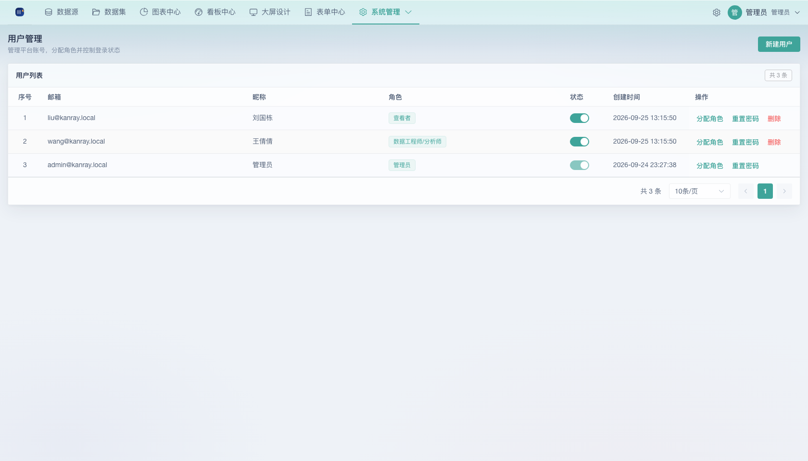

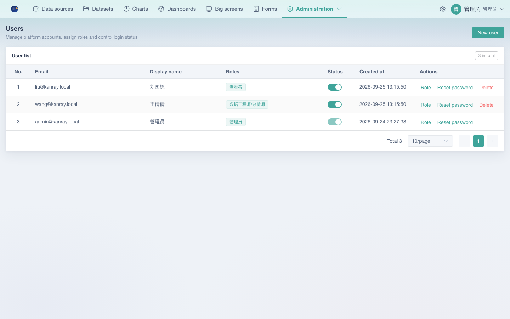

### 2.1 新建用户

弹窗字段：

### 2.1 Creating a user

Fields in the dialog:

- **邮箱**：必填，格式校验
- **昵称**：必填，最长 50 字符
- **密码**：至少 8 位且同时包含字母和数字
- **角色**：可多选（勾选系统内已存在角色）

- **Email**: required, and the format is validated
- **Display name**: required, up to 50 characters
- **Password**: at least 8 characters, including both letters and digits
- **Roles**: multi-select (tick the roles that already exist in the system)

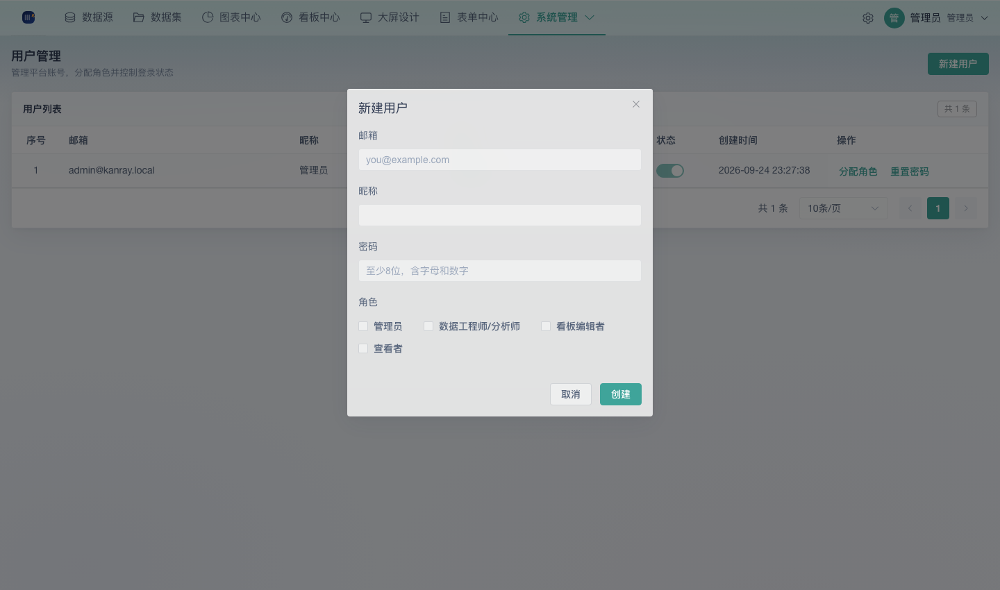

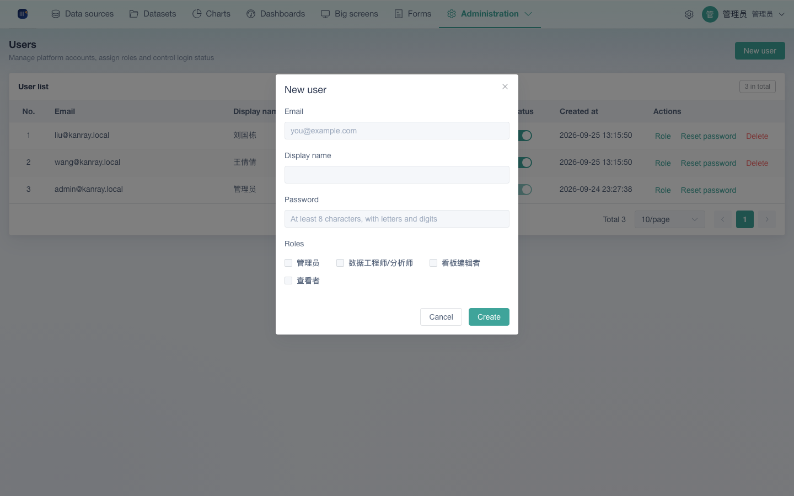

### 2.2 分配角色

每个用户可绑定一个或多个角色，权限取并集。内置角色与自定义角色均可分配。

### 2.2 Assigning roles

Each user can hold one or more roles, and their permissions are the union of those roles. Both built-in and custom roles can be assigned.

### 2.3 重置密码

管理员可为用户设置新密码（同样要求至少 8 位字母+数字）。用户侧无自助找回，忘记密码找管理员重置。

### 2.3 Resetting a password

An administrator can set a new password for a user (the same rule applies: at least 8 characters with letters and digits). There is no self-service recovery, so a user who forgets their password has to ask an administrator to reset it.

### 2.4 启停与删除

- 状态列使用开关启停账号；**被禁用的账号登录时报「账号已被禁用」**，但不删除其数据
- **当前登录账号不可停用/删除**：该账号的状态开关为禁用态，删除按钮也不展示
- 删除用户会移除账号与登录态，需二次确认

### 2.4 Enabling, disabling and deleting

- The Status column has a switch that enables and disables the account; **a disabled account reports "Account has been disabled" at sign-in**, but none of its data is deleted
- **The account you are signed in with cannot be disabled or deleted**: its Status switch is disabled and its Delete button is not shown
- Deleting a user removes the account and its sessions, and asks you to confirm first

## 三、角色与权限

## 3. Roles and permissions

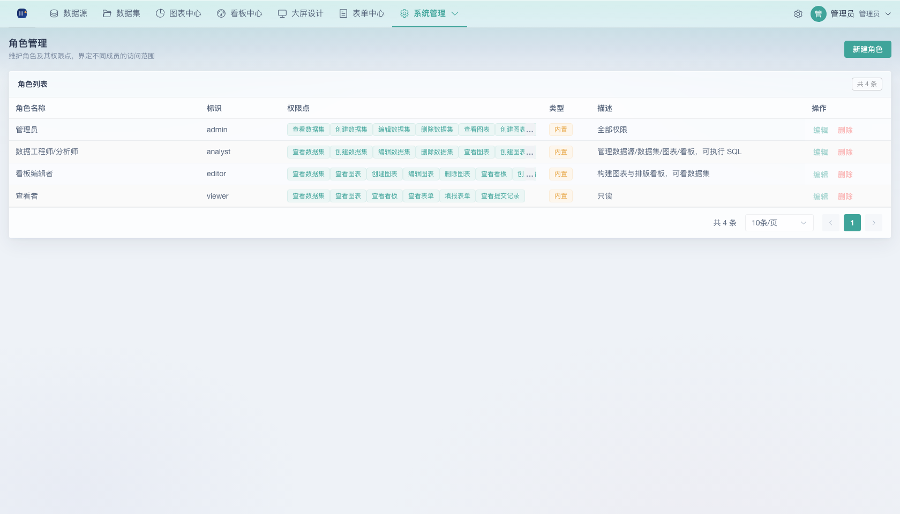

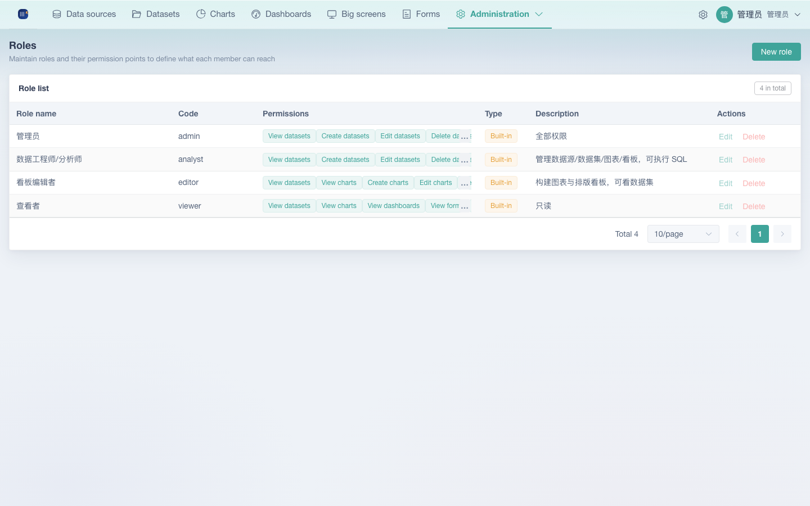

### 3.1 内置角色

| 角色 | 标识 | 说明 |
|------|------|------|
| 管理员 | `admin` | 平台全量权限（系统内置，不可编辑/删除） |
| 数据工程师/分析师 | `analyst` | 数据源、数据集、图表、看板等数据侧权限 |
| 看板编辑者 | `editor` | 看板相关权限 |
| 查看者 | `viewer` | 只读权限 |

### 3.1 Built-in roles

| Role | Code | Description |
|------|------|------|
| Administrator | `admin` | Full permissions across the platform (built in, cannot be edited or deleted) |
| Data engineer / analyst | `analyst` | Data-side permissions for data sources, datasets, charts, dashboards, and so on |
| Dashboard editor | `editor` | Dashboard-related permissions |
| Viewer | `viewer` | Read-only permissions |

内置角色带「内置」标签，**编辑与删除按钮禁用**。

Built-in roles carry a "Built-in" tag, and their **Edit and Delete buttons are disabled**.

### 3.2 自定义角色

新建/编辑角色：

### 3.2 Custom roles

Creating or editing a role:

- **标识（code）**：2–32 位小写字母/数字/下划线，编辑时锁定
- **名称**：最长 50 字符
- **描述**：最长 200 字符
- **权限配置**：按权限组勾选

- **Code**: 2–32 lowercase letters, digits or underscores; locked once you are editing an existing role
- **Name**: up to 50 characters
- **Description**: up to 200 characters
- **Permission configuration**: tick by permission group

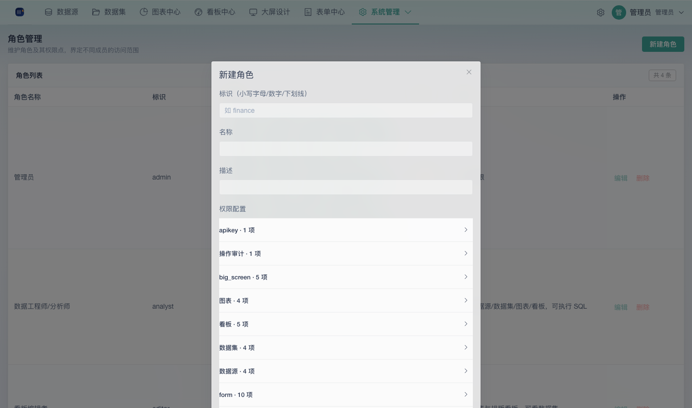

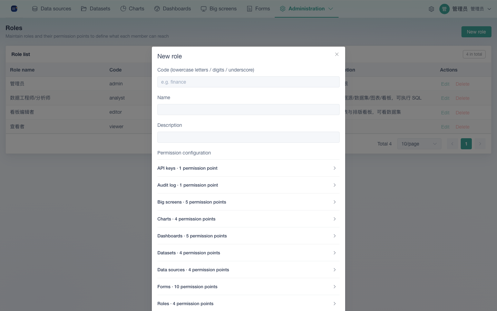

### 3.3 权限组结构

| 组 | 前缀 | 包含权限点 |
|----|------|-----------|
| 数据集 | `dataset` | 读 / 建 / 改 / 删 |
| 图表 | `chart` | 读 / 建 / 改 / 删 |
| 看板 | `dashboard` | 读 / 建 / 改 / 删 / 分享 |
| 数据源 | `datasource` | 读 / 建 / 改 / 删 / 同步（按实际） |
| SQL 实验室 | `sqllab` | 读 / 执行 |
| 用户管理 | `user` | 读 / 建 / 改 / 删 |
| 角色 | `role` | 读 / 建 / 改 / 删 |
| 操作审计 | `audit` | 读 |
| 系统 | `system` | 系统级设置 |

### 3.3 Permission group structure

| Group | Prefix | Permission points included |
|----|------|-----------|
| Datasets | `dataset` | read / create / edit / delete |
| Charts | `chart` | read / create / edit / delete |
| Dashboards | `dashboard` | read / create / edit / delete / share |
| Data sources | `datasource` | read / create / edit / delete / sync (as available) |
| SQL lab | `sqllab` | read / execute |
| Users | `user` | read / create / edit / delete |
| Roles | `role` | read / create / edit / delete |
| Audit log | `audit` | read |
| System | `system` | system-level settings |

> 权限点命名规则：`资源:动作`，例如 `dashboard:share`。前端菜单按用户权限动态显隐：无 `user:read` 看不到「用户管理」，无 `audit:read` 看不到「操作审计」。

> Permission points are named `resource:action`, for example `dashboard:share`. The front end shows and hides menu items based on your permissions: without `user:read` you do not see "Users", and without `audit:read` you do not see "Audit log".

## 四、操作审计

## 4. Audit log

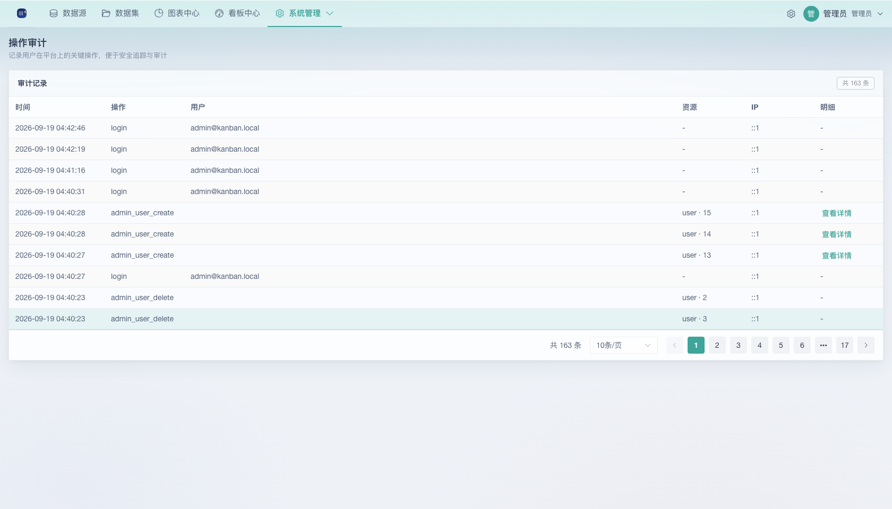

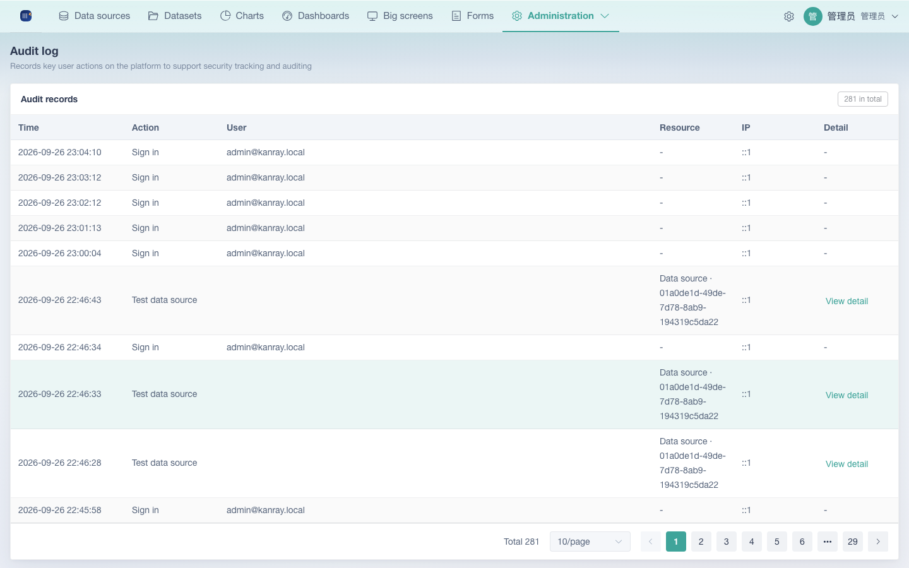

记录用户在平台上的关键操作，便于安全追踪：

It records key user actions on the platform so that you can track them for security:

- 列表列：时间、操作、用户（邮箱）、资源（类型+ID）、IP、明细
- **明细**：弹窗以格式化 JSON 展示请求/变更内容

- Columns: time, action, user (email), resource (type + ID), IP, detail
- **Detail**: a dialog shows the request or the change as formatted JSON

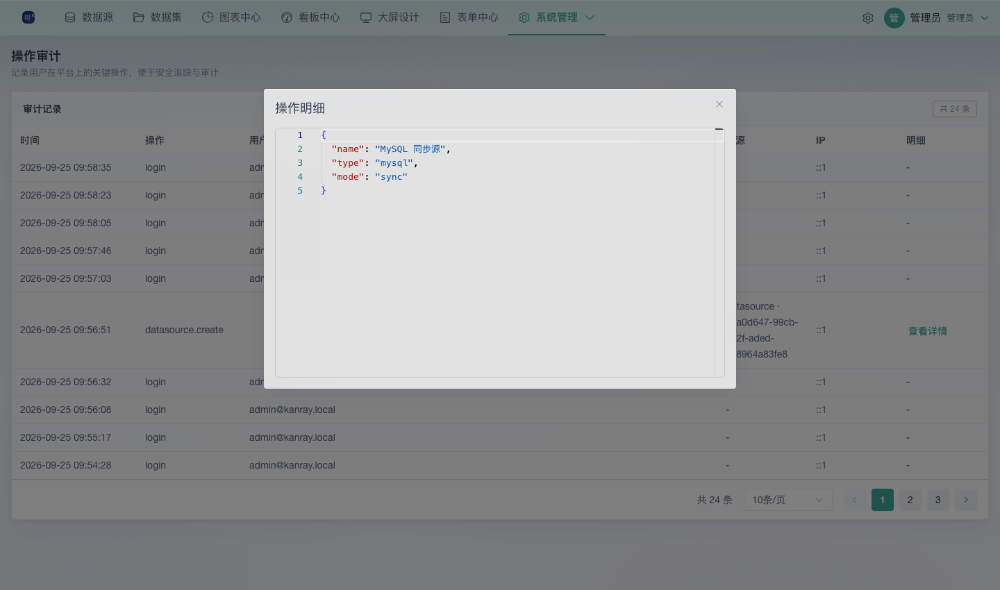

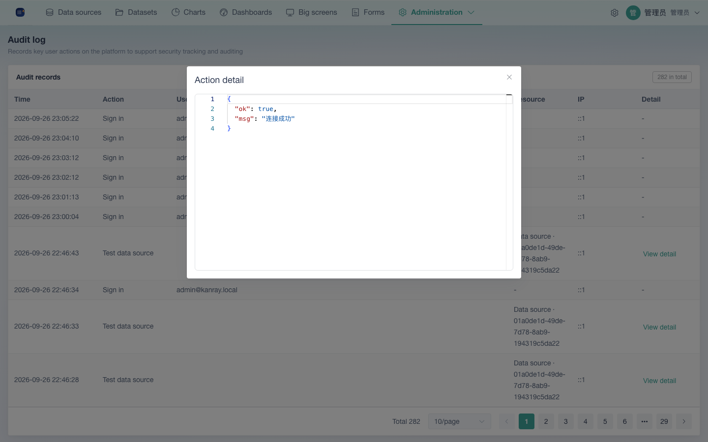

无权限用户访问时显示「无权限访问该页面」空态。

Users without permission see a "No permission to access this page" empty state.

## 五、开放 API 凭证管理

## 5. Open API credentials

### 5.1 凭证类型

| 类型 | 说明 | 适用 |
|------|------|------|
| **API Key**（静态） | 固定密钥，可限定 Scopes（`chart:read / dataset:read / dashboard:read`） | 系统间长期数据交换 |
| **访问令牌 PAT** | 权限继承**归属用户**，非静态 | 与个人账号绑定的外部调用 |

### 5.1 Credential types

| Type | Description | Best for |
|------|------|------|
| **API Key** (static) | A fixed secret, optionally restricted to certain scopes (`chart:read / dataset:read / dashboard:read`) | Long-term data exchange between systems |
| **Access token PAT** | Not static: it **inherits the owning user's** permissions | External calls tied to an individual account |

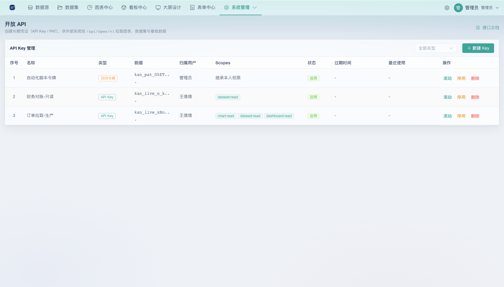

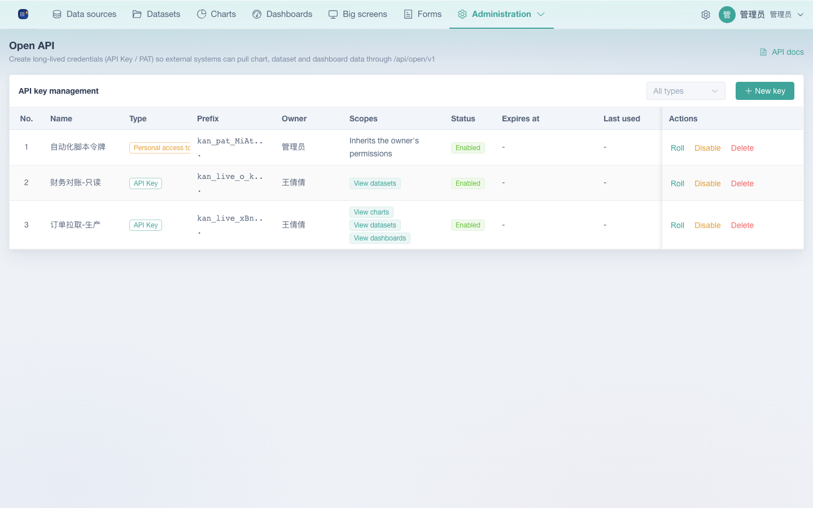

### 5.2 创建与安全规则

- 创建时选择归属用户（PAT 继承该用户权限）与过期时间（留空=永不过期）
- **明文凭证仅创建/滚动时展示一次**，关闭弹窗后不可再次查看 → 务必当场复制保存
- 启用态可直接阻止外部调用（停用后请求返回 401/403）

### 5.2 Creation and security rules

- When you create one, pick the owning user (a PAT inherits that user's permissions) and an expiry time (leave it empty for no expiry)
- **The credential is shown in plain text only once**, right after it is created or rolled, and it cannot be viewed again once you close the dialog → copy and store it straight away
- A disabled credential blocks external calls immediately (after you disable it, requests return 401/403)

### 5.3 滚动与删除

- 滚动（rotate）会生成新 Key **并立即使旧 Key 失效**
- 删除不可恢复，需危险操作确认

### 5.3 Rolling and deleting

- Rolling (rotate) generates a new key **and immediately invalidates the old one**
- Deletion cannot be undone and asks you to confirm a destructive action

> 完整鉴权方式、请求头、限流与错误码见 [开放 API 集成指南](04-开放API集成指南.md)。

> For the full authentication options, request headers, rate limits and error codes, see the [Open API integration guide](04-开放API集成指南.md).

## 六、日常运维提示

## 6. Day-to-day operations notes

- **默认管理员**：种子数据自动创建 `admin@kanray.local / admin123`，生产环境必须第一时间改密（用户管理 → 重置密码）
- **密钥管理**：部署层环境变量 `JWT_SECRET`（用户态令牌签名）与 `DATASOURCE_SECRET`（数据源明文加密），轮换见 [部署运维手册](05-部署运维手册.md)
- 管理员的全部操作会进入审计日志，作为变更依据

- **Default administrator**: the seed data creates `admin@kanray.local / admin123` automatically. Change that password first thing in production (Users → Reset password)
- **Secrets**: the deployment-level environment variables `JWT_SECRET` (signs user tokens) and `DATASOURCE_SECRET` (encrypts data source secrets at rest). See the [Deployment & operations manual](05-部署运维手册.md) for how to rotate them
- Everything an administrator does lands in the audit log, which is what you use as the record of a change
