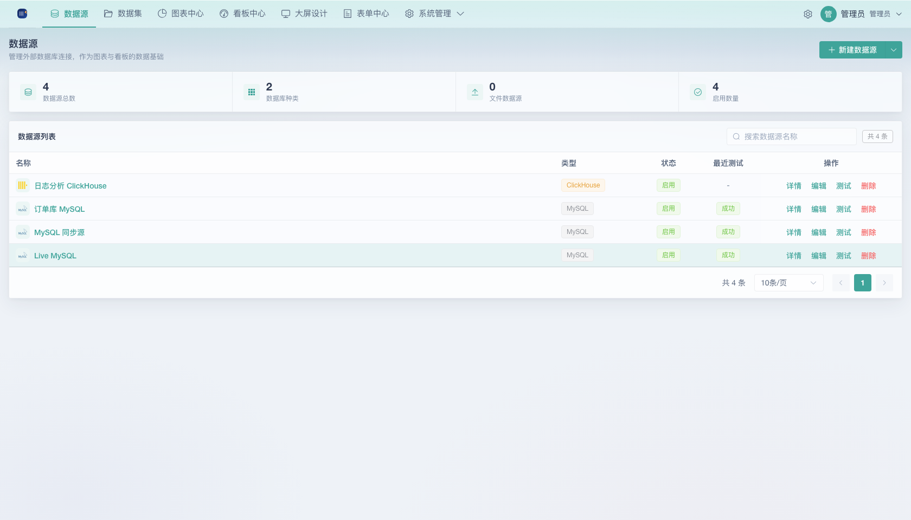
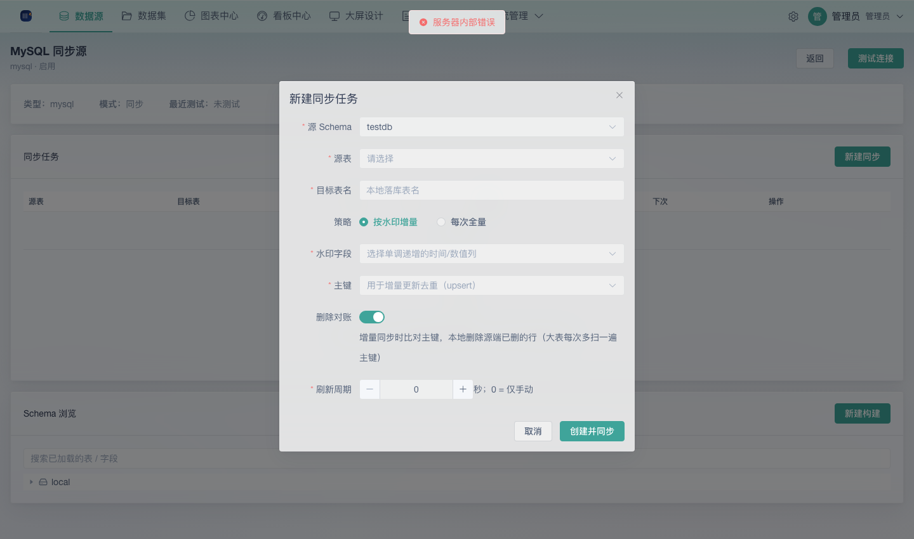

# 03 数据源与构建器

面向数据工程师。本系统除了直接上传文件外，还可连接外部数据库，并在其之上用三种形态构建数据集。

## 一、数据源总揽

「数据源」页面管理所有外部连接与文件数据源。

### 1.1 支持的驱动

「新建数据源」下拉选择 22 种类型：

`MySQL / PostgreSQL / SQL Server / MariaDB / TiDB / ClickHouse / Elasticsearch / API/Web Service / Oracle / DB2 / 达梦 / GBASE / Hive / Impala / Presto / MaxCompute / Doris / StarRocks / Greenplum / KingbaseES / GaussDB / Redshift / Excel/CSV`

### 1.2 两种连接模式

| 模式 | 说明 | 适用 |
|------|------|------|
| **直连（direct）** | 查询时实时连接外部数据库取数 | 数据量适中、要求实时 |
| **同步（sync）** | 先把源表同步到本机落库，再基于本地表查询 | 大数据量、源库慢、需离线快照 |

> 文件型数据源（Excel/CSV）**不支持同步模式**，上传后作为数据集直接使用。

### 1.3 安全与存储

- 连接配置中的**密码字段入库前使用 AES 加密**（密钥来自部署环境变量 `DATASOURCE_SECRET`）
- 编辑保存时省略不填 `********` 表示保留原密码不变
- 数据源为 owner 隔离：普通用户只能看到自己创建的；管理员可见全部

### 1.4 列表操作

每行操作：**详情 / 编辑 / 测试（连通性）/ 删除**；状态列可启停。创建/更新后建议先「测试」连通性（返回「测试成功」或失败原因）。

## 二、数据源详情

详情页包含：

- **信息卡**：类型、模式（同步/直连）、最近测试结果
- **文件数据源卡**：显示行数/列数，可直接用于图表构建
- **同步任务卡**（仅同步模式）：新建同步任务，把远端表拉到本机落库
- **Schema 浏览**：浏览已加载的库表树，可直接基于表「新建构建」或「创建数据集」

> **Excel / CSV 文件数据源**不支持 Schema 浏览，详情页会显示提示："Excel / CSV 文件数据源不支持 Schema 浏览，请在数据集列表中管理并预览数据"；在数据集列表中，Excel 数据集的「编辑构建」按钮置灰不可用，如需更换数据请在数据源页重新上传。

### 2.1 新建同步任务

弹窗字段：

| 字段 | 说明 |
|------|------|
| 源 Schema / 源表 | 从远端库选择 |
| 目标表名 | 本地落库表名 |
| 策略 | 按水印增量 / 每次全量 |
| 水印字段（增量） | 单调递增的时间/数值列 |
| 主键（增量） | 用于增量更新去重（upsert）与删除对账 |
| 删除对账（增量） | 默认开：每次比对主键，本地删除源端已删的行（大表每次多扫一遍主键，可关） |
| 刷新周期 | 秒；`0` = 仅手动 |

创建后立即触发首次同步。同步落到本机存储，浏览树即可看到本地表。「立即同步 / 日志 / 删除」管理任务；同步日志弹窗展示时间、级别、内容；增量模式的「立即同步」日志会记录对账删除行数。

> 说明：全量策略每次 DROP 本地表整表重建，天然与源端一致；增量策略靠主键对账删除已删行，因此删除对账仅在配置了主键的增量任务上生效。

## 三、数据集构建器

从数据源 Schema 树某张表点「新建构建」，进入构建器。支持**三种构建形态**，顶部 Tab 切换：

> 三种形态均用于「SQL 数据集」；文件上传得到的数据集等价于已固化的可视化/ETL 结果，直接可用于图表。

### 3.1 纯 SQL

在代码编辑器（CodeMirror）中直接写查询语句，带语法高亮与表字段自动补全。写的 SQL 直接执行并自动推断返回字段，起名后保存即可得到数据集。

适用于对 SQL 熟、要精确控制口径的取数场景。

### 3.2 可视化

可视化构建：
- 从 Schema 树选择数据表（支持多表，可配置关联条件）
- 选择输出字段，可配置聚合（分组 + SUM/AVG/COUNT/MIN/MAX）、过滤、排序
- 生成的查询按配置即时执行，保存前可预览

适合不写 SQL 的用户。

### 3.3 ETL

画布式多步数据加工：把左侧算子拖入画布、连线形成数据流，最终接入「输出」节点后保存。**删除节点 / 连线使用右键菜单**（点右键即出「删除」）。

内置算子（11 种）：

| 节点（图标） | 作用 |
|------|------|
| 输入源 | 选择要加工的表（来自该数据源的 Schema 树） |
| 关联 Join | 两表关联，INNER/LEFT/RIGHT，支持多个 on 条件 |
| 过滤 | 按条件筛行：`=` `≠` `包含` `≤/≥/</>`（值）`∈` 等 |
| 选择列 | 仅保留勾选的列输出 |
| 去重 | 按全部列或指定列去重 |
| 值替换 | 把某列中特定值 → 新值 |
| Null 替换 | 把某列的 Null → 指定的默认值 |
| 去空格 | 对指定列（默认全部）执行 TRIM |
| 聚合 | 分组字段 + 一个或多个指标（SUM/AVG/COUNT/去重计数/MAX/MIN），指标列表带序号、按行分隔 |
| SQL | 自定义 SQL 节点（代码编辑器，语法高亮） |
| 输出 | 终点节点，可配置输出行数上限（默认 1000） |

**SQL 节点（`sqlNode`）用法**——易混淆点：

- **有连线接上游节点**：SQL 里的 `__etl_prev` 就代表「上游节点的数据」，可像查表一样使用，例如
  `SELECT * FROM __etl_prev WHERE ...` 或 `SELECT x, SUM(y) FROM __etl_prev GROUP BY x`，即在上游加工结果之上再写一层 SQL；
- **没有接上游节点**：SQL 直接查询该数据源里的**真实表**（需写真实表名），此时 `__etl_prev` 不生效。因此纯用 SQL 也能产出一个数据集，无需任何上游节点。

**节点预览**：在节点配置抽屉中点击「预览此节点」，可查看该节点输出的真实数据（上限 200 行，表格为虚拟滚动，避免大数据卡顿）。修改节点配置后重点预览即可刷新。

### 3.4 保存与校验

- 保存前校验名称与构建定义非空
- 成功后返回数据集，可立即在图表构建器中引用
- 定义解析失败时会明确报错

**行数统计说明**：SQL/ETL 数据集保存时行数不立即计算（记为 0）。打开「数据集」列表时会自动**批量懒计算并以 `…` 占位动画回填**，结果落库缓存——只有仍为 0 的数据集才会触发计算，之后翻页/重进列表直接读缓存，不再反复全表扫描；重新编辑并保存定义后行数自动失效、下次列表加载重算。

## 四、从已加载表注册数据集

Schema 树中每张表悬停出现「创建数据集」入口，可快速把该表注册为数据集（列类型自动映射：数值→number、时间→date、其余→string），随后可直接建图表。

## 五、常见路径速查

| 我要… | 操作 |
|-------|------|
| 连 MySQL 做图表 | 数据源 → 新建数据源（MySQL）→ 测试 → 详情 → Schema 建数据集 |
| 大表避免慢查询 | 数据源 → 同步模式 → 新建同步任务（全量） |
| 从三张表 join 取数 | 数据源 → 新建构建 → ETL → 数据源+连接 |
| 只想要 select 口径 | 数据源 → 新建构建 → 纯 SQL |