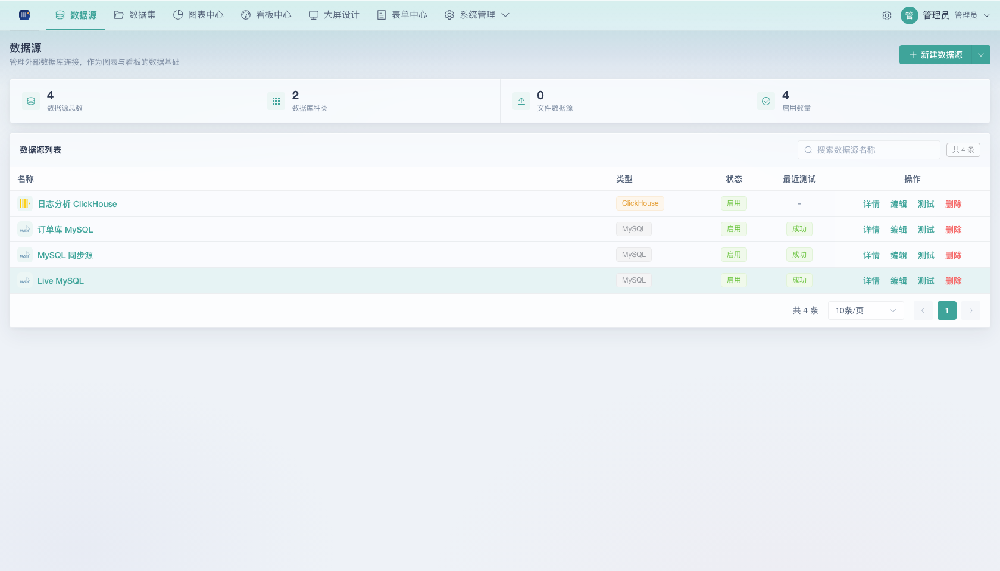
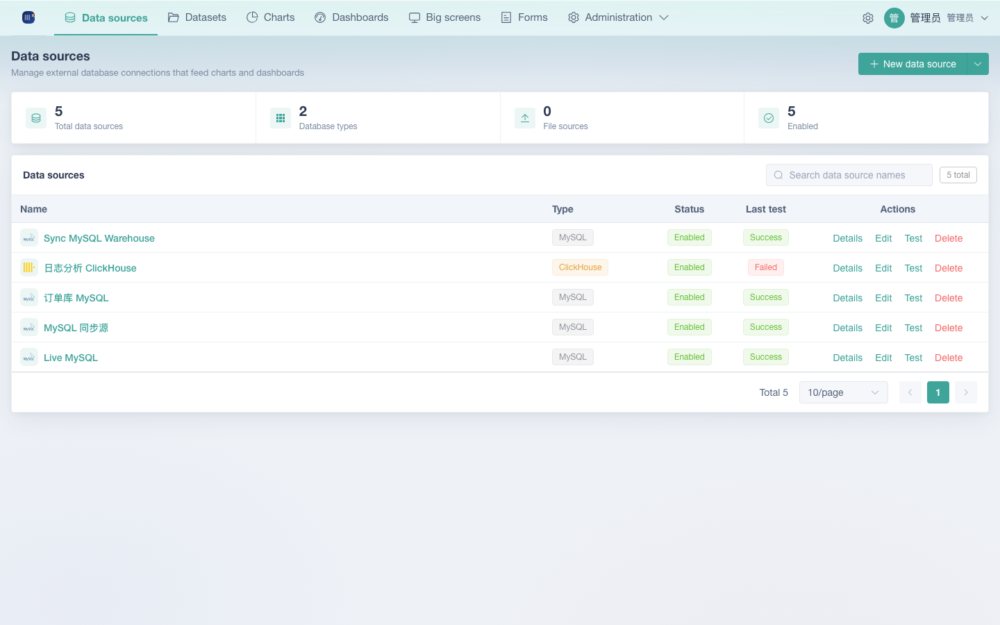
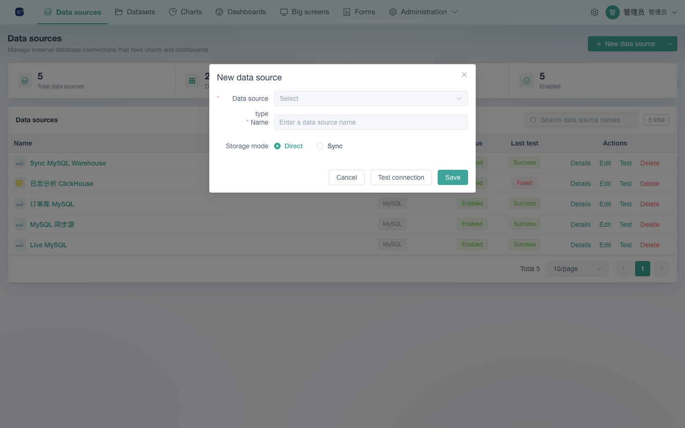
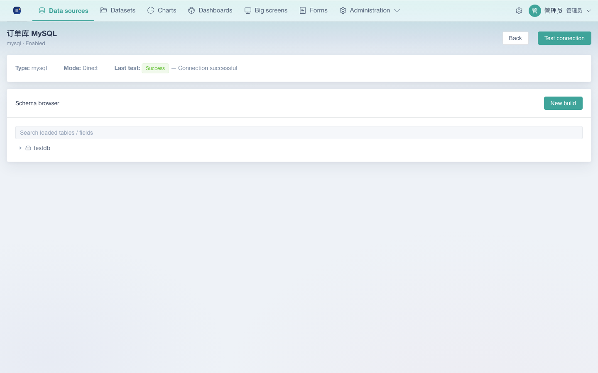
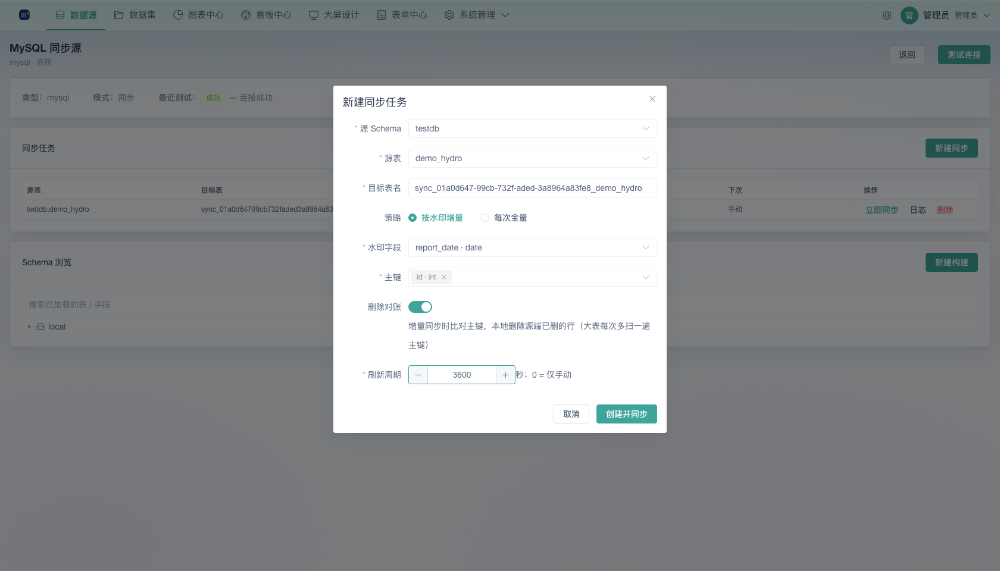
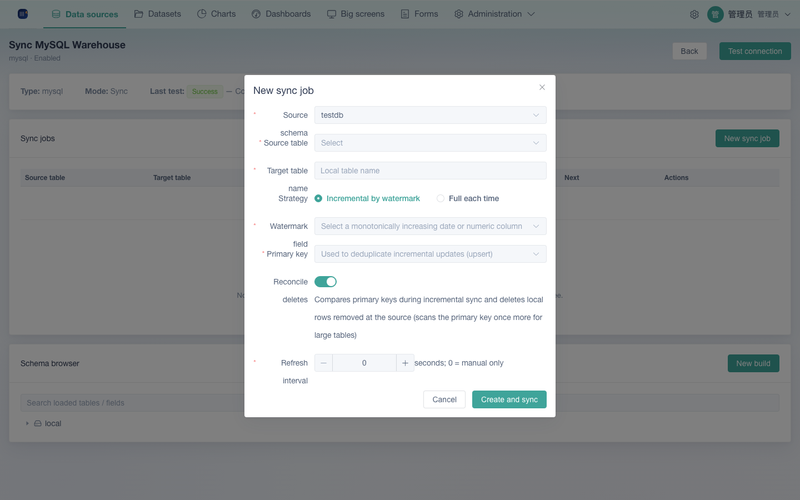
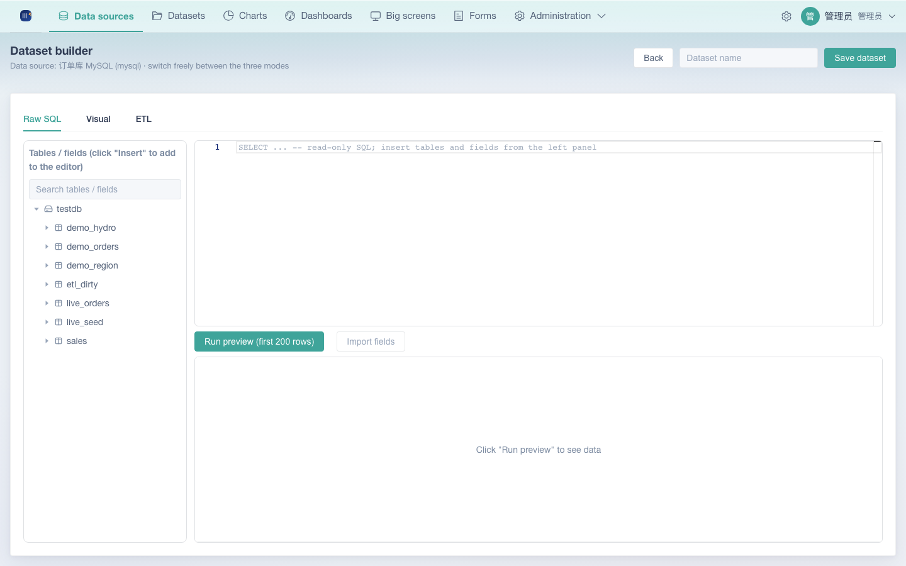
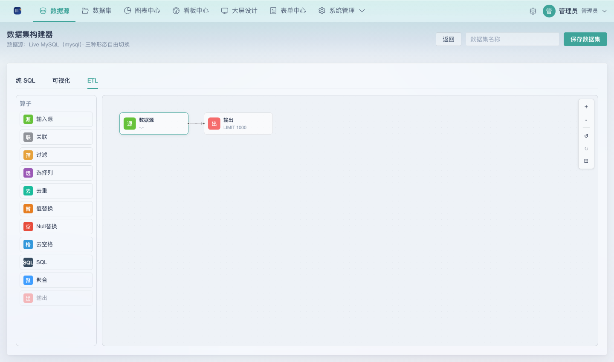
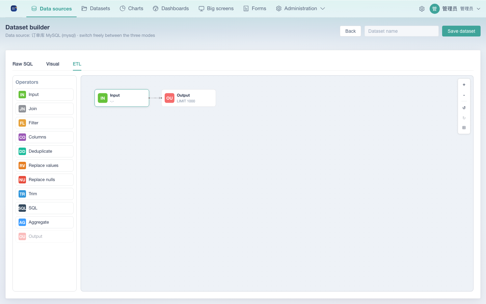

# 03 数据源与构建器

面向数据工程师。本系统除了直接上传文件外，还可连接外部数据库，并在其之上用三种形态构建数据集。

# 03 Data Sources & Builder

For data engineers. Besides uploading files directly, the system can connect to external databases and build datasets on top of them in three different ways.

## 一、数据源总揽

「数据源」页面管理所有外部连接与文件数据源。

## 1. Data sources at a glance

The **Data sources** page manages every external connection and file-based data source.

### 1.1 支持的驱动

「新建数据源」下拉选择 22 种驱动类型（另有一个独立的「上传 Excel / CSV 文件」入口）：

### 1.1 Supported drivers

The **New data source** dropdown offers 22 driver types, plus a separate **Upload Excel / CSV file** entry:

`MySQL / PostgreSQL / SQL Server / MariaDB / TiDB / ClickHouse / Elasticsearch / API/Web Service / Oracle / DB2 / 达梦 / GBASE / Hive / Impala / Presto / MaxCompute / Doris / StarRocks / Greenplum / KingbaseES / GaussDB / Redshift`

### 1.2 两种连接模式

| 模式 | 说明 | 适用 |
|------|------|------|
| **直连（direct）** | 查询时实时连接外部数据库取数 | 数据量适中、要求实时 |
| **同步（sync）** | 先把源表同步到本机落库，再基于本地表查询 | 大数据量、源库慢、需离线快照 |

### 1.2 Two connection modes

| Mode | Description | When to use |
|------|------|------|
| **Direct (`direct`)** | Connects to the external database in real time on every query | Moderate data volume, real-time freshness required |
| **Sync (`sync`)** | Copies the source table into local storage first, then queries the local table | Large data volumes, a slow source database, or when an offline snapshot is needed |

> 文件型数据源（Excel/CSV）**不支持同步模式**，上传后作为数据集直接使用。

> **Note:** File-based data sources (Excel/CSV) **do not support sync mode**. Once uploaded, they are used as datasets directly.

### 1.3 安全与存储

- 连接配置中的**密码字段入库前使用 AES 加密**（密钥来自部署环境变量 `DATASOURCE_SECRET`）
- 编辑保存时省略不填 `********` 表示保留原密码不变
- 数据源为 owner 隔离：普通用户只能看到自己创建的；管理员可见全部

### 1.3 Security and storage

- The **password field** in the connection config is **encrypted with AES before it is stored** (the key comes from the deployment environment variable `DATASOURCE_SECRET`).
- When editing, leaving `********` untouched means "keep the existing password unchanged".
- Data sources are isolated by owner: a regular user sees only what they created, while an administrator sees everything.

### 1.4 列表操作

每行操作：**详情 / 编辑 / 测试（连通性）/ 删除**；状态列可启停。创建/更新后建议先「测试」连通性（返回「测试成功」或失败原因）。

### 1.4 List actions

Each row offers **Details / Edit / Test (connectivity) / Delete**; the status column can be enabled or disabled. After creating or updating a data source, run **Test** first — it returns "测试成功" (test succeeded) or the reason for failure.

## 二、数据源详情

详情页包含：

## 2. Data source details

The details page contains:

- **信息卡**：类型、模式（同步/直连）、最近测试结果
- **文件数据源卡**：显示行数/列数，可直接用于图表构建
- **同步任务卡**（仅同步模式）：新建同步任务，把远端表拉到本机落库
- **Schema 浏览**：浏览已加载的库表树，可直接基于表「新建构建」或「创建数据集」

- **Info card**: type, mode (sync/direct), and the most recent test result.
- **File data source card**: shows the row/column counts and can be used for chart building right away.
- **Sync task card** (sync mode only): create a sync task that pulls the remote table into local storage.
- **Schema browser**: browse the tree of loaded schemas and tables, and create a **new build** or a **dataset** straight from a table.

> **Excel / CSV 文件数据源**不支持 Schema 浏览，详情页会显示提示："Excel / CSV 文件数据源不支持 Schema 浏览，请在数据集列表中管理并预览数据"；在数据集列表中，Excel 数据集的「编辑构建」按钮置灰不可用，如需更换数据请在数据源页重新上传。

> **Note:** **Excel / CSV file data sources** do not support Schema browsing, and the details page shows this tip: "Excel / CSV data sources do not support Schema browsing. Manage and preview the data from the dataset list." In the dataset list, the **Edit build** button on an Excel dataset is greyed out; to change the data, upload a new file from the data source page.

### 2.1 新建同步任务

弹窗字段：

### 2.1 Creating a sync task

Dialog fields:

| 字段 | 说明 |
|------|------|
| 源 Schema / 源表 | 从远端库选择 |
| 目标表名 | 本地落库表名 |
| 策略 | 按水印增量 / 每次全量 |
| 水印字段（增量） | 单调递增的时间/数值列 |
| 主键（增量） | 用于增量更新去重（upsert）与删除对账 |
| 删除对账（增量） | 默认开：每次比对主键，本地删除源端已删的行（大表每次多扫一遍主键，可关） |
| 刷新周期 | 秒；`0` = 仅手动 |

| Field | Description |
|------|------|
| Source schema / source table | Pick from the remote database |
| Target table name | Name of the local table to store the data in |
| Strategy | Incremental by watermark / full refresh every time |
| Watermark field (incremental) | A monotonically increasing date/number column |
| Primary key (incremental) | Used to deduplicate incremental updates (upsert) and to reconcile deletions |
| Delete reconciliation (incremental) | On by default: compare primary keys on every run and delete locally the rows already removed at the source (this scans the primary key once more on large tables, so it can be turned off) |
| Refresh interval | In seconds; `0` = manual only |

创建后立即触发首次同步。同步落到本机存储，浏览树即可看到本地表。「立即同步 / 日志 / 删除」管理任务；同步日志弹窗展示时间、级别、内容；增量模式的「立即同步」日志会记录对账删除行数。

Creating the task triggers the first sync immediately. Synced data lands in local storage, so the local table shows up in the browser tree. **Sync now / Logs / Delete** manage the task; the sync log dialog shows the time, level, and content, and for incremental mode the "Sync now" log also records how many rows the delete reconciliation removed.

> 说明：全量策略每次 DROP 本地表整表重建，天然与源端一致；增量策略靠主键对账删除已删行，因此删除对账仅在配置了主键的增量任务上生效。

> **Note:** The full strategy DROPs and rebuilds the whole local table on every run, so it is naturally consistent with the source. The incremental strategy relies on primary-key reconciliation to remove deleted rows, so delete reconciliation only takes effect on incremental tasks that have a primary key configured.

## 三、数据集构建器

从数据源 Schema 树某张表点「新建构建」，进入构建器。支持**三种构建形态**，顶部 Tab 切换：

## 3. The dataset builder

Click **New build** on a table in the data source's Schema tree to open the builder. It supports **three build modes**, switched via the tabs at the top:

> 三种形态均用于「SQL 数据集」；文件上传得到的数据集等价于已固化的可视化/ETL 结果，直接可用于图表。

> **Note:** All three modes produce a **SQL dataset**. A dataset from a file upload is equivalent to an already-materialized visual/ETL result and can be used by charts directly.

### 3.1 纯 SQL

在代码编辑器（CodeMirror）中直接写查询语句，带语法高亮与表字段自动补全。写的 SQL 直接执行并自动推断返回字段，起名后保存即可得到数据集。

适用于对 SQL 熟、要精确控制口径的取数场景。

### 3.1 Pure SQL

Write the query directly in the code editor (CodeMirror), with syntax highlighting and auto-completion for table and field names. The SQL you write is executed as-is and the returned fields are inferred automatically; give the dataset a name and save, and you have a dataset.

Suits data-fetching scenarios where you know SQL well and need precise control over the query definition.

### 3.2 可视化

可视化构建：
- 从 Schema 树选择数据表（支持多表，可配置关联条件）
- 选择输出字段，可配置聚合（分组 + SUM/AVG/COUNT/MIN/MAX）、过滤、排序
- 生成的查询按配置即时执行，保存前可预览

适合不写 SQL 的用户。

### 3.2 Visual

Visual building:
- Pick tables from the Schema tree (multiple tables are supported, with configurable join conditions).
- Choose the output fields, and configure aggregation (group by + SUM/AVG/COUNT/MIN/MAX), filters, and sorting.
- The generated query runs immediately against your configuration, and you can preview the result before saving.

Suits users who do not write SQL.

### 3.3 ETL

画布式多步数据加工：把左侧算子拖入画布、连线形成数据流，最终接入「输出」节点后保存。**删除节点 / 连线使用右键菜单**（点右键即出「删除」）。

内置算子（11 种）：

### 3.3 ETL builder

Canvas-based, multi-step data processing: drag operators from the left panel onto the canvas, connect them into a data flow, and save once the flow reaches an **Output** node. **Deleting a node or a connection uses the context menu** (right-click and pick "Delete").

Built-in operators (11 types):

| 节点（图标） | 作用 |
|------|------|
| 输入源 | 选择要加工的表（来自该数据源的 Schema 树） |
| 关联 Join | 两表关联，INNER/LEFT/RIGHT，支持多个 on 条件 |
| 过滤 | 按条件筛行：`=` `≠` `包含` `≤/≥/</>`（值）`∈` 等 |
| 选择列 | 仅保留勾选的列输出 |
| 去重 | 按全部列或指定列去重 |
| 值替换 | 把某列中特定值 → 新值 |
| Null 替换 | 把某列的 Null → 指定的默认值 |
| 去空格 | 对指定列（默认全部）执行 TRIM |
| 聚合 | 分组字段 + 一个或多个指标（SUM/AVG/COUNT/去重计数/MAX/MIN），指标列表带序号、按行分隔 |
| SQL | 自定义 SQL 节点（代码编辑器，语法高亮） |
| 输出 | 终点节点，可配置输出行数上限（默认 1000） |

| Node (icon) | What it does |
|------|------|
| Source | Picks the table to process (from that data source's Schema tree) |
| Join | Joins two tables — INNER/LEFT/RIGHT — with support for multiple `on` conditions |
| Filter | Filters rows by condition: `=`, `≠`, `contains`, `≤/≥/</>` (value), `∈`, and so on |
| Select columns | Outputs only the ticked columns |
| Dedup | Removes duplicates by all columns or by specified columns |
| Value replace | Maps a specific value in a column to a new value |
| Null replace | Replaces NULLs in a column with a specified default |
| Trim | Runs TRIM on the specified columns (all of them by default) |
| Aggregate | Group-by fields plus one or more metrics (SUM/AVG/COUNT/distinct count/MAX/MIN); the metric list is numbered and carries one metric per line |
| SQL | Custom SQL node (code editor with syntax highlighting) |
| Output | Terminal node; you can set the output row limit (1000 by default) |

**SQL 节点（`sqlNode`）用法**——易混淆点：

**How the SQL node (`sqlNode`) works** — an easy-to-confuse point:

- **有连线接上游节点**：SQL 里的 `__etl_prev` 就代表「上游节点的数据」，可像查表一样使用，例如
  `SELECT * FROM __etl_prev WHERE ...` 或 `SELECT x, SUM(y) FROM __etl_prev GROUP BY x`，即在上游加工结果之上再写一层 SQL；
- **没有接上游节点**：SQL 直接查询该数据源里的**真实表**（需写真实表名），此时 `__etl_prev` 不生效。因此纯用 SQL 也能产出一个数据集，无需任何上游节点。

- **Connected to an upstream node**: `__etl_prev` in the SQL stands for "the upstream node's data" and can be queried like a table, for example `SELECT * FROM __etl_prev WHERE ...` or `SELECT x, SUM(y) FROM __etl_prev GROUP BY x` — that is, you write one more layer of SQL on top of the upstream result.
- **Not connected to an upstream node**: the SQL queries a **real table** in that data source directly (you must write the real table name), and `__etl_prev` has no effect. So a pure SQL setup can produce a dataset on its own, with no upstream node required.

**节点预览**：在节点配置抽屉中点击「预览此节点」，可查看该节点输出的真实数据（上限 200 行，表格为虚拟滚动，避免大数据卡顿）。修改节点配置后重点预览即可刷新。

**Node preview**: click **Preview this node** in a node's configuration drawer to see the real data that node outputs (capped at 200 rows; the table uses virtual scrolling so large results do not stall the UI). After changing a node's configuration, previewing it again refreshes the result.

### 3.4 保存与校验

- 保存前校验名称与构建定义非空
- 成功后返回数据集，可立即在图表构建器中引用
- 定义解析失败时会明确报错

**行数统计说明**：SQL/ETL 数据集保存时行数不立即计算（记为 0）。打开「数据集」列表时会自动**批量懒计算并以 `…` 占位动画回填**，结果落库缓存——只有仍为 0 的数据集才会触发计算，之后翻页/重进列表直接读缓存，不再反复全表扫描；重新编辑并保存定义后行数自动失效、下次列表加载重算。

### 3.4 Saving and validation

- The name and the build definition are both validated as non-empty before saving.
- On success you get the dataset back and can reference it in the chart builder immediately.
- A definition that fails to parse produces an explicit error.

**About row counts**: when a SQL/ETL dataset is saved, its row count is not computed right away (it is recorded as 0). Opening the **Dataset** list triggers a **batched lazy computation, filled in behind a `…` placeholder animation**, and the result is cached in the database — only datasets still at 0 trigger a computation, and after that, paging or reopening the list reads the cache instead of rescanning the table. Editing and saving the definition again invalidates the count, and the next list load recomputes it.

## 四、从已加载表注册数据集

Schema 树中每张表悬停出现「创建数据集」入口，可快速把该表注册为数据集（列类型自动映射：数值→number、时间→date、其余→string），随后可直接建图表。

## 4. Registering a dataset from a loaded table

Hovering a table in the Schema tree reveals a **Create dataset** entry, which registers that table as a dataset in one step (column types are mapped automatically: numeric → number, date/time → date, everything else → string). You can then build charts from it right away.

## 五、常见路径速查

| 我要… | 操作 |
|-------|------|
| 连 MySQL 做图表 | 数据源 → 新建数据源（MySQL）→ 测试 → 详情 → Schema 建数据集 |
| 大表避免慢查询 | 数据源 → 同步模式 → 新建同步任务（全量） |
| 从三张表 join 取数 | 数据源 → 新建构建 → ETL → 数据源+连接 |
| 只想要 select 口径 | 数据源 → 新建构建 → 纯 SQL |

## 5. Quick path reference

| I want to… | Steps |
|-------|------|
| Connect MySQL and chart it | Data sources → New data source (MySQL) → Test → Details → create a dataset from the Schema tree |
| Avoid slow queries on a large table | Data sources → sync mode → New sync task (full) |
| Pull data by joining three tables | Data sources → New build → ETL → source + join |
| Just need a plain `SELECT` | Data sources → New build → pure SQL |
