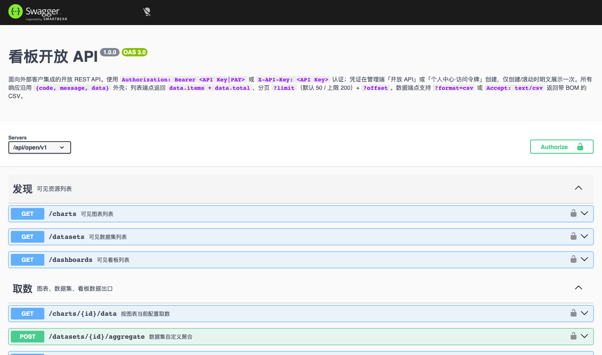

# 04 开放 API 集成指南

面向外部系统开发者。本系统提供一组只读数据接口（`/api/open/v1`），让外部系统以编程方式拉取图表、数据集与看板数据。

## 一、准备凭证

### 1.1 凭证类型

| 类型 | 创建入口 | 权限 | 说明 |
|------|---------|------|------|
| **API Key** | 系统管理 → 开放 API | 仅限勾选的 Scopes | 静态长期凭证，适合系统间 |
| **访问令牌 PAT** | 系统管理 → 访问令牌 | 继承本人权限 | 个人账户绑定 |

创建时设置：名称、归属用户（PAT 继承该用户）、Scopes（静态 Key 可选 `chart:read / dataset:read / dashboard:read`）、过期时间（留空=永不过期）。

> **凭证只明文展示一次**，关闭后无法再查看。请当场复制保存。
> 滚动（rotate）会让旧 Key 立即失效；删除不可恢复。

### 1.2 请求示例

```bash
# 方式一：Authorization: Bearer
curl -H "Authorization: Bearer kan_live_xxxx" \
     "http://localhost:8080/api/open/v1/charts"

# 方式二：X-API-Key 头
curl -H "X-API-Key: kan_live_xxxx" \
     "http://localhost:8080/api/open/v1/dashboards"
```

凭证格式：`kan_live_*`（API Key）/ `kan_pat_*`（PAT）。

## 二、接口总览

Swagger UI：`/api/open/docs`（浏览器打开）；OpenAPI 规范：`GET /api/open/v1/openapi.json`。浏览器打开后为可视化接口文档，可直接对照联调：



### 发现（列表）

| 方法 + 路径 | 作用 | 所需权限 |
|------------|------|---------|
| `GET /api/open/v1/charts` | 可见图表列表（`keyword` 搜索、`limit`/`offset` 分页） | `chart:read` |
| `GET /api/open/v1/datasets` | 可见数据集列表 | `dataset:read` |
| `GET /api/open/v1/dashboards` | 可见看板列表 | `dashboard:read` |

分页：`limit` 默认 50、上限 200；`offset` 从 0 起。响应 `{ items, total }`。

### 取数（数据消费）

| 方法 + 路径 | 作用 | 所需权限 |
|------------|------|---------|
| `GET /api/open/v1/charts/{id}/data` | 按图表当前配置取数（columns+rows） | `chart:read` |
| `POST /api/open/v1/datasets/{id}/aggregate` | 数据集自定义聚合 | `dataset:read` |
| `GET /api/open/v1/dashboards/{id}/export` | 看板快照（元信息 + 全部图表数据） | `dashboard:read` |

### 2.1 按图表取数

```
GET /api/open/v1/charts/{id}/data
```

- 执行图表当前配置的聚合，响应为 `columns`（维度字段 + 指标字段带聚合）+ `rows`
- 校验图表与数据集双重归属；无权或不存在统一返回 404「资源不存在或无权访问」

### 2.2 数据集自定义聚合

```
POST /api/open/v1/datasets/{id}/aggregate
Content-Type: application/json

{
  "metrics":   [{ "field": "销售额", "agg": "sum", "label": "销售额(sum)" }],
  "dimensions":[ { "field": "区域", "label": "区域" } ],
  "filters":   [ { "field": "区域", "op": "eq", "value": "华南" } ]
}
```

- 指标聚合：`sum / avg / count / count_distinct / max / min`
- 维度可选 `granularity`（日/月/年）；更多排序/分组参数见 Swagger
- **字段必须已注册**：引用未注册字段返回 422「聚合包含未注册字段」
- 超限截断时响应带 `truncated: true`

### 2.3 看板导出

```
GET /api/open/v1/dashboards/{id}/export
```

返回看板元信息 + 逐图表按各自配置取数的完整数据。

### 2.4 CSV 输出

列表/取数端点支持 `?format=csv`（或请求头 `Accept: text/csv`）：

- 取数端点 CSV：首行为字段展示名，值自动转义；**带 BOM**，Excel 直接打开不乱码
- 看板导出 CSV：逐卡以 `# 图表名` 分节
- CSV 模式下错误以纯文本 + 状态码返回（非 `{code,data}` 外壳）

## 三、响应结构

成功统一为 `{ code: 0, data, message }`：

```json
{
  "code": 0,
  "data": {
    "columns": [ { "field": "区域", "label": "区域" },
                 { "field": "销售额", "label": "销售额", "agg": "sum" } ],
    "rows": [ { "区域": "华南", "销售额": 67300 } ],
    "truncated": false
  },
  "message": "OK"
}
```

## 四、安全与限流

| 机制 | 说明 |
|------|------|
| 鉴权 | 仅接受有效 `kan_*` 凭证；无效/停用/过期返回 401，对应权限缺失返回 403 |
| 资源隔离 | 列表仅返回本人可见；数据端点同时校验图表与数据集归属 |
| 限流 | 每 Key 每分钟 `OPEN_API_RATE_PER_MIN` 次（默认 120），超限返回 `429 请求过于频繁` |
| 行数上限 | `OPEN_API_MAX_ROWS`（默认 10000），超出截断并标记 `truncated` |
| 审计 | 取数类调用记录审计日志（资源 chart/dataset，操作 `api:charts.data` 等） |

## 五、错误码

| 状态码 | 含义 |
|--------|------|
| 400 | 参数不正确（含细分原因） |
| 401 | 缺少/无效/停用/过期凭证 |
| 403 | 凭证有效但无该权限 |
| 404 | 资源不存在或无权访问（列表类端点报 404 表示未找到） |
| 422 | 聚合字段未注册 |
| 429 | 触发限流 |

## 六、典型集成场景

### 大屏轮询

```bash
# 每分钟拉一次图表数据渲染大屏
curl -sH "Authorization: Bearer kan_live_xxx" \
  "http://localhost:8080/api/open/v1/charts/1/data" \
  | jq '.data.rows'
```

### 定时导出 CSV 到报表库

```bash
curl -sH "Authorization: Bearer kan_live_xxx" \
  "http://localhost:8080/api/open/v1/charts/1/data?format=csv" \
  -o 销售.csv
```

### 看板快照到邮件

```bash
curl -sH "Authorization: Bearer kan_pat_xxx" \
  "http://localhost:8080/api/open/v1/dashboards/2/export" \
  | jq '.data.meta + { charts: (.data.cards | length) }'
```

> 实际返回字段名以 `/api/open/v1/openapi.json` 为准；本手册示例基于当前版本。