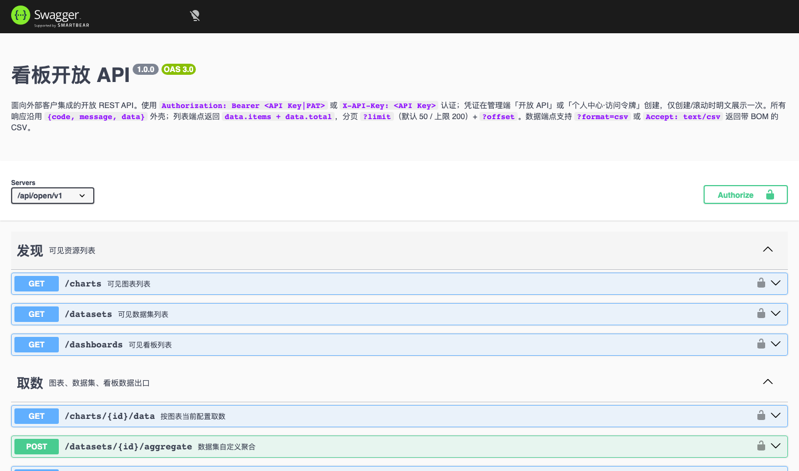

# 04 开放 API 集成指南

面向外部系统开发者。本系统提供一组只读数据接口（`/api/open/v1`），让外部系统以编程方式拉取图表、数据集与看板数据。

# 04 Open API Integration Guide

For developers integrating external systems. The system exposes a set of read-only data endpoints under `/api/open/v1` so that external systems can pull chart, dataset, and dashboard data programmatically.

## 一、准备凭证

## 1. Preparing credentials

### 1.1 凭证类型

| 类型 | 创建入口 | 权限 | 说明 |
|------|---------|------|------|
| **API Key** | 系统管理 → 开放 API | 仅限勾选的 Scopes | 静态长期凭证，适合系统间 |
| **访问令牌 PAT** | 系统管理 → 访问令牌 | 继承本人权限 | 个人账户绑定 |

创建时设置：名称、归属用户（PAT 继承该用户）、Scopes（静态 Key 可选 `chart:read / dataset:read / dashboard:read`）、过期时间（留空=永不过期）。

> **凭证只明文展示一次**，关闭后无法再查看。请当场复制保存。
> 滚动（rotate）会让旧 Key 立即失效；删除不可恢复。

### 1.1 Credential types

| Type | Where to create it | Permissions | Description |
|------|---------|------|------|
| **API Key** | System management → Open API | Limited to the ticked Scopes | A static, long-lived credential, suited to system-to-system use |
| **Access token (PAT)** | System management → Access tokens | Inherits your own permissions | Bound to an individual account |

At creation time you set: name, owning user (a PAT inherits that user), Scopes (a static key can take `chart:read / dataset:read / dashboard:read`), and expiry (leave it empty = never expires).

> **Note:** **A credential is shown in plaintext only once** and cannot be viewed again after you close the dialog. Copy and store it right away.
> **Note:** Rotating invalidates the old key immediately; deletion cannot be undone.

### 1.2 请求示例

```bash
# 方式一：Authorization: Bearer
curl -H "Authorization: Bearer kan_live_xxxx" \
     "http://localhost:8080/api/open/v1/charts"

# 方式二：X-API-Key 头
curl -H "X-API-Key: kan_live_xxxx" \
     "http://localhost:8080/api/open/v1/dashboards"
```

凭证格式：`kan_live_*`（API Key）/ `kan_pat_*`（PAT）。

### 1.2 Request examples

Two header forms are accepted — `Authorization: Bearer` (method one above) and `X-API-Key` (method two above).

Credential formats: `kan_live_*` (API Key) / `kan_pat_*` (PAT).

## 二、接口总览

Swagger UI：`/api/open/docs`（浏览器打开）；OpenAPI 规范：`GET /api/open/v1/openapi.json`。浏览器打开后为可视化接口文档，可直接对照联调：




## 2. Endpoint overview

Swagger UI: `/api/open/docs` (open it in a browser); OpenAPI spec: `GET /api/open/v1/openapi.json`. Opened in a browser it renders as visual API documentation you can integrate against directly:

### 发现（列表）

| 方法 + 路径 | 作用 | 所需权限 |
|------------|------|---------|
| `GET /api/open/v1/charts` | 可见图表列表（`keyword` 搜索、`limit`/`offset` 分页） | `chart:read` |
| `GET /api/open/v1/datasets` | 可见数据集列表 | `dataset:read` |
| `GET /api/open/v1/dashboards` | 可见看板列表 | `dashboard:read` |

分页：`limit` 默认 50、上限 200；`offset` 从 0 起。响应 `{ items, total }`。

### Discovery (listing)

| Method + path | What it does | Required permission |
|------------|------|---------|
| `GET /api/open/v1/charts` | List of visible charts (search with `keyword`, paginate with `limit`/`offset`) | `chart:read` |
| `GET /api/open/v1/datasets` | List of visible datasets | `dataset:read` |
| `GET /api/open/v1/dashboards` | List of visible dashboards | `dashboard:read` |

Pagination: `limit` defaults to 50 and is capped at 200; `offset` starts at 0. The response is `{ items, total }`.

### 取数（数据消费）

| 方法 + 路径 | 作用 | 所需权限 |
|------------|------|---------|
| `GET /api/open/v1/charts/{id}/data` | 按图表当前配置取数（columns+rows） | `chart:read` |
| `POST /api/open/v1/datasets/{id}/aggregate` | 数据集自定义聚合 | `dataset:read` |
| `GET /api/open/v1/dashboards/{id}/export` | 看板快照（元信息 + 全部图表数据） | `dashboard:read` |

### Data consumption

| Method + path | What it does | Required permission |
|------------|------|---------|
| `GET /api/open/v1/charts/{id}/data` | Fetch data using the chart's current configuration (`columns` + `rows`) | `chart:read` |
| `POST /api/open/v1/datasets/{id}/aggregate` | Custom aggregation over a dataset | `dataset:read` |
| `GET /api/open/v1/dashboards/{id}/export` | Dashboard snapshot (metadata + data for every chart) | `dashboard:read` |

### 2.1 按图表取数

```
GET /api/open/v1/charts/{id}/data
```

- 执行图表当前配置的聚合，响应为 `columns`（维度字段 + 指标字段带聚合）+ `rows`
- 校验图表与数据集双重归属；无权或不存在统一返回 404「资源不存在或无权访问」

### 2.1 Fetching data by chart

- Runs the aggregation defined by the chart's current configuration; the response is `columns` (dimension fields plus metric fields with their aggregation) + `rows`.
- Ownership is validated for both the chart and its dataset; "no permission" and "not found" are both masked as 404 "资源不存在或无权访问" (Resource not found or you do not have access to it).

### 2.2 数据集自定义聚合

```
POST /api/open/v1/datasets/{id}/aggregate
Content-Type: application/json

{
  "metrics":   [{ "field": "销售额", "agg": "sum", "label": "销售额(sum)" }],
  "dimensions":[ { "field": "区域", "label": "区域" } ],
  "filters":   [ { "field": "区域", "op": "eq", "value": "华南" } ]
}
```

- 指标聚合：`sum / avg / count / count_distinct / max / min`
- 维度可选 `granularity`（日/月/年）；更多排序/分组参数见 Swagger
- **字段必须已注册**：引用未注册字段返回 422「聚合包含未注册字段」
- 超限截断时响应带 `truncated: true`

### 2.2 Custom aggregation over a dataset

- Metric aggregations: `sum / avg / count / count_distinct / max / min`
- A dimension can carry `granularity` (day/month/year); see Swagger for the additional sorting and grouping parameters
- **Fields must already be registered**: referencing an unregistered field returns 422 "聚合包含未注册字段" (Aggregation contains unregistered fields)
- When the result is truncated, the response carries `truncated: true`

### 2.3 看板导出

```
GET /api/open/v1/dashboards/{id}/export
```

返回看板元信息 + 逐图表按各自配置取数的完整数据。

### 2.3 Dashboard export

Returns the dashboard metadata plus the complete data of every chart, each fetched with its own configuration.

### 2.4 CSV 输出

列表/取数端点支持 `?format=csv`（或请求头 `Accept: text/csv`）：

- 取数端点 CSV：首行为字段展示名，值自动转义；**带 BOM**，Excel 直接打开不乱码
- 看板导出 CSV：逐卡以 `# 图表名` 分节
- CSV 模式下错误以纯文本 + 状态码返回（非 `{code,data}` 外壳）

### 2.4 CSV output

The list and data endpoints support `?format=csv` (or the request header `Accept: text/csv`):

- Data-endpoint CSV: the first row holds the display names of the fields and values are escaped automatically; it **carries a BOM**, so Excel opens it without garbled characters.
- Dashboard export CSV: each card is a separate section introduced by `# 图表名` (`# ` plus the chart name).
- In CSV mode, errors come back as plain text plus a status code (not the `{code,data}` envelope).

## 三、响应结构

成功统一为 `{ code: 0, data, message }`：

```json
{
  "code": 0,
  "data": {
    "columns": [ { "field": "区域", "label": "区域" },
                 { "field": "销售额", "label": "销售额", "agg": "sum" } ],
    "rows": [ { "区域": "华南", "销售额": 67300 } ],
    "truncated": false
  },
  "message": "success"
}
```

失败统一为 `{ code, message, data: null }`，`code` 与 HTTP 状态码一致。

## 3. Response structure

A success response is always `{ code: 0, data, message }`:

A failure response is always `{ code, message, data: null }`, where `code` matches the HTTP status code.

### 3.1 `message` 与 `messageEn`

信封固定带两个文案字段，职责不同：

- `message`：**中文**文案，始终存在
- `messageEn`：**可选**英文字段，只在确实存在英文译文时才出现

### 3.1 `message` and `messageEn`

The envelope always carries two text fields with different roles:

- `message`: the **Chinese** text, always present.
- `messageEn`: an **optional** English field, present only when an English translation actually exists.

关于 `messageEn` 的三条硬性约定（集成方请依赖）：

1. **查不到译文时整个字段被省略**——绝不会把中文原文塞进 `messageEn`，也绝不是空字符串。收到只有 `message` 的响应是完全正常的，不要当成错误处理。
2. 译文由后端查表得出：中英对照表在 `backend/src/i18n/en-messages.js`，解析器是 `backend/src/i18n/index.js` 导出的 `enOf()`——它按中文原文查英文，带插值的错误消息按模板匹配并回填实际值。
3. 因此 `messageEn` 是**尽力而为**字段：漏译只会让英文界面回退显示中文，不会丢信息、不会导致解析失败。

**成功响应通常不带 `messageEn`**：开放 API 的成功响应走默认文案 `message: "success"`，而 `"success"` 在对照表中没有英文条目，因此查不到译文、字段被省略。**错误响应则基本都带 `messageEn`**，各状态码的常见取值如下：

| 状态码 | `message`（中文） | `messageEn`（英文） |
|--------|-------------------|---------------------|
| 401 | `缺少 API Key` | `Missing API Key` |
| 401 | `API Key 无效` | `Invalid API Key` |
| 403 | `该 API Key 无权执行操作: chart:read` | `This API Key is not allowed to perform: chart:read` |
| 404 | `资源不存在或无权访问` | `Resource not found or you do not have access to it` |
| 422 | `聚合包含未注册字段: 区域` | `Aggregation contains unregistered fields: 区域` |
| 429 | `请求过于频繁，请稍后再试` | `Too many requests, please try again later` |

集成方取值一律写 `messageEn || message`（`messageEn` 缺失时回退中文），不要假设该字段一定存在。

Three hard rules about `messageEn` that integrators can rely on:

1. **When no translation is found, the field is omitted entirely** — the Chinese text is never copied into `messageEn`, and it is never an empty string. Receiving a response with only `message` is perfectly normal; do not treat it as an error.
2. The English text is resolved server-side by table lookup: the Chinese-to-English table lives in `backend/src/i18n/en-messages.js`, and the resolver is `enOf()`, exported from `backend/src/i18n/index.js` — it looks up the English text from the Chinese original, and for messages with interpolation it matches on a template and fills the actual values back in.
3. `messageEn` is therefore a **best-effort** field: a missing translation only makes an English UI fall back to the Chinese text. No information is lost and nothing fails to parse.

**Successful responses usually carry no `messageEn`**: open API successes use the default text `message: "success"`, and `"success"` has no entry in the table, so the lookup fails and the field is omitted. **Error responses, on the other hand, almost always carry `messageEn`**; the common values per status code are:

| Status code | `message` (Chinese) | `messageEn` (English) |
|--------|-------------------|---------------------|
| 401 | `缺少 API Key` | `Missing API Key` |
| 401 | `API Key 无效` | `Invalid API Key` |
| 403 | `该 API Key 无权执行操作: chart:read` | `This API Key is not allowed to perform: chart:read` |
| 404 | `资源不存在或无权访问` | `Resource not found or you do not have access to it` |
| 422 | `聚合包含未注册字段: 区域` | `Aggregation contains unregistered fields: 区域` |
| 429 | `请求过于频繁，请稍后再试` | `Too many requests, please try again later` |

Always read the text as `messageEn || message` (falling back to Chinese when `messageEn` is absent); never assume the field is there.

> **注意**：OpenAPI 规范的 `Error` schema 只声明了 `code` / `message` / `data`，未列 `messageEn`——以实际响应为准。
> **Note:** The OpenAPI `Error` schema declares only `code` / `message` / `data` and does not list `messageEn` — go by the actual response.

## 四、安全与限流

| 机制 | 说明 |
|------|------|
| 鉴权 | 仅接受有效 `kan_*` 凭证；无效/停用/过期返回 401，对应权限缺失返回 403 |
| 资源隔离 | 列表仅返回本人可见；数据端点同时校验图表与数据集归属 |
| 限流 | 每 Key 每分钟 `OPEN_API_RATE_PER_MIN` 次（默认 120），超限返回 `429 请求过于频繁，请稍后再试` |
| 行数上限 | `OPEN_API_MAX_ROWS`（默认 10000），超出截断并标记 `truncated` |
| 审计 | 取数类调用记录审计日志（资源 chart/dataset，操作 `api:chart.data` 等） |

## 4. Security and rate limiting

| Mechanism | Description |
|------|------|
| Authentication | Only valid `kan_*` credentials are accepted; an invalid, revoked, or expired credential returns 401, and a missing permission returns 403 |
| Resource isolation | Lists return only what you can see; data endpoints validate ownership of both the chart and the dataset |
| Rate limiting | `OPEN_API_RATE_PER_MIN` requests per key per minute (120 by default); exceeding it returns 429 "请求过于频繁，请稍后再试" (Too many requests, please try again later) |
| Row limit | `OPEN_API_MAX_ROWS` (10000 by default); larger results are truncated and flagged with `truncated` |
| Audit | Data-fetching calls are written to the audit log (resource `chart`/`dataset`, action `api:chart.data`, and so on) |

## 五、错误码

| 状态码 | 含义 |
|--------|------|
| 400 | 参数不正确（含细分原因） |
| 401 | 缺少/无效/停用/过期凭证 |
| 403 | 凭证有效但无该权限 |
| 404 | 资源不存在或无权访问（列表类端点报 404 表示未找到） |
| 422 | 聚合字段未注册 |
| 429 | 触发限流 |

## 5. Error codes

| Status code | Meaning |
|--------|------|
| 400 | Invalid parameters (with a detailed reason) |
| 401 | Missing, invalid, revoked, or expired credential |
| 403 | Valid credential but without the required permission |
| 404 | Resource not found or you do not have access to it (on list endpoints, 404 simply means not found) |
| 422 | Aggregation field is not registered |
| 429 | Rate limit triggered |

## 六、典型集成场景

## 6. Typical integration scenarios

### 大屏轮询

```bash
# 每分钟拉一次图表数据渲染大屏
curl -sH "Authorization: Bearer kan_live_xxx" \
  "http://localhost:8080/api/open/v1/charts/1/data" \
  | jq '.data.rows'
```

### Big-screen polling

Poll a chart on a timer to drive a big screen (see the command above).

### 定时导出 CSV 到报表库

```bash
curl -sH "Authorization: Bearer kan_live_xxx" \
  "http://localhost:8080/api/open/v1/charts/1/data?format=csv" \
  -o 销售.csv
```

### Scheduled CSV export into a reporting store

Fetch a chart as CSV on a schedule and write it straight to a file (see the command above).

### 看板快照到邮件

```bash
curl -sH "Authorization: Bearer kan_pat_xxx" \
  "http://localhost:8080/api/open/v1/dashboards/2/export" \
  | jq '.data.dashboard + { cards: (.data.cards | length) }'
```

### Dashboard snapshot by email

Export a dashboard snapshot with a PAT and post-process it for an email (see the command above).

> 实际返回字段名以 `/api/open/v1/openapi.json` 为准；本手册示例基于当前版本。
> **Note:** Treat `/api/open/v1/openapi.json` as the authority on the actual field names; the examples in this guide are based on the current version.
