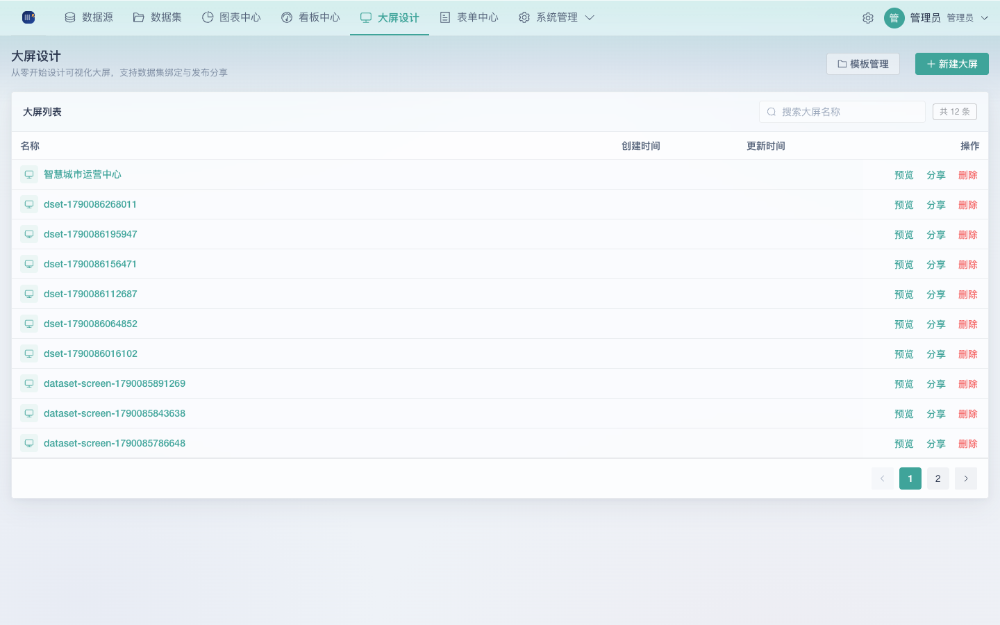
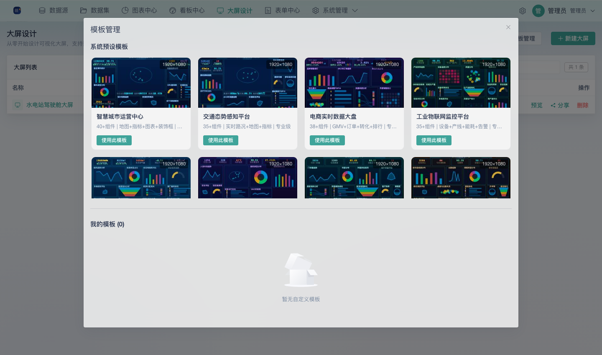
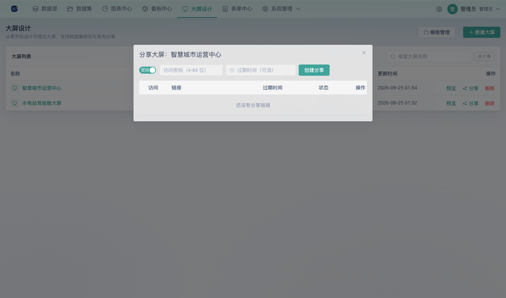

# 07 大屏设计器使用手册

面向需要搭建可视化数据大屏的用户。大屏设计器提供**自由画布**式的大屏编排能力：从组件库拖拽图表/文本/媒体/装饰组件，自由摆放、缩放，绑定静态数据 / API 或数据集，一键保存、预览与分享。与「看板中心」的 flow-grid 自动流式排版不同，大屏为**像素级自由布局**，适合数据可视化展示墙、领导驾驶舱、汇报大屏等场景。

> 前置：需要具备 `big_screen` 相关权限（内置角色中「看板编辑者」以上角色默认拥有，详见文末权限说明）。数据图表请先通过「图表中心」或大屏组件自身的「数据集」数据源绑定。

## 一、入口与界面总览

登录后左侧一级菜单 **大屏设计** 位于「看板中心」与「表单中心」之间，点击进入大屏列表页。

| 界面区域 | 用途 |
|------|------|
| 顶部工具栏 | 新建大屏 / 模板管理 / 搜索 |
| 大屏列表 | 每行含名称、创建时间、更新时间；操作列提供 预览 / 分享 / 删除 |
| 设计器 | 进入单个大屏的编辑画布（见下节） |

## 二、新建大屏

大屏列表页点击「**新建大屏**」：

- 方式一：**空白创建** —— 填写大屏名称后直接进入设计器（空画布）
- 方式二：**从模板创建** —— 点「模板管理」选择一套预设模板或「我的模板」，填写名称后基于模板进入设计器

> 从模板创建会把模板的画布尺寸、背景与全部组件复制到新大屏，进入设计器即可直接调整。

## 三、模板管理

「**模板管理**」弹窗分为两个标签页：

### 3.1 系统预设模板

内置多套 **1920×1080 自适应**大屏模板，覆盖多个业务场景，均可二次编辑：

| 类别 | 模板 |
|------|------|
| 产业园区 | 智慧园区、智慧停车场、数字孪生 |
| 城市治理 | 智慧城市、交通信号、应急指挥、政府政务 |
| 行业驾驶舱 | 交通大数据、电商、IoT、能源、智慧社区、物流、健康、教育、企业 |
| 数据可视化 | DataV 建设工程、DataV 管理台、DataV 电子档案 |

每套模板以缩略图 + 名称 + 画布尺寸（如 1920×1080）展示，点「**使用此模板**」按提示填写新大屏名称后进入设计器。

### 3.2 我的模板

当设计器里把大屏另存为模板后（见 §7.4），此处会列出；每个模板支持「使用」（据此创建新大屏）与「删除」。

> 模板按创建者隔离：只能看到并操作自己的模板；管理员可操作全部。

## 四、设计器界面

进入某大屏的 `/big-screen/design/:id`，界面自上而下、由左至右分为：

| 区域 | 组成 | 作用 |
|------|------|------|
| 顶栏 | 返回 / 大屏名称 / 撤销重做 / PC-移动端预览切换 / 自适应-固定模式切换 / 预览 / 保存（含「另存为模板」下拉） | 全局操作与保存 |
| 左栏 | 「组件」与「图层」两个标签页 | 组件库拖拽入库；图层树管理组件层次 |
| 画布 | 居中设计区 + 右下角缩放控制与 JSON 导入导出 | 自由摆放组件、选中、缩放、对齐 |
| 右栏 | 「画布 / 移动端 / 数据 / 属性 / 代码 / 样式」折叠面板 | 页面级配置与选中组件的详细配置 |
| 底栏 | 缩放/画布尺寸/组件数/选中数 + 快捷键按钮 | 状态总览 |

## 五、组件库（左栏「组件」）

组件按类别分组，从面板**拖拽到画布**即完成添加：

| 类别 | 组件 |
|------|------|
| 可视化图表 | 柱形图（单柱/簇状/堆积/折线混合/分组堆积/百分比堆积/瀑布）、条形图（单条/簇状/堆积/百分比/混合/正负/动态排序）、折线图与面积图（单线/多线/堆积面积/平滑等）、3D 地球 |
| 表格 | 普通表格、轮播列表、排名列表 |
| 文本 | 静态文本、数据文本、数字翻牌器、时间文本、跑马灯 |
| 媒体 | 静态图片、轮播图片、视频、iframe 嵌入 |
| DataV 装饰 | 边框、背景等装饰组件，用于给大屏加外框与氛围 |

> 另有代码型组件（自定义 HTML/CSS/JS，见 §9.4）与其他扩展组件，以实际组件面板为准。

## 六、画布操作

### 6.1 画布与缩放

- 右下角浮层按钮：`−` / 百分比 / `+` / **↺ 复位**（回到 100%）；也可 `Ctrl/Cmd + 滚轮` 缩放（10%–500%）
- 快捷键：`Ctrl/Cmd + 0` 复位、`Ctrl/Cmd + =`/`-` 放大缩小
- 空白处按住拖动平移视野；缩放后的「实际缩放」实时显示在底栏

### 6.2 选中组件

- 点击组件选中；`Shift/Ctrl` 点击多选；空白处拉框**框选**；`Ctrl/Cmd + A` 全选
- `Tab` 循环切换选中组件；`Esc` 取消选中

### 6.3 拖动与缩放

- 拖动移动位置（可吸附对齐）；选中后拖 8 个方向手柄缩放（最小 20px）
- 移动 / 缩放结束自动进入撤销栈，可 `Ctrl/Cmd + Z` 回退

### 6.4 对齐辅助

- **吸附线**：组件边缘与中心线、画布边缘间距小于阈值时显示参考线并吸附
- **右键菜单**：复制 / 剪切 / 粘贴 / 复制组件、置顶/置底/上移/下移一层、锁定/解锁、显示/隐藏，以及「对齐」子菜单（左 / 右 / 顶 / 底 / 水平居中 / 垂直居中）

### 6.5 图层（左栏「图层」）

图层树集中管理全部组件：可点击选中，提供 上移/下移/置顶 等层次调整、显示/隐藏（眼睛）、锁定（不再可被选中与移动）与删除，层次变化实时反映到画布。

### 6.6 快捷键全集

在设计器内点击底栏「**快捷键**」可随时查看完整列表（Windows / Mac 双语），常用如下：

| 功能 | Windows | Mac |
|------|---------|-----|
| 撤销 / 重做 | Ctrl+Z / Ctrl+Shift+Z | ⌘Z / ⌘⇧Z |
| 复制 / 剪切 / 粘贴 | Ctrl+C / Ctrl+X / Ctrl+V | ⌘C / ⌘X / ⌘V |
| 复制并粘贴 | Ctrl+D | ⌘D |
| 全选 | Ctrl+A | ⌘A |
| 删除选中 | Delete / Backspace | ⌫ |
| 微调位置（1px / 10px） | 方向键 / Ctrl+方向键 | 方向键 / ⌘+方向键 |
| 锁定/解锁 | Ctrl+L | ⌘L |
| 显示/隐藏 | Ctrl+H | ⌘H |
| 保存 | Ctrl+S | ⌘S |
| 画布复位 / 缩放 | Ctrl+0 / Ctrl± | ⌘0 / ⌘± |

## 七、保存、预览与导出

### 7.1 保存

顶栏「**保存**」按钮为主按钮（主点击直接保存当前大屏，快捷键 `Ctrl/Cmd + S`）。按钮右侧下拉提供「**另存为模板**」。

### 7.2 预览模式与布局模式

顶栏中段提供两组快速切换：

- **PC / 移动端**：切换设计画布视口（PC 1920×1080 / 移动端 375×812），用于在不同设备形态下排版预览；右栏「移动端」面板仅在移动端视口下显示
- **自适应 / 固定**：布局模式——自适应在大屏展示时随屏幕等比缩放铺满；固定则以画布原始分辨率呈现

切换实时生效并可保存。

### 7.3 预览与打开

- 设计器顶栏「预览」在新标签页打开该大屏预览页（见 §8）
- 设计器内可随时退出返回大屏列表；未找到大屏时会自动跳转回列表

### 7.4 另存为模板

在保存下拉中选择「**另存为模板**」→ 填写模板名称 → 保存后出现在大屏列表「模板管理 → 我的模板」中，可用于创建同款新大屏。

### 7.5 导入 / 导出 JSON

画布右下角缩放控制旁的「↑ 导入 JSON」与「↓ 导出 JSON」：导出当前大屏完整配置（配置 + 组件 JSON）到本地，便于备份、迁移或在他处导入重建。

## 八、预览与分享

### 8.1 预览页

- 设计器顶栏「预览」或大屏列表「操作 → 预览」进入 `/big-screen/preview/:id` 预览页
- 预览页顶栏提供「**全屏预览**」（浏览器全屏）与 **PC端 / 移动端** 视口切换，并按画布布局模式（自适应/固定）呈现缩放，展示缩放比例
- 预览为**只读**展示，不进入编辑；返回设计器需回到大屏列表或刷新前页

### 8.2 分享大屏

大屏列表「操作 → 分享」打开分享弹窗：

- **公开访问 / 密码门禁**：默认需设置访问密码（4–64 位）；关闭「密码」开关则生成无需密码的公开链接
- **过期时间**：可选设置过期时间，过期后分享链接失效
- **分享列表管理**：可查看访问方式（公开/密码）、过期时间，支持复制链接、启停与删除分享

分享完成后得到链接，形如 `/big-screen/share/{token}`。**无需登录**即可打开。

### 8.3 公开分享页

- 公开访问：打开即看到大屏（只读）
- 密码访问：先输入密码，验证通过后展示；验证有频率限制（10 次 / 15 分钟）
- 分享被停用或过期时提示对应文案；登录用户在分享页右上角可「返回系统」回到平台

## 九、配置面板（右栏）

右栏为折叠面板，**页面级配置**与**选中组件的配置**共用此栏：

### 9.1 画布

- 画布尺寸：提供常用预设（如 1920×1080 等），也可自定义宽高（宽高范围 100–7680 / 100–4320）
- 背景：纯色 / 渐变，或上传背景图片
- 布局模式：自适应（跟随屏幕等比缩放） / 固定

### 9.2 移动端（仅移动端预览模式显示）

移动设备视口（如 375×812）下的大屏布局适配设置，用于移动端预览与分享。

### 9.3 数据

选中组件的数据来源，三种模式：

| 模式 | 说明 |
|------|------|
| 静态数据 | 直接编辑 JSON 数据，适合固定展示 |
| API 请求 | 配置 URL / 方法 / 请求头 / 请求体 / **响应路径**（从响应中提取字段）/ 字段映射；支持自动「刷新秒数」定时刷新与手动刷新 |
| 数据集 | 选择已构建的数据集，弹窗配置 **维度 + 指标**（含聚合方式：求和/计数/去重计数/最大/最小等，日期粒度：日/月/年，排序与显示条数），无需写 SQL 即可取数 |

> 图表组件通过「数据」面板绑定数据后即在大屏上渲染；切换数据模式会实时刷新预览。

### 9.4 属性 / 样式 / 代码

- **属性**：选中组件的独占配置（如文本组件的内容与字号、图表的标题开关等），随组件类型变化
- **样式**：通用外观——背景、边框、阴影等
- **代码**：仅部分代码型组件（自定义 HTML/CSS/JS，如 `custom-chart`）显示，以代码编辑方式实现完全自定义内容

## 十、权限说明

大屏功能使用五个权限点，内置角色的拥有情况：

| 权限点 | 说明 | admin | analyst | editor | viewer |
|--------|------|:---:|:---:|:---:|:---:|
| `big_screen:read` | 查看大屏 | ✅ | ✅ | ✅ | ❌ |
| `big_screen:create` | 创建大屏/模板 | ✅ | ✅ | ✅ | ❌ |
| `big_screen:update` | 编辑大屏 | ✅ | ✅ | ✅ | ❌ |
| `big_screen:delete` | 删除大屏/模板 | ✅ | ✅ | ✅ | ❌ |
| `big_screen:share` | 分享大屏 | ✅ | ✅ | ✅ | ❌ |

- **资源隔离**：大屏 / 模板/ 分享均按 owner 隔离——默认只能看到并操作自己的资源（编辑/删除页面按权限校验），管理员可访问全部
- **查看者（viewer）**：不拥有任何 `big_screen` 权限，无法访问大屏
- 自定义角色可在「系统管理 → 角色管理」中按需勾选以上权限点

## 十一、常见操作速查

| 我要… | 操作 |
|-------|------|
| 新建一个空大屏 | 大屏设计 → 新建大屏 → 填写名称 |
| 参考现成风格快速开始 | 大屏设计 → 模板管理 → 系统预设模板 → 使用此模板 |
| 把组件放进大屏 | 左栏「组件」→ 拖拽到画布 |
| 让图表显示真实数据 | 选组件 → 右栏「数据」→ 数据集/API/静态数据 |
| 多组件对齐 | 多选后右键 → 对齐 → 选择对齐方式 |
| 保存当前大屏 | 顶栏保存，或 Ctrl/Cmd + S |
| 把大屏存成我的模板 | 保存下拉 → 另存为模板 → 填写名称 |
| 把大屏发给别人只看 | 大屏列表 → 操作 → 分享 → 设置密码/公开 → 复制链接 |
| 大屏数据定时刷新 | 选组件 → 右栏「数据」→ API 请求 → 设置刷新秒数 |
| 备份大屏配置 | 画布右下角「↓ 导出 JSON」 |