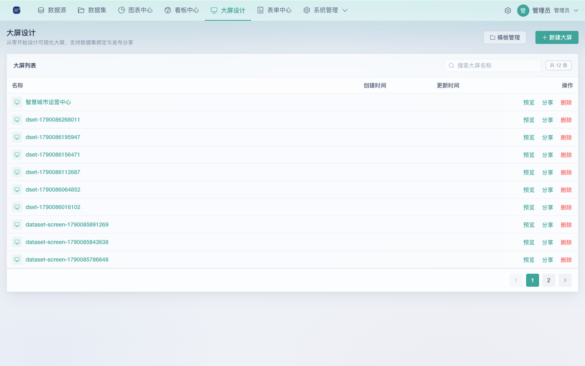
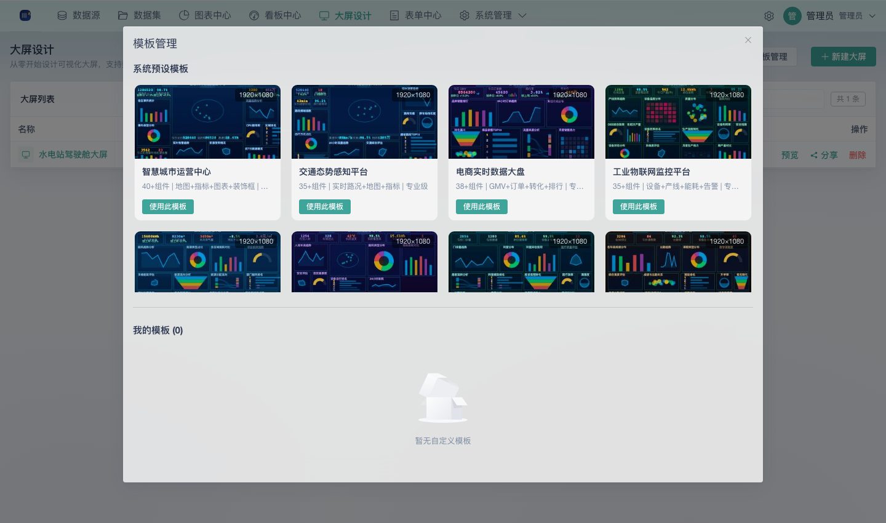
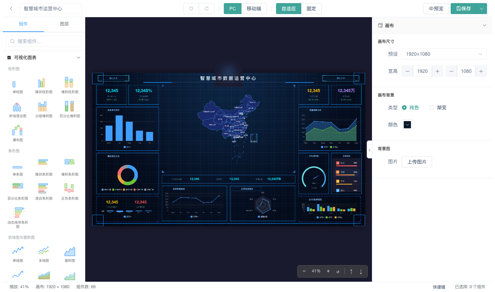
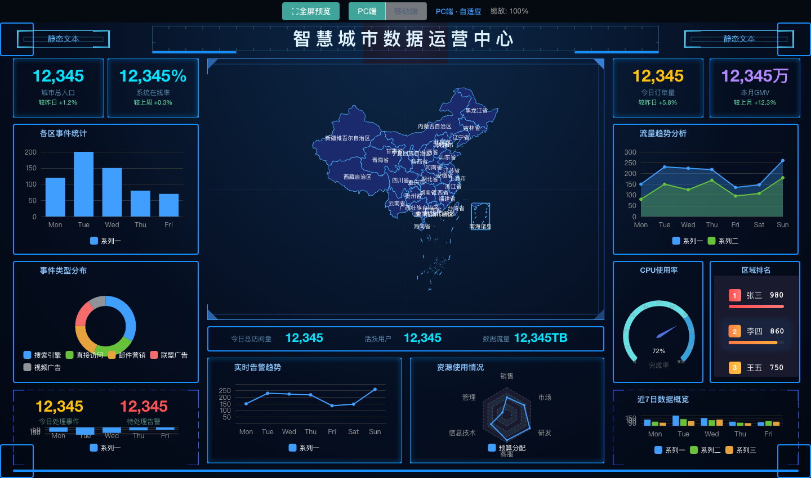
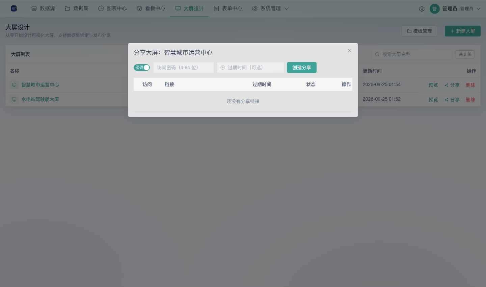

# 07 大屏设计器使用手册

面向需要搭建可视化数据大屏的用户。大屏设计器提供**自由画布**式的大屏编排能力：从组件库拖拽图表/文本/媒体/装饰组件，自由摆放、缩放，绑定静态数据 / API 或数据集，一键保存、预览与分享。与「看板中心」的 flow-grid 自动流式排版不同，大屏为**像素级自由布局**，适合数据可视化展示墙、领导驾驶舱、汇报大屏等场景。

> 前置：需要具备 `big_screen` 相关权限（内置角色中「看板编辑者」以上角色默认拥有，详见文末权限说明）。数据图表请先通过「图表中心」或大屏组件自身的「数据集」数据源绑定。

# 07 Big-screen Designer Manual

For users who need to build visual data big screens. The big-screen designer gives you **free-canvas** composition: drag charts, text, media and decoration components out of the component library, place and resize them anywhere, bind static data, an API or a dataset, then save, preview and share in one click. Unlike the flow-grid auto-layout of "Dashboards", a big screen is a **pixel-level free layout** — a good fit for data-visualization video walls, executive cockpits and presentation screens.

> **Prerequisite**: you need the `big_screen` permissions (built-in roles from "Dashboard Editor" (`看板编辑者`) upwards have them by default — see the permissions section at the end). Bind chart data first through "Charts", or through a component's own "Dataset" data source.

## 一、入口与界面总览

登录后左侧一级菜单 **大屏设计** 位于「看板中心」与「表单中心」之间，点击进入大屏列表页。

| 界面区域 | 用途 |
|------|------|
| 顶部工具栏 | 新建大屏 / 模板管理 / 搜索 |
| 大屏列表 | 每行含名称、创建时间、更新时间；操作列提供 预览 / 分享 / 删除 |
| 设计器 | 进入单个大屏的编辑画布（见下节） |

## 1. Entry and interface overview

After signing in, the **Big screens** entry in the left sidebar sits between "Dashboards" and "Forms". Click it to open the big screen list.

| UI area | Purpose |
|------|------|
| Top toolbar | New Screen / Template Manager / search |
| Screen list | Each row shows the name, creation time and update time; the Actions column offers Preview / Share / Delete |
| Designer | The editing canvas for a single big screen (see the next section) |

## 二、新建大屏

大屏列表页点击「**新建大屏**」：

- 方式一：**空白创建** —— 填写大屏名称后直接进入设计器（空画布）
- 方式二：**从模板创建** —— 点「模板管理」选择一套预设模板或「我的模板」，填写名称后基于模板进入设计器

> 从模板创建会把模板的画布尺寸、背景与全部组件复制到新大屏，进入设计器即可直接调整。

## 2. Creating a big screen

On the screen list page, click "**New Screen**":

- Option 1: **Start from scratch** — enter a screen name and go straight into the designer with an empty canvas
- Option 2: **Create from a template** — click "Template Manager", pick a preset template or one of "My Templates", enter a name, and enter the designer with that template as the starting point

> **Note**: creating from a template copies the template's canvas size, background and every component into the new screen, so you can start adjusting as soon as you enter the designer.

## 三、模板管理

「**模板管理**」弹窗分为两个标签页：

## 3. Template management

The "**Template Manager**" dialog has two tabs:

### 3.1 系统预设模板

内置多套 **1920×1080 自适应**大屏模板，覆盖多个业务场景，均可二次编辑：

| 类别 | 模板 |
|------|------|
| 产业园区 | 智慧园区、智慧停车场、数字孪生 |
| 城市治理 | 智慧城市、交通信号、应急指挥、政府政务 |
| 行业驾驶舱 | 交通大数据、电商、IoT、能源、智慧社区、物流、健康、教育、企业 |
| 数据可视化 | DataV 建设工程、DataV 管理台、DataV 电子档案 |

每套模板以缩略图 + 名称 + 画布尺寸（如 1920×1080）展示，点「**使用此模板**」按提示填写新大屏名称后进入设计器。

### 3.1 System preset templates

Several **1920×1080 adaptive** big-screen templates ship with the product, covering a range of business scenarios; all of them can be edited further:

| Category | Templates |
|------|------|
| Industrial parks | Smart Park Operations Platform, Smart Parking Platform, Digital Twin Visualization Platform |
| City governance | Smart City Operations Center, Smart Traffic Signal Control, Emergency Command Center, Government Services Data Screen |
| Industry cockpits | Traffic Perception Platform, E-commerce Realtime Dashboard, Industrial IoT Monitoring Platform, Smart Energy Management Platform, Smart Community Platform, Smart Logistics Dispatch Center, Smart Healthcare Data Center, Smart Campus Platform, Business Management Cockpit |
| Data visualization | Construction Maintenance Data, MEP Operations Desk, MEP Equipment Archive |

Each template is shown as a thumbnail plus its name and canvas size (e.g. 1920×1080). Click "**Use this template**", enter a name for the new big screen when prompted, and you go straight into the designer.

### 3.2 我的模板

当设计器里把大屏另存为模板后（见 §7.4），此处会列出；每个模板支持「使用」（据此创建新大屏）与「删除」。

> 模板按创建者隔离：只能看到并操作自己的模板；管理员可操作全部。

### 3.2 My templates

Once you have saved a big screen as a template from the designer (see §7.4), it shows up here; every template supports "Use" (to create a new big screen from it) and "Delete".

> **Note**: templates are isolated by creator — you can only see and operate your own templates; administrators can operate all of them.

## 四、设计器界面

进入某大屏的 `/big-screen/design/:id`，界面自上而下、由左至右分为：

| 区域 | 组成 | 作用 |
|------|------|------|
| 顶栏 | 返回 / 大屏名称 / 撤销重做 / PC-移动端预览切换 / 自适应-固定模式切换 / 预览 / 保存（含「另存为模板」下拉） | 全局操作与保存 |
| 左栏 | 「组件」与「图层」两个标签页 | 组件库拖拽入库；图层树管理组件层次 |
| 画布 | 居中设计区 + 右下角缩放控制与 JSON 导入导出 | 自由摆放组件、选中、缩放、对齐 |
| 右栏 | 「画布 / 移动端 / 数据 / 属性 / 代码 / 样式」折叠面板 | 页面级配置与选中组件的详细配置 |
| 底栏 | 缩放/画布尺寸/组件数/选中数 + 快捷键按钮 | 状态总览 |

## 4. Designer interface

Open a big screen at `/big-screen/design/:id` and the interface is divided, top to bottom and left to right, into:

| Area | Contents | Purpose |
|------|------|------|
| Top bar | Back / screen name / undo & redo / PC–mobile preview toggle / adaptive–fixed mode toggle / Preview / Save (with a "Save as Template" dropdown) | Global actions and saving |
| Left column | Two tabs, "Components" and "Layers" | Drag components in from the library; the layer tree manages component stacking order |
| Canvas | Centred design area, plus zoom controls and JSON import/export in the bottom-right corner | Place components freely, select, resize and align them |
| Right column | Collapsible panels: "Canvas / Mobile / Data / Properties / Code / Style" | Page-level configuration plus the detailed configuration of the selected component |
| Bottom bar | Zoom / canvas size / component count / selection count, plus a Shortcuts button | At-a-glance status |

## 五、组件库（左栏「组件」）

组件按类别分组，从面板**拖拽到画布**即完成添加：

| 类别 | 组件 |
|------|------|
| 可视化图表 | 柱形图（单柱/簇状/堆积/折线混合/分组堆积/百分比堆积/瀑布）、条形图（单条/簇状/堆积/百分比/混合/正负/动态排序）、折线图与面积图（单线/多线/堆积面积/平滑等）、3D 地球 |
| 表格 | 普通表格、轮播列表、排名列表 |
| 文本 | 静态文本、数据文本、数字翻牌器、时间文本、跑马灯 |
| 媒体 | 静态图片、轮播图片、视频、iframe 嵌入 |
| DataV 装饰 | 边框、背景等装饰组件，用于给大屏加外框与氛围 |

> 另有代码型组件（自定义 HTML/CSS/JS，见 §9.4）与其他扩展组件，以实际组件面板为准。

## 5. Component library (the "Components" tab on the left)

Components are grouped by category; drag one from the panel **onto the canvas** to add it:

| Category | Components |
|------|------|
| Visual Charts | Bar Charts (Single Bar / Clustered Bar / Stacked Bar / Bar & Line Mix / Grouped Stacked Bar / Percent Stacked Bar / Waterfall), Horizontal Bar Charts (Single Horizontal Bar / Clustered Horizontal Bar / Stacked Horizontal Bar / Percent Horizontal Bar / Mixed Horizontal Bar / Positive & Negative Bar / Dynamic Ranked Bar), Line & Area Charts (Single Line / Multi Line / Stacked Area / Smooth Line, etc.), 3D Globe |
| Tables | Standard Table, Carousel List, Rank List |
| Text | Static Text, Data Text, Number Flip, Time Text, Marquee Text |
| Media | Static Image, Carousel Image, Video, Embedded Page (iframe) |
| DataV Decorations | Decorative components such as Borders and backgrounds, used to frame the big screen and set the mood |

> **Note**: there are also code-based components (custom HTML/CSS/JS, see §9.4) and other extended components — the actual component panel is the source of truth.

## 六、画布操作

## 6. Canvas operations

### 6.1 画布与缩放

- 右下角浮层按钮：`−` / 百分比 / `+` / **↺ 复位**（回到 100%）；也可 `Ctrl/Cmd + 滚轮` 缩放（10%–500%）
- 快捷键：`Ctrl/Cmd + 0` 复位、`Ctrl/Cmd + =`/`-` 放大缩小
- 空白处按住拖动平移视野；缩放后的「实际缩放」实时显示在底栏

### 6.1 Canvas and zoom

- Floating buttons in the bottom-right corner: `−` / percentage / `+` / **↺ Reset view** (back to 100%); you can also zoom with `Ctrl/Cmd +` mouse wheel (10%–500%)
- Shortcuts: `Ctrl/Cmd + 0` to reset, `Ctrl/Cmd + =`/`-` to zoom in and out
- Press and drag on empty space to pan the viewport; the effective zoom is shown live in the bottom bar

### 6.2 选中组件

- 点击组件选中；`Shift/Ctrl` 点击多选；空白处拉框**框选**；`Ctrl/Cmd + A` 全选
- `Tab` 循环切换选中组件；`Esc` 取消选中

### 6.2 Selecting components

- Click a component to select it; `Shift/Ctrl`-click to multi-select; drag a box on empty space to **rubber-band select**; `Ctrl/Cmd + A` to select all
- `Tab` cycles through the selected components; `Esc` clears the selection

### 6.3 拖动与缩放

- 拖动移动位置（可吸附对齐）；选中后拖 8 个方向手柄缩放（最小 20px）
- 移动 / 缩放结束自动进入撤销栈，可 `Ctrl/Cmd + Z` 回退

### 6.3 Moving and resizing

- Drag to change position (with snapping); once selected, drag any of the 8 directional handles to resize (minimum 20px)
- Finishing a move or a resize automatically pushes an undo-stack entry, so you can roll it back with `Ctrl/Cmd + Z`

### 6.4 对齐辅助

- **吸附线**：组件边缘与中心线、画布边缘间距小于阈值时显示参考线并吸附
- **右键菜单**：复制 / 剪切 / 粘贴 / 复制组件、置顶/置底/上移/下移一层、锁定/解锁、显示/隐藏，以及「对齐」子菜单（左 / 右 / 顶 / 底 / 水平居中 / 垂直居中）

### 6.4 Alignment aids

- **Snap guides**: when the gap between a component's edges or centre lines and the canvas edges falls below a threshold, guide lines appear and the component snaps to them
- **Context menu**: Copy / Cut / Paste / Duplicate Component, Bring to Front / Send to Back / Move Up One Layer / Move Down One Layer, Lock / Unlock, Show / Hide, plus an "Align" submenu (Left / Right / Top / Bottom / Center Horizontally / Center Vertically)

### 6.5 图层（左栏「图层」）

图层树集中管理全部组件：可点击选中，提供 上移/下移/置顶 等层次调整、显示/隐藏（眼睛）、锁定（不再可被选中与移动）与删除，层次变化实时反映到画布。

### 6.5 Layers (the "Layers" tab on the left)

The layer tree manages all components in one place: click to select, reorder with Move Up / Move Down / Bring to Front, show or hide (the eye icon), Lock (so the component can no longer be selected or moved) and Delete. Layer changes are reflected on the canvas immediately.

### 6.6 快捷键全集

在设计器内点击底栏「**快捷键**」可随时查看完整列表（Windows / Mac 双语），常用如下：

| 功能 | Windows | Mac |
|------|---------|-----|
| 撤销 / 重做 | Ctrl+Z / Ctrl+Shift+Z | ⌘Z / ⌘⇧Z |
| 复制 / 剪切 / 粘贴 | Ctrl+C / Ctrl+X / Ctrl+V | ⌘C / ⌘X / ⌘V |
| 复制并粘贴 | Ctrl+D | ⌘D |
| 全选 | Ctrl+A | ⌘A |
| 删除选中 | Delete / Backspace | ⌫ |
| 微调位置（1px / 10px） | 方向键 / Ctrl+方向键 | 方向键 / ⌘+方向键 |
| 锁定/解锁 | Ctrl+L | ⌘L |
| 显示/隐藏 | Ctrl+H | ⌘H |
| 保存 | Ctrl+S | ⌘S |
| 画布复位 / 缩放 | Ctrl+0 / Ctrl± | ⌘0 / ⌘± |

### 6.6 Full shortcut list

Click "**Shortcuts**" in the bottom bar at any time to see the complete list (Windows / Mac, bilingual). The common ones are:

| Action | Windows | Mac |
|---------|---------|-----|
| Undo / Redo | Ctrl+Z / Ctrl+Shift+Z | ⌘Z / ⌘⇧Z |
| Copy / Cut / Paste | Ctrl+C / Ctrl+X / Ctrl+V | ⌘C / ⌘X / ⌘V |
| Copy and paste | Ctrl+D | ⌘D |
| Select all | Ctrl+A | ⌘A |
| Delete selection | Delete / Backspace | ⌫ |
| Nudge position (1px / 10px) | 方向键 / Ctrl+方向键 | 方向键 / ⌘+方向键 |
| Lock / unlock | Ctrl+L | ⌘L |
| Show / hide | Ctrl+H | ⌘H |
| Save | Ctrl+S | ⌘S |
| Reset canvas / zoom | Ctrl+0 / Ctrl± | ⌘0 / ⌘± |

## 七、保存、预览与导出

## 7. Saving, previewing and exporting

### 7.1 保存

顶栏「**保存**」按钮为主按钮（主点击直接保存当前大屏，快捷键 `Ctrl/Cmd + S`）。按钮右侧下拉提供「**另存为模板**」。

### 7.1 Saving

The "**Save**" button in the top bar is the primary action (clicking it saves the current big screen directly; shortcut `Ctrl/Cmd + S`). The dropdown to its right offers "**Save as Template**".

### 7.2 预览模式与布局模式

顶栏中段提供两组快速切换：

- **PC / 移动端**：切换设计画布视口（PC 1920×1080 / 移动端 375×812），用于在不同设备形态下排版预览；右栏「移动端」面板仅在移动端视口下显示
- **自适应 / 固定**：布局模式——自适应在大屏展示时随屏幕等比缩放铺满；固定则以画布原始分辨率呈现

切换实时生效并可保存。

### 7.2 Preview mode and layout mode

The middle of the top bar offers two quick toggles:

- **PC / Mobile**: switches the design canvas viewport (PC 1920×1080 / Mobile 375×812) so you can lay out and preview for different device form factors; the "Mobile" panel in the right column is only shown in the mobile viewport
- **Adaptive / Fixed**: the layout mode — Adaptive scales proportionally with the screen to fill it when the big screen is displayed, while Fixed renders at the canvas's native resolution

Both switches take effect immediately and can be saved.

### 7.3 预览与打开

- 设计器顶栏「预览」在新标签页打开该大屏预览页（见 §8）
- 设计器内可随时退出返回大屏列表；未找到大屏时会自动跳转回列表

### 7.3 Previewing and opening

- "Preview" in the designer top bar opens that big screen's preview page in a new tab (see §8)
- You can leave the designer at any time to go back to the screen list; if the big screen cannot be found, it redirects to the list automatically

### 7.4 另存为模板

在保存下拉中选择「**另存为模板**」→ 填写模板名称 → 保存后出现在大屏列表「模板管理 → 我的模板」中，可用于创建同款新大屏。

### 7.4 Saving as a template

Pick "**Save as Template**" from the save dropdown → enter a template name → once saved it appears in the screen list under "Template Manager → My Templates", ready to create matching new big screens.

### 7.5 导入 / 导出 JSON

画布右下角缩放控制旁的「↑ 导入 JSON」与「↓ 导出 JSON」：导出当前大屏完整配置（配置 + 组件 JSON）到本地，便于备份、迁移或在他处导入重建。

### 7.5 Importing / exporting JSON

Next to the zoom controls in the bottom-right corner of the canvas are "↑ Import JSON" and "↓ Export JSON". Exporting writes the big screen's complete configuration (settings + component JSON) to your machine, which is handy for backups, migration, or rebuilding it elsewhere by importing.

## 八、预览与分享

## 8. Preview and sharing

### 8.1 预览页

- 设计器顶栏「预览」或大屏列表「操作 → 预览」进入 `/big-screen/preview/:id` 预览页
- 预览页顶栏提供「**全屏预览**」（浏览器全屏）与 **PC端 / 移动端** 视口切换，并按画布布局模式（自适应/固定）呈现缩放，展示缩放比例
- 预览为**只读**展示，不进入编辑；返回设计器需回到大屏列表或刷新前页

### 8.1 Preview page

- "Preview" in the designer top bar, or "Actions → Preview" in the screen list, opens the `/big-screen/preview/:id` preview page
- The preview page's top bar offers "**Fullscreen Preview**" (browser fullscreen) and a **PC / Mobile** viewport switch, and it applies the canvas layout mode (Adaptive / Fixed) to the scaling while showing the zoom percentage
- The preview is a **read-only** view and does not enter editing mode; to get back to the designer you return to the screen list or reload the previous page

### 8.2 分享大屏

大屏列表「操作 → 分享」打开分享弹窗：

- **公开访问 / 密码门禁**：默认需设置访问密码（4–64 位）；关闭「密码」开关则生成无需密码的公开链接
- **过期时间**：可选设置过期时间，过期后分享链接失效
- **分享列表管理**：可查看访问方式（公开/密码）、过期时间，支持复制链接、启停与删除分享

分享完成后得到链接，形如 `/big-screen/share/{token}`。**无需登录**即可打开。

### 8.2 Sharing a big screen

"Actions → Share" in the screen list opens the share dialog:

- **Public access / password gate**: an access password (4–64 characters) is required by default; turning the "Password" switch off produces a public link that needs no password
- **Expiry time**: optional — once it passes, the share link stops working
- **Share list management**: shows the access mode (public / password) and the expiry time, and lets you copy the link, enable or disable a share, and delete it

Once you are done you get a link of the form `/big-screen/share/{token}`. It opens **without signing in**.

### 8.3 公开分享页

- 公开访问：打开即看到大屏（只读）
- 密码访问：先输入密码，验证通过后展示；验证有频率限制（10 次 / 15 分钟）
- 分享被停用或过期时提示对应文案；登录用户在分享页右上角可「返回系统」回到平台

### 8.3 Public share page

- Public access: the big screen appears as soon as you open the link (read-only)
- Password access: you enter the password first and the screen is shown once it verifies; verification is rate limited (10 attempts / 15 minutes)
- If the share has been disabled or has expired, the matching message is shown; signed-in users can click "Back to system" in the top-right corner of the share page to return to the platform

## 九、配置面板（右栏）

右栏为折叠面板，**页面级配置**与**选中组件的配置**共用此栏：

## 9. Configuration panel (right column)

The right column is a set of collapsible panels shared by the **page-level configuration** and the **configuration of the selected component**:

### 9.1 画布

- 画布尺寸：提供常用预设（如 1920×1080 等），也可自定义宽高（宽高范围 100–7680 / 100–4320）
- 背景：纯色 / 渐变，或上传背景图片
- 布局模式：自适应（跟随屏幕等比缩放） / 固定

### 9.1 Canvas

- Canvas size: common presets are offered (such as 1920×1080), and you can also set a custom width and height (width range 100–7680 / height range 100–4320)
- Background: a solid color, a gradient, or an uploaded background image
- Layout mode: Adaptive (scales proportionally with the screen) / Fixed

### 9.2 移动端（仅移动端预览模式显示）

移动设备视口（如 375×812）下的大屏布局适配设置，用于移动端预览与分享。

### 9.2 Mobile (shown in mobile preview mode only)

Layout-adaptation settings for the big screen in a mobile device viewport (such as 375×812), used for mobile preview and sharing.

### 9.3 数据

选中组件的数据来源，三种模式：

| 模式 | 说明 |
|------|------|
| 静态数据 | 直接编辑 JSON 数据，适合固定展示 |
| API 请求 | 配置 URL / 方法 / 请求头 / 请求体 / **响应路径**（从响应中提取字段）/ 字段映射；支持自动「刷新秒数」定时刷新与手动刷新 |
| 数据集 | 选择已构建的数据集，弹窗配置 **维度 + 指标**（含聚合方式：求和/计数/去重计数/最大/最小等，日期粒度：日/月/年，排序与显示条数），无需写 SQL 即可取数 |

> 图表组件通过「数据」面板绑定数据后即在大屏上渲染；切换数据模式会实时刷新预览。

### 9.3 Data

The data source of the selected component — three modes:

| Mode | Description |
|------|------|
| Static Data | Edit the JSON data directly; best for fixed content |
| API Request | Configure the URL / method / request headers / request body / **Response Path** (the field to extract from the response) / field mapping; supports automatic timed refresh via "Refresh (s)" as well as manual refresh |
| Dataset | Pick a dataset you have already built and configure **dimensions + metrics** in the dialog (including the aggregation: sum / count / distinct count / max / min, the date granularity: day / month / year, sorting and the row limit) — you can pull data without writing any SQL |

> **Note**: once a chart component is bound through the "Data" panel it renders on the big screen; switching data mode refreshes the preview immediately.

### 9.4 属性 / 样式 / 代码

- **属性**：选中组件的独占配置（如文本组件的内容与字号、图表的标题开关等），随组件类型变化
- **样式**：通用外观——背景、边框、阴影等
- **代码**：仅部分代码型组件（自定义 HTML/CSS/JS，如 `custom-chart`）显示，以代码编辑方式实现完全自定义内容

### 9.4 Properties / Style / Code

- **Properties**: configuration specific to the selected component (such as a text component's content and font size, a chart's title toggle), varying with the component type
- **Style**: appearance shared by everything — background, border, shadow, and so on
- **Code**: shown only for some code-based components (custom HTML/CSS/JS, such as `custom-chart`), letting you implement fully custom content by editing code

## 十、权限说明

大屏功能使用五个权限点，内置角色的拥有情况：

| 权限点 | 说明 | admin | analyst | editor | viewer |
|--------|------|:---:|:---:|:---:|:---:|
| `big_screen:read` | 查看大屏 | ✅ | ✅ | ✅ | ❌ |
| `big_screen:create` | 创建大屏/模板 | ✅ | ✅ | ✅ | ❌ |
| `big_screen:update` | 编辑大屏 | ✅ | ✅ | ✅ | ❌ |
| `big_screen:delete` | 删除大屏/模板 | ✅ | ✅ | ✅ | ❌ |
| `big_screen:share` | 分享大屏 | ✅ | ✅ | ✅ | ❌ |

- **资源隔离**：大屏 / 模板/ 分享均按 owner 隔离——默认只能看到并操作自己的资源（编辑/删除页面按权限校验），管理员可访问全部
- **查看者（viewer）**：不拥有任何 `big_screen` 权限，无法访问大屏
- 自定义角色可在「系统管理 → 角色管理」中按需勾选以上权限点

## 10. Permissions

Big-screen features use five permission points. Here is which built-in roles have them:

| Permission | Description | admin | analyst | editor | viewer |
|--------|------|:---:|:---:|:---:|:---:|
| `big_screen:read` | View big screens | ✅ | ✅ | ✅ | ❌ |
| `big_screen:create` | Create big screens / templates | ✅ | ✅ | ✅ | ❌ |
| `big_screen:update` | Edit big screens | ✅ | ✅ | ✅ | ❌ |
| `big_screen:delete` | Delete big screens / templates | ✅ | ✅ | ✅ | ❌ |
| `big_screen:share` | Share big screens | ✅ | ✅ | ✅ | ❌ |

- **Resource isolation**: big screens, templates and shares are all isolated by owner — by default you can only see and operate your own resources (the edit and delete pages check permissions), while administrators can reach everything
- **Viewer**: holds no `big_screen` permission at all and cannot access big screens
- Custom roles can tick any of the permission points above in "Administration → Roles"

## 十一、常见操作速查

| 我要… | 操作 |
|-------|------|
| 新建一个空大屏 | 大屏设计 → 新建大屏 → 填写名称 |
| 参考现成风格快速开始 | 大屏设计 → 模板管理 → 系统预设模板 → 使用此模板 |
| 把组件放进大屏 | 左栏「组件」→ 拖拽到画布 |
| 让图表显示真实数据 | 选组件 → 右栏「数据」→ 数据集/API/静态数据 |
| 多组件对齐 | 多选后右键 → 对齐 → 选择对齐方式 |
| 保存当前大屏 | 顶栏保存，或 Ctrl/Cmd + S |
| 把大屏存成我的模板 | 保存下拉 → 另存为模板 → 填写名称 |
| 把大屏发给别人只看 | 大屏列表 → 操作 → 分享 → 设置密码/公开 → 复制链接 |
| 大屏数据定时刷新 | 选组件 → 右栏「数据」→ API 请求 → 设置刷新秒数 |
| 备份大屏配置 | 画布右下角「↓ 导出 JSON」 |

## 11. Quick reference

| I want to… | Steps |
|-------|------|
| Create an empty big screen | Big screens → New Screen → enter a name |
| Start quickly from a ready-made style | Big screens → Template Manager → System Preset Templates → Use this template |
| Put a component on the big screen | "Components" in the left column → drag it onto the canvas |
| Make a chart show real data | Select the component → "Data" in the right column → Dataset / API / Static Data |
| Align several components | Multi-select → right-click → Align → pick an alignment |
| Save the current big screen | Save in the top bar, or Ctrl/Cmd + S |
| Save a big screen as one of my templates | Save dropdown → Save as Template → enter a name |
| Send a big screen to someone for viewing only | Screen list → Actions → Share → set a password / make it public → Copy link |
| Refresh big-screen data on a schedule | Select the component → "Data" in the right column → API Request → set Refresh (s) |
| Back up a big screen's configuration | "↓ Export JSON" in the bottom-right corner of the canvas |
