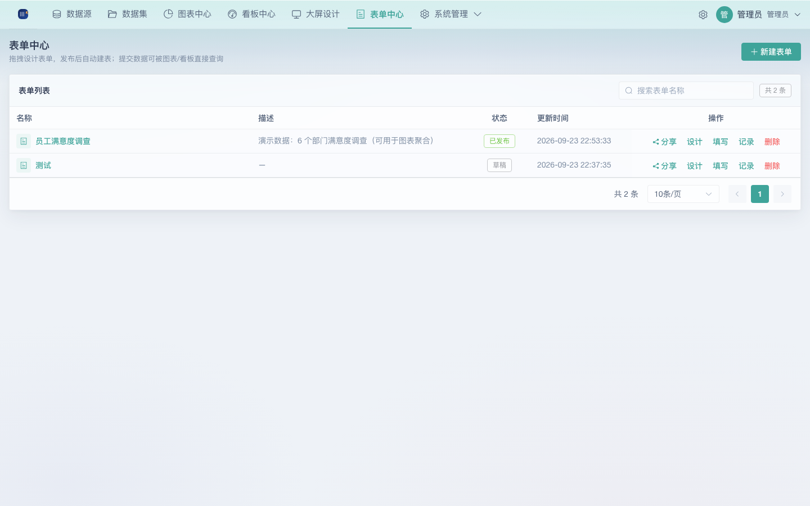
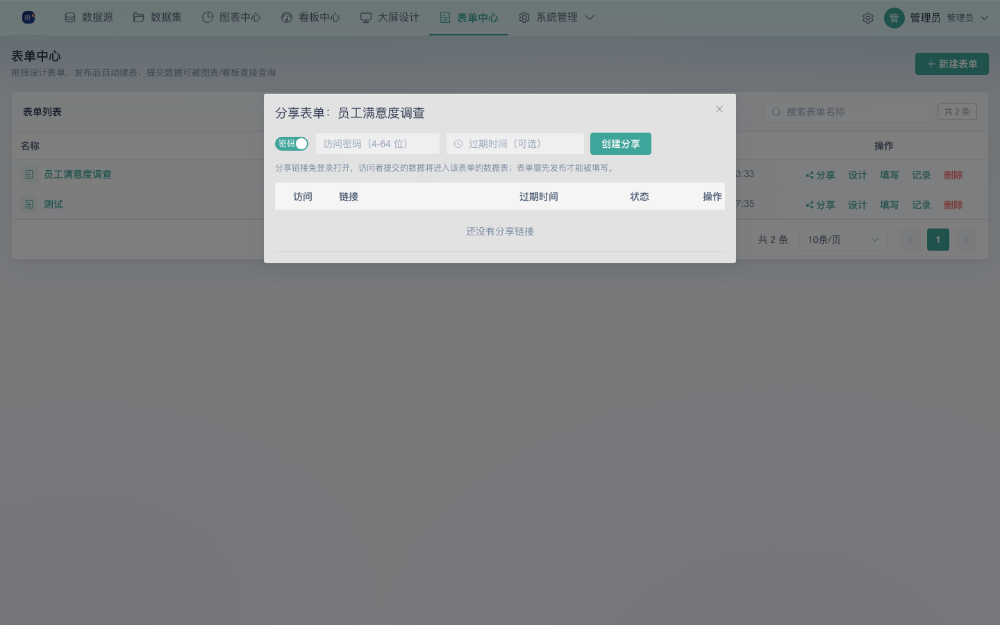
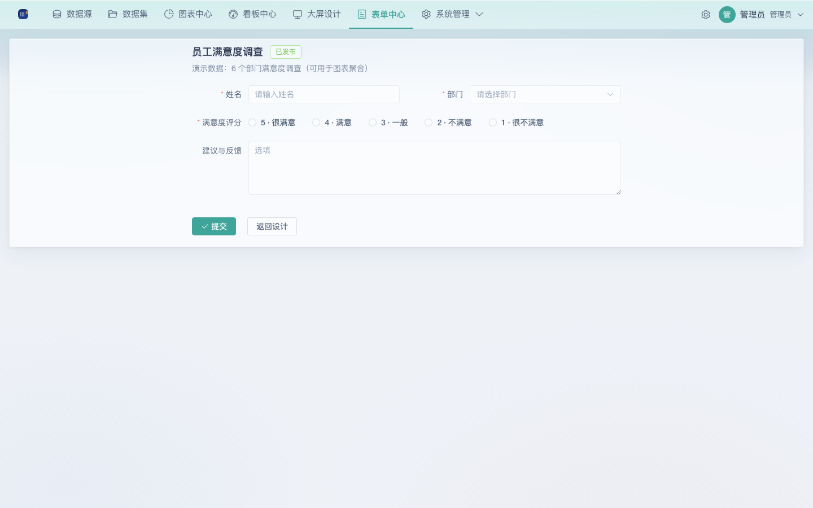
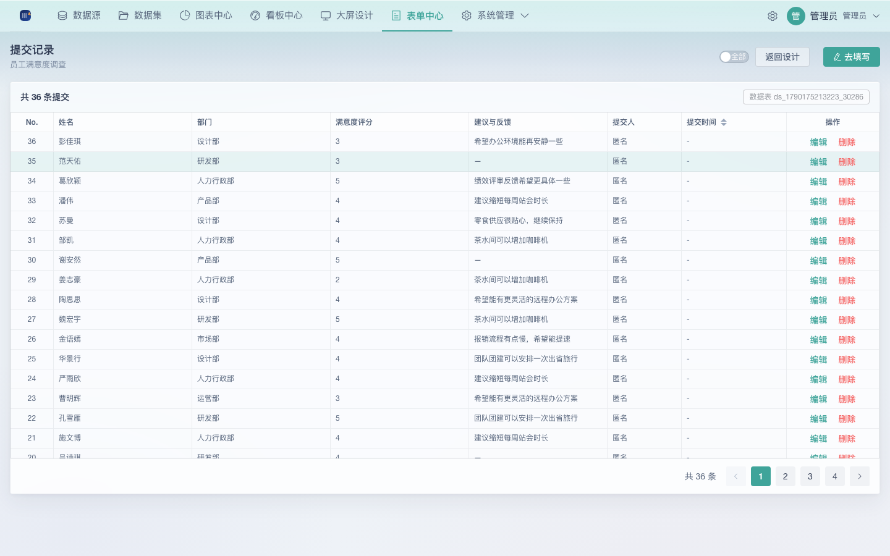

# 08 表单中心使用手册

表单中心是 KanRay 的**数据采集闭环**组件：以拖拽方式设计在线填报表单，**发布后自动建表入库并注册为数据集**，提交记录可以直接进入图表 / 看板 / 大屏的分析链路，实现「采集 → 建模 → 可视化 → 反馈」的完整闭环。无需编写任何代码。

> 前置：需要具备 `form` 相关权限。内置角色中「看板编辑者」拥有表单的全部权限（设计 / 发布 / 分享 / 提交记录）；「查看者」可查看表单、在线填写、查看提交记录（详见文末权限说明）。发布后的填报页自适应移动端，可直接分享到微信群 / 企业内部系统。

## 一、入口与界面总览

登录后左侧一级菜单 **表单中心** 位于「看板中心」与「大屏设计」之间，点击进入表单列表页。

| 界面区域 | 用途 |
|------|------|
| 顶部按钮 | 新建表单 / 按名称搜索 |
| 表单列表 | 名称、描述、状态（草稿 / 已发布 / 已关闭）、更新时间；操作列提供 分享 / 设计 / 填写 / 记录 / 删除 |
| 状态说明 | `草稿`：尚未发布、未建表；`已发布`：可填写可分享；`已关闭`：提交入口不可用，可重新发布恢复 |

## 二、新建表单

列表页点击「**新建表单**」，在弹窗中填写表单名称（如「员工满意度调查」），随即进入设计器：

- 新建表单为**草稿**状态，未创建数据表，填写入口暂不可用；
- 在设计中随时点「保存草稿」持久化字段配置，便于稍后再编辑。

## 三、表单设计器

进入某表单的 `/forms/:id/design`，界面分为以下几个区域：

- **顶部工具栏**：返回 / 表单名称（可直接改名）/ 状态标签；右侧 分享、填写、提交记录；保存草稿、**发布**（草稿时）、关闭（发布后）、删除。
- **左侧控件库**：单行文本、多行文本、数字、日期、下拉选择、单选、多选、说明文字，拖拽到中间画布即完成添加；画布为空时点击空区可直接添加第一个字段。
- **中部画布**：表单说明（文本域，选填）+ 全部字段，字段带必填标记，可拖动排序、删除。
- **右侧属性栏**：选中字段后编辑其 标签、字段 key（入库列名，发布后不可随意更改）、占位提示、是否必填；下拉 / 单选 / 多选类字段可增删编辑选项（显示文案 + 提交值）。
- **提交设置**：成功提示文案（默认「提交成功」）与 是否允许重复提交（`允许` 同一人可多次提交 / `每人一次` 按提交人去重拦截）。

> 字段 key 即写入数据表的列名，建议在发布前确定；发布后新增字段仍允许加列，但删除或修改既有字段类型会受数据保护限制。

## 四、发布 / 关闭

- **发布**：把草稿表单发布为正式表单。系统自动创建一张数据表（表名形如 `ds_<时间戳>_<随机>`），**并注册为数据集**，状态变为「已发布」，此时即可对外分享与在线填写。
- **关闭**：对已发布表单可随时关闭，关闭后提交入口不可用（登录用户的「填写」与公开链接均不可提交）；重新发布即可恢复，历史数据保留。
- **删除**：删除表单会**连同其数据表与全部提交记录一并删除**，不可恢复。

## 五、分享表单

列表或设计器点「**分享**」打开分享弹窗，可为一个表单创建多条分享：

| 配置项 | 说明 |
|------|------|
| 密码分享 | 打开后访问公开链接需先输入 4–64 位密码 |
| 公开分享 | 免密，任何拿到链接的人均可填写 |
| 过期时间 | 可选；到期后链接失效 |
| 启用开关 | 随时启停某条分享，停用后链接立即不可用 |

分享链接形如 `http://<你的域名>/f/<token>`，可复制发给任何人，无需登录即可填写。密码、过期时间、启停均可随时修改或删除。

## 六、在线填写

两个填写入口，渲染同一套字段：

- **内部填写**：登录用户在列表 / 设计器点「填写」（`/forms/:id/fill`），提交人自动记录为当前用户；
- **公开填写**：任何人打开分享链接（`/f/:token`），带密码的分享需先过密码门禁；提交人记为「匿名」。

提交后的反馈依据「提交设置」：显示配置的成功提示文案；若禁止重复提交，同一提交人重复提交会被拦截。

## 七、提交记录

列表点「记录」进入 `/forms/:id/submissions`：

| 能力 | 说明 |
|------|------|
| 查看 | 表格展示 No.、各表单字段、提交人（`匿名` 或用户名）、提交时间，支持按提交时间排序与分页 |
| 筛选 | 「全部 / 只看我的」一键切换 |
| 编辑 / 删除 | 单条提交可直接以表单渲染器回填编辑或删除 |
| 数据表 | 顶栏直接显示该表单对应的数据表名，行数据实时写入数据表 |

## 八、数据链路打通

发布表单后系统自动注册的数据集与上传 Excel 注册的数据集完全同构，因此提交记录立即可被：

- **图表中心**：选择该数据集新建图表（柱状 / 折线 / 饼图 / 表格等）；
- **看板 / 大屏**：把上述图表拖入看板或大屏，与上传数据一起联动分析；
- **开放 API**：通过数据消费接口（`GET /datasets/:id/aggregate` 等）拉取聚合结果供外部系统使用。

于是「**发起问卷 → 采集 → 自动入库 → 实时分析**」在 KanRay 内一站式完成，无需任何数据搬运。

## 九、表单字段类型速查

| 控件 | 入库类型 | 说明 |
|------|------|------|
| 单行文本 | 字符串 | 短文本（姓名、部门等） |
| 多行文本 | 字符串 | 长文本（建议、备注等） |
| 数字 | 数值 | 可参与聚合计算（评分等） |
| 日期 | 日期 | 选择日期 |
| 下拉选择 / 单选 | 字符串 | 从预设选项中选择一项 |
| 多选 | 字符串 | 从预设选项中选择多项 |
| 说明文字 | — | 仅展示，不入库 |

## 十、权限说明（form / form:submission）

| 权限点 | 说明 | 看板编辑者 | 查看者 |
|------|------|:---:|:---:|
| form:read | 查看表单列表与详情 | ✓ | ✓ |
| form:create / update / delete | 新建 / 编辑 / 删除表单 | ✓ | — |
| form:publish | 发布与关闭表单 | ✓ | — |
| form:share | 创建与管理分享 | ✓ | — |
| form:submit | 在线填写提交 | ✓ | ✓ |
| form:submission:read / update / delete | 查看 / 编辑 / 删除提交记录 | ✓ | ✓ |