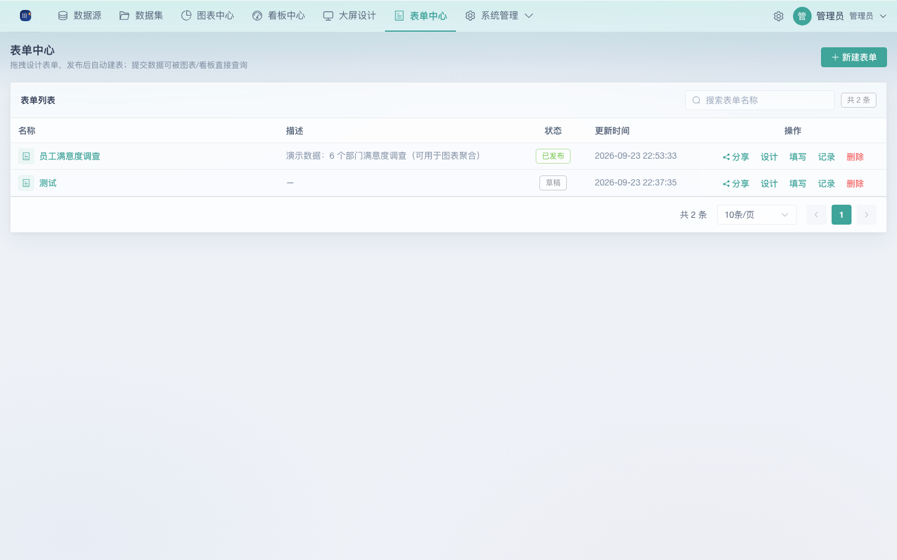
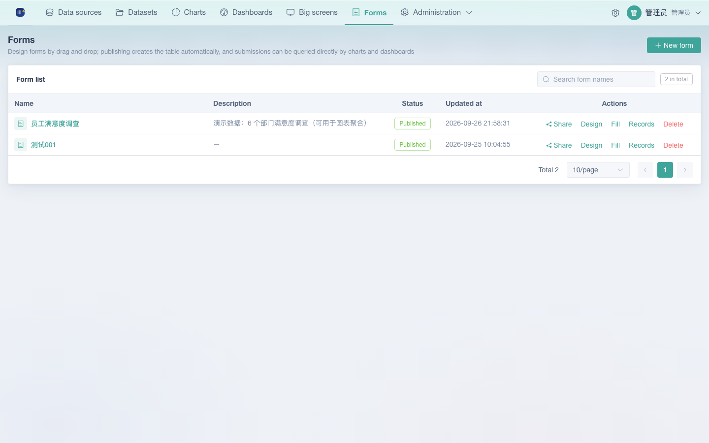
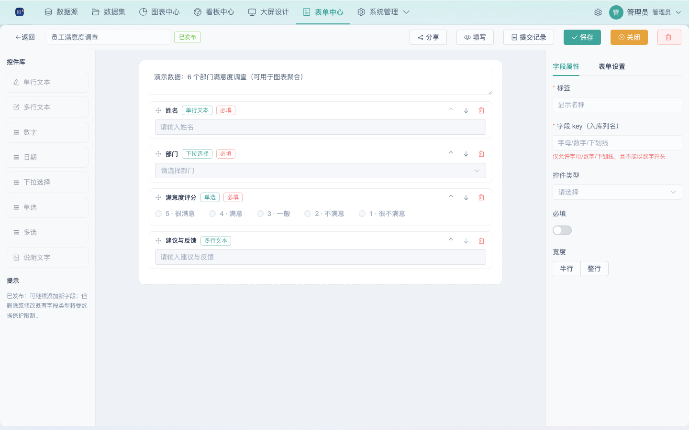
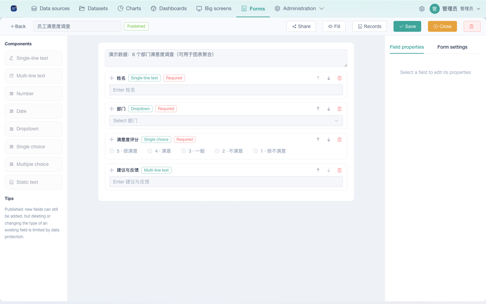
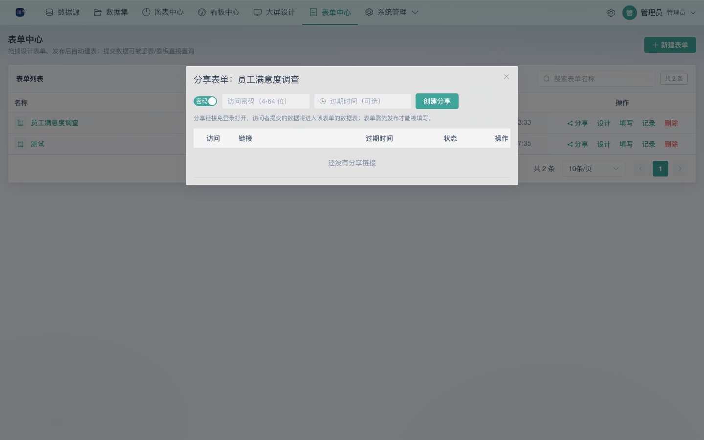
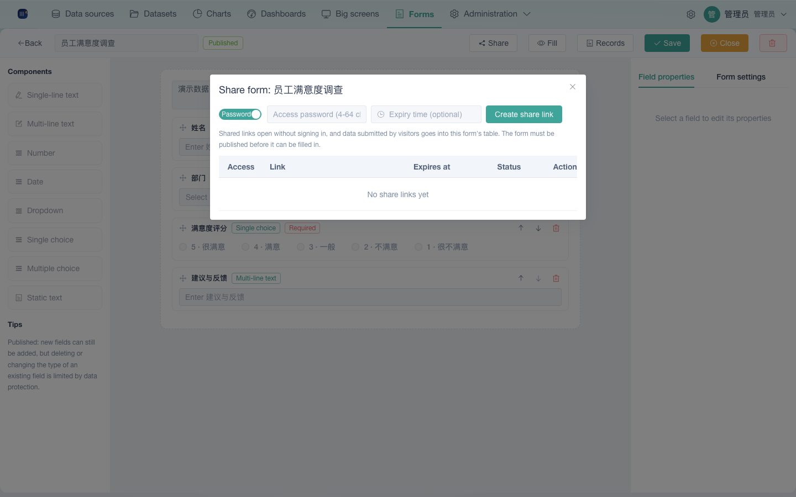
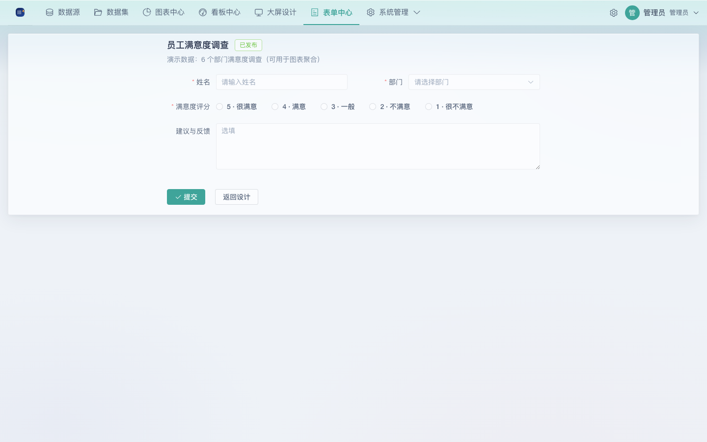
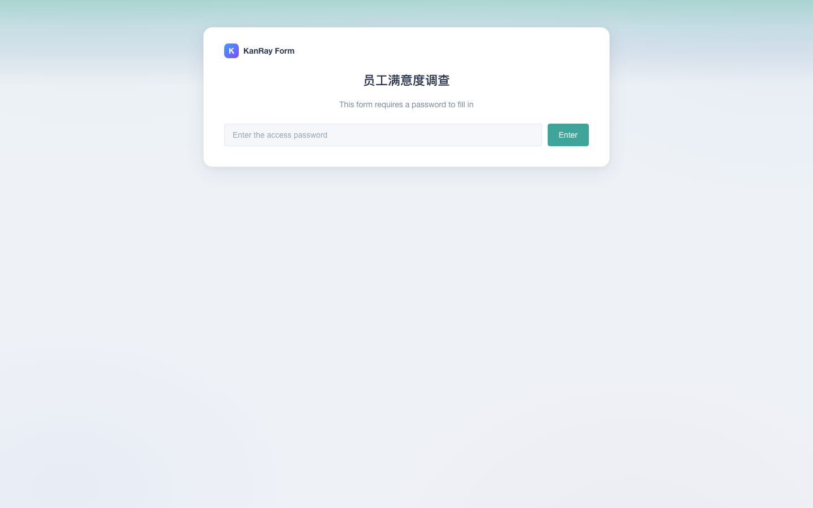
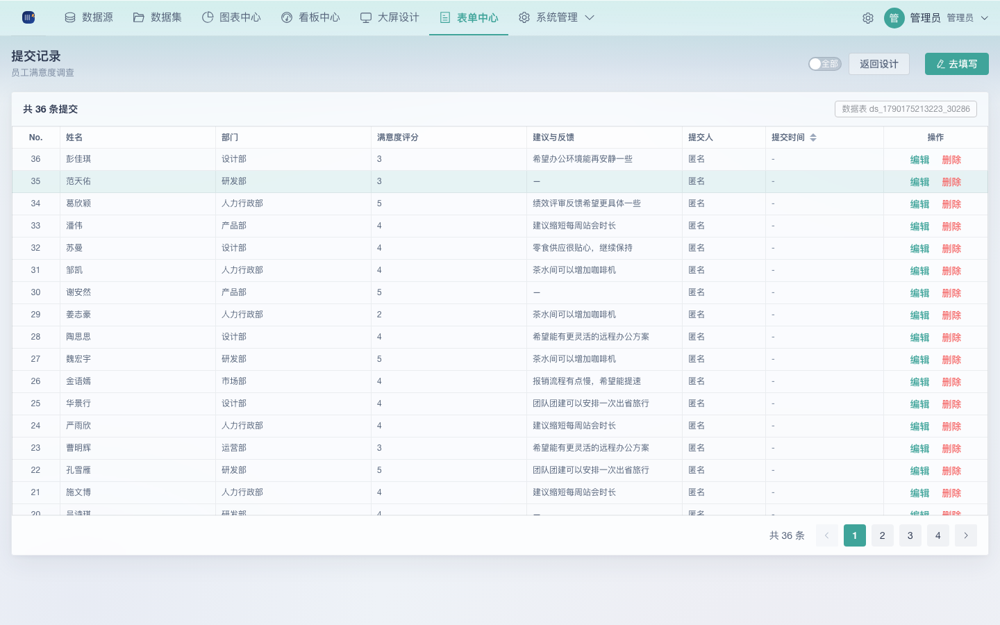
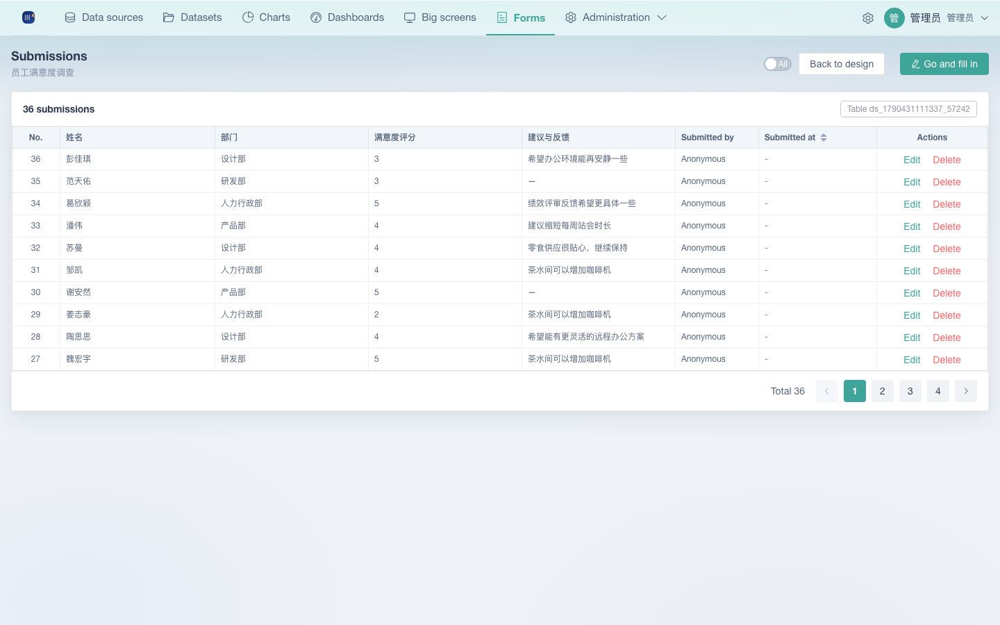

# 08 表单中心使用手册

表单中心是 KanRay 的**数据采集闭环**组件：以拖拽方式设计在线填报表单，**发布后自动建表入库并注册为数据集**，提交记录可以直接进入图表 / 看板 / 大屏的分析链路，实现「采集 → 建模 → 可视化 → 反馈」的完整闭环。无需编写任何代码。

> 前置：需要具备 `form` 相关权限。内置角色中「看板编辑者」拥有表单的全部权限（设计 / 发布 / 分享 / 提交记录）；「查看者」可查看表单、在线填写、查看提交记录（详见文末权限说明）。发布后的填报页自适应移动端，可直接分享到微信群 / 企业内部系统。

# 08 Form Center Manual

The Form Center is KanRay's **data-capture loop**: design an online form by drag and drop, and **publishing it automatically creates the table, stores the data and registers it as a dataset**, so submissions flow straight into the analysis chain of charts, dashboards and big screens — a complete "capture → model → visualize → act on it" loop. No code required.

> **Prerequisite**: you need the `form` permissions. Among the built-in roles, "Dashboard Editor" (`看板编辑者`) has full form permissions (design / publish / share / submissions), while "Viewer" (`查看者`) can view forms, fill them in and view submissions (see the permissions section at the end). Published forms adapt to mobile, so you can share them straight into a WeChat group or an internal company system.

## 一、入口与界面总览

登录后左侧一级菜单 **表单中心** 位于「看板中心」与「大屏设计」之间，点击进入表单列表页。

| 界面区域 | 用途 |
|------|------|
| 顶部按钮 | 新建表单 / 按名称搜索 |
| 表单列表 | 名称、描述、状态（草稿 / 已发布 / 已关闭）、更新时间；操作列提供 分享 / 设计 / 填写 / 记录 / 删除 |
| 状态说明 | `草稿`：尚未发布、未建表；`已发布`：可填写可分享；`已关闭`：提交入口不可用，可重新发布恢复 |

## 1. Entry and interface overview

After signing in, the **Forms** entry in the left sidebar sits between "Dashboards" and "Big screens". Click it to open the form list.

| UI area | Purpose |
|------|------|
| Top buttons | New form / search by name |
| Form list | Name, description, status (Draft / Published / Closed) and update time; the Actions column offers Share / Design / Fill / Records / Delete |
| Status meanings | `Draft`: not published yet, no table created; `Published`: can be filled in and shared; `Closed`: the submission entry is unavailable, and publishing again restores it |

## 二、新建表单

列表页点击「**新建表单**」，在弹窗中填写表单名称（如「员工满意度调查」），随即进入设计器：

- 新建表单为**草稿**状态，未创建数据表，填写入口暂不可用；
- 在设计中随时点「保存草稿」持久化字段配置，便于稍后再编辑。

## 2. Creating a form

On the list page, click "**New form**", enter a form name in the dialog (e.g. "Employee satisfaction survey"), and you go straight into the designer:

- A new form starts in the **Draft** state: no data table is created yet and the fill-in entry is not available;
- While designing, click "Save draft" at any time to persist the field configuration so you can come back to it later.

## 三、表单设计器

进入某表单的 `/forms/:id/design`，界面分为以下几个区域：

- **顶部工具栏**：返回 / 表单名称（可直接改名）/ 状态标签；右侧 分享、填写、提交记录；保存草稿、**发布**（草稿时）、关闭（发布后）、删除。
- **左侧控件库**：单行文本、多行文本、数字、日期、下拉选择、单选、多选、说明文字，拖拽到中间画布即完成添加；画布为空时点击空区可直接添加第一个字段。
- **中部画布**：表单说明（文本域，选填）+ 全部字段，字段带必填标记，可拖动排序、删除。
- **右侧属性栏**：选中字段后编辑其 标签、字段 key（入库列名，发布后不可随意更改）、占位提示、是否必填；下拉 / 单选 / 多选类字段可增删编辑选项（显示文案 + 提交值）。
- **提交设置**：成功提示文案（默认「提交成功」）与 是否允许重复提交（`允许` 同一人可多次提交 / `每人一次` 按提交人去重拦截）。

> 字段 key 即写入数据表的列名，建议在发布前确定；发布后新增字段仍允许加列，但删除或修改既有字段类型会受数据保护限制。

## 3. Form designer

Open a form at `/forms/:id/design` and the interface is split into the following areas:

- **Top toolbar**: Back / form name (rename it in place) / status tag; on the right, Share, Fill and Records, plus Save draft, **Publish** (while it is a draft), Close (once published) and Delete.
- **Left component palette**: Single-line text, Multi-line text, Number, Date, Dropdown, Single choice, Multiple choice and Static text — drag one onto the centre canvas to add it; while the canvas is empty, clicking the empty area adds the first field directly.
- **Centre canvas**: the form description (a text area, optional) plus all fields, each carrying a required marker and reorderable by drag, and deletable.
- **Right property column**: with a field selected, edit its Label, field key (the column name used in storage, not freely changeable after publishing), placeholder and whether it is required; Dropdown / Single choice / Multiple choice fields can also have options added, removed and edited (display label + submitted value).
- **Submission settings**: the success message (defaults to "Submitted successfully") and whether repeat submissions are allowed ("Allowed" lets the same person submit many times / "Once per person" blocks duplicates per submitter).

> **Note**: the field key becomes the column name written into the data table, so decide it before publishing; after publishing you can still add new fields and columns, but deleting an existing field or changing its type is limited by data protection.

## 四、发布 / 关闭

- **发布**：把草稿表单发布为正式表单。系统自动创建一张数据表（表名形如 `ds_<时间戳>_<随机>`），**并注册为数据集**，状态变为「已发布」，此时即可对外分享与在线填写。
- **关闭**：对已发布表单可随时关闭，关闭后提交入口不可用（登录用户的「填写」与公开链接均不可提交）；重新发布即可恢复，历史数据保留。
- **删除**：删除表单会**连同其数据表与全部提交记录一并删除**，不可恢复。

## 4. Publishing and closing

- **Publish**: turn a draft form into a live form. The system automatically creates a data table (with a name of the form `ds_<timestamp>_<random>`) **and registers it as a dataset**, the status becomes "Published", and from then on you can share it and take online submissions.
- **Close**: a published form can be closed at any time; once closed, the submission entry is unavailable (neither the "Fill" action for signed-in users nor the public link accepts submissions). Publishing again restores it, and historical data is kept.
- **Delete**: deleting a form **deletes its data table and every submission record along with it**, and this cannot be undone.

## 五、分享表单

列表或设计器点「**分享**」打开分享弹窗，可为一个表单创建多条分享：

| 配置项 | 说明 |
|------|------|
| 密码分享 | 打开后访问公开链接需先输入 4–64 位密码 |
| 公开分享 | 免密，任何拿到链接的人均可填写 |
| 过期时间 | 可选；到期后链接失效 |
| 启用开关 | 随时启停某条分享，停用后链接立即不可用 |

分享链接形如 `http://<你的域名>/f/<token>`，可复制发给任何人，无需登录即可填写。密码、过期时间、启停均可随时修改或删除。

## 5. Sharing a form

Click "**Share**" in the list or the designer to open the share dialog, where you can create multiple shares for one form:

| Option | Description |
|------|------|
| Password share | Opening the public link requires entering a 4–64 character password first |
| Public share | No password; anyone with the link can fill the form in |
| Expiry time | Optional; the link stops working once it passes |
| Enabled switch | Enable or disable an individual share at any time — a disabled link stops working immediately |

The share link looks like `http://<your-domain>/f/<token>`. You can copy it and send it to anyone, who can fill in the form without signing in. The password, expiry time and enabled state can all be changed or removed at any time.

## 六、在线填写

两个填写入口，渲染同一套字段：

- **内部填写**：登录用户在列表 / 设计器点「填写」（`/forms/:id/fill`），提交人自动记录为当前用户；
- **公开填写**：任何人打开分享链接（`/f/:token`），带密码的分享需先过密码门禁；提交人记为「匿名」。

提交后的反馈依据「提交设置」：显示配置的成功提示文案；若禁止重复提交，同一提交人重复提交会被拦截。

## 6. Filling in online

There are two fill-in entry points, and both render the same set of fields:

- **Internal fill**: a signed-in user clicks "Fill" in the list or the designer (`/forms/:id/fill`), and the submitter is recorded automatically as the current user;
- **Public fill**: anyone opens the share link (`/f/:token`); a password-protected share must clear the password gate first, and the submitter is recorded as "Anonymous".

The response after submitting follows the "Submission settings": the configured success message is shown, and if repeat submissions are disabled, a second submission from the same submitter is blocked.

## 七、提交记录

列表点「记录」进入 `/forms/:id/submissions`：

| 能力 | 说明 |
|------|------|
| 查看 | 表格展示 No.、各表单字段、提交人（`匿名` 或用户名）、提交时间，支持按提交时间排序与分页 |
| 筛选 | 「全部 / 只看我的」一键切换 |
| 编辑 / 删除 | 单条提交可直接以表单渲染器回填编辑或删除 |
| 数据表 | 顶栏直接显示该表单对应的数据表名，行数据实时写入数据表 |

## 7. Submissions

Click "Records" in the list to open `/forms/:id/submissions`:

| Capability | Description |
|------|------|
| View | A table showing No., each form field, the submitter (`anonymous` or the user name) and the submission time, with sorting by submission time and pagination |
| Filter | One-click switching between "All" and "Only mine" |
| Edit / delete | A single submission can be edited — refilled through the form renderer — or deleted, straight from the row |
| Data table | The top bar shows the data table name behind the form directly, and each row is written to that table in real time |

## 八、数据链路打通

发布表单后系统自动注册的数据集与上传 Excel 注册的数据集完全同构，因此提交记录立即可被：

- **图表中心**：选择该数据集新建图表（柱状 / 折线 / 饼图 / 表格等）；
- **看板 / 大屏**：把上述图表拖入看板或大屏，与上传数据一起联动分析；
- **开放 API**：通过数据消费接口（`GET /datasets/:id/aggregate` 等）拉取聚合结果供外部系统使用。

于是「**发起问卷 → 采集 → 自动入库 → 实时分析**」在 KanRay 内一站式完成，无需任何数据搬运。

## 8. How the data pipeline connects up

The dataset that the system registers automatically after you publish a form is structurally identical to one registered by uploading an Excel file, so submissions become immediately available to:

- **Charts**: create a new chart against that dataset (bar / line / pie / table, and so on);
- **Dashboards / big screens**: drag those charts into a dashboard or big screen to analyse them together with your uploaded data;
- **Open API**: pull aggregated results through the data-consumption endpoints (`GET /datasets/:id/aggregate`, etc.) for external systems to use.

So "**launch a survey → collect → store automatically → analyse in real time**" happens end to end inside KanRay, with no data shuttling at all.

## 九、表单字段类型速查

| 控件 | 入库类型 | 说明 |
|------|------|------|
| 单行文本 | 字符串 | 短文本（姓名、部门等） |
| 多行文本 | 字符串 | 长文本（建议、备注等） |
| 数字 | 数值 | 可参与聚合计算（评分等） |
| 日期 | 日期 | 选择日期 |
| 下拉选择 / 单选 | 字符串 | 从预设选项中选择一项 |
| 多选 | 字符串 | 从预设选项中选择多项 |
| 说明文字 | — | 仅展示，不入库 |

## 9. Form field types at a glance

| Control | Stored type | Description |
|------|------|------|
| Single-line text | String | Short text (name, department, etc.) |
| Multi-line text | String | Long text (suggestions, remarks, etc.) |
| Number | Number | Can take part in aggregations (scores, etc.) |
| Date | Date | Picks a date |
| Dropdown / Single choice | String | Pick one of the preset options |
| Multiple choice | String | Pick several of the preset options |
| Static text | — | Display only, not stored |

## 十、权限说明（form / form:submission）

| 权限点 | 说明 | 看板编辑者 | 查看者 |
|------|------|:---:|:---:|
| form:read | 查看表单列表与详情 | ✓ | ✓ |
| form:create / update / delete | 新建 / 编辑 / 删除表单 | ✓ | — |
| form:publish | 发布与关闭表单 | ✓ | — |
| form:share | 创建与管理分享 | ✓ | — |
| form:submit | 在线填写提交 | ✓ | ✓ |
| form:submission:read | 查看提交记录 | ✓ | ✓ |
| form:submission:update | 编辑提交记录 | ✓ | — |
| form:submission:delete | 删除提交记录 | ✓ | — |

## 10. Permissions (form / form:submission)

| Permission | Description | Dashboard Editor | Viewer |
|------|------|:---:|:---:|
| form:read | View the form list and form details | ✓ | ✓ |
| form:create / update / delete | Create / edit / delete forms | ✓ | — |
| form:publish | Publish and close forms | ✓ | — |
| form:share | Create and manage shares | ✓ | — |
| form:submit | Submit a form online | ✓ | ✓ |
| form:submission:read | View submissions | ✓ | ✓ |
| form:submission:update | Edit submissions | ✓ | — |
| form:submission:delete | Delete submissions | ✓ | — |
