# 01 User Manual

> 中文: [01-用户手册.md](../01-用户手册.md)

For everyday business users. It covers the full path from uploading data and building charts to assembling dashboards and sharing them. Suggested reading order: work through [Quick start](quick-start.md) to get your first dashboard, then come back for the advanced material here.

## 1. Interface overview

After you sign in, the top bar holds the first-level menu, from left to right:

| Menu | Purpose |
|------|------|
| Data sources | Manage external database connections and Excel/CSV file data sources |
| Datasets | Manage uploaded and built datasets (the data foundation for charts and dashboards) |
| Charts | Create and manage visualizations |
| Dashboards | Arrange charts into dashboards, with cross-filtering |
| Big screens | Free-canvas visualization screens (cockpits, video walls) — see the [Big-screen designer manual](07-big-screen-designer.md) |
| Forms | Design online forms and collect entries — see the [Forms manual](08-forms-manual.md) |
| Administration | Users, roles, audit, Open API, access tokens (visible to administrators) |

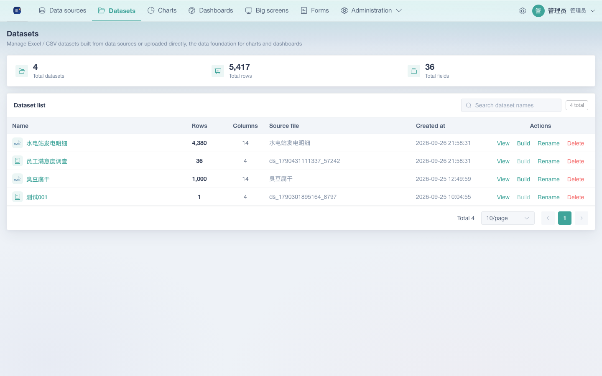

The top-right corner of each page carries the high-frequency action buttons (such as "New data source", "New chart", "New dashboard").

## 2. Uploading data

Excel and CSV uploads all happen on the **Data sources** page: click "New data source" → "Upload Excel / CSV file". A three-step wizard opens, and once it finishes you have a dataset that is ready to chart.

### 2.1 Where to start

- "Upload Excel / CSV file" in the "New data source" dropdown on the data source list page

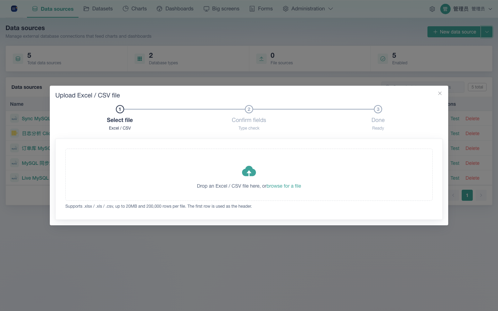

### 2.2 The three-step wizard

**Step 1: Select file**

- Supports `.xlsx` / `.xls` / `.csv`, up to **20MB** and **200,000 rows** per file
- The first row is used as the header row
- The dataset name is optional and defaults to the file name, up to 100 characters
- Click "Next: parse and preview"

**Step 2: Confirm fields**

- Shows a preview of the first 50 parsed rows together with the row count
- You can correct each field's type by hand: `Text / Integer / Decimal / Date / Boolean`
- "Internal name" is the English identifier the system generates (used by the API and the builder); "Display name" is the readable label
- Click "Create dataset"

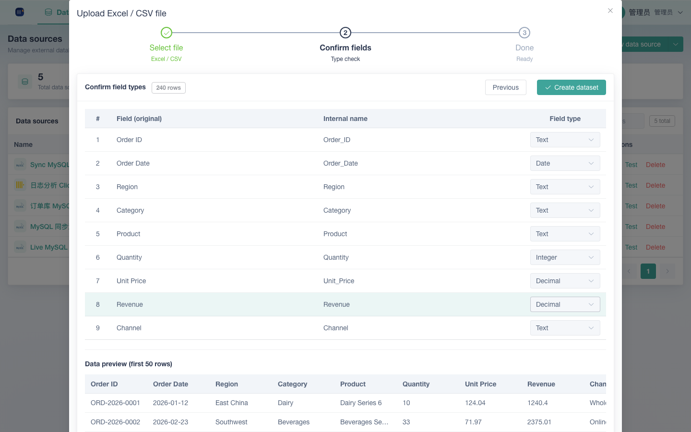

**Step 3: Done**

- Shows the dataset name and row count, with a one-click "Create a chart" shortcut or a way back to the list

> Type detection example: an all-numeric column is detected as "Integer", a column with decimal points as "Decimal", and a standard date string as "Date". Anything that lands on Text shows up that way in the preview, and you can change it by hand.

## 3. Dataset details
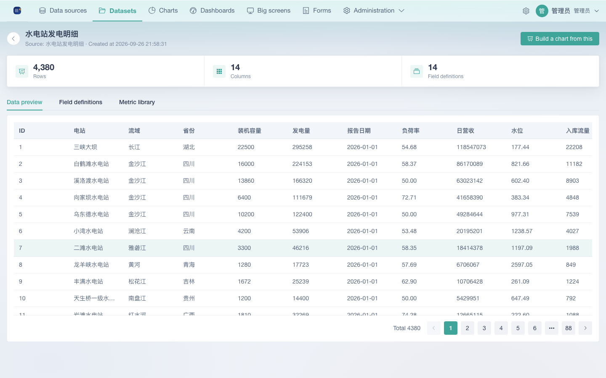

Click a dataset name to open its detail page, which has three tabs:

- **Data preview**: the data row by row, 50 rows per page
- **Field definitions**: you can change a field's display name (press Enter to save); the type is shown as a tag
- **Metric library**: create named atomic, composite and derived metrics for charts to reuse (see §4.5 under "4. Building charts")

The detail page offers a "Build a chart from this" shortcut that jumps straight into the chart builder with that dataset preselected.

## 4. Building charts

### 4.1 Entry points

In Charts, click "New chart"; or use "Build a chart from this" on a dataset detail page.

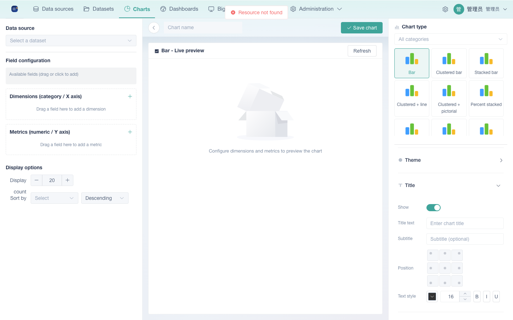

### 4.2 Build steps

1. **Select a dataset**: pick one from the dropdown at the top (the row count is shown). If you have no datasets yet, upload one from the Data sources page first.
2. **Configure dimensions and metrics**:
   - Drag fields from "Available fields" into "Dimensions (category / X axis)" and "Metrics (numeric / Y axis)", or click a field to add it in one step
   - **Only numeric fields can be metrics**: text and date fields can only be dimensions (quick-add or dropping them into the metric area is blocked automatically). The dimension area accepts several dimensions at once.
   - Each metric picks an aggregation: `Sum / Average / Count / Distinct count / Max / Min`
   - A date field used as a dimension can pick a granularity: `Day / Month / Year`
   - The "+" dropdown on a metric row adds computed metrics: a `Formula metric` (a custom expression that can reference other metric keys) and a `Derived metric` (current-period YoY / previous-period MoM change amount / change rate). Adjacent metrics are separated by a divider so they are easy to tell apart.
3. **Choose a chart type**: the library on the right is grouped into 9 categories (see the next section), and the preview in the middle updates as soon as you pick one.
4. **Display options**: display count (1–500, default 20); sort by (no sorting / by metric / by dimension) plus ascending or descending.
5. **Save**: give the chart a name, then click "Save chart".

### 4.3 Chart types

The builder ships with **53 chart types across 9 categories**:

| Category | Representative charts |
|------|---------|
| Bar | Bar, clustered bar, stacked bar, waterfall, Pareto, bullet chart |
| Horizontal bar | Horizontal bar, clustered horizontal bar, stacked horizontal bar, butterfly |
| Line & area | Line, multi-line, stacked area, percent stacked area |
| Pie & funnel | Pie, donut, sunburst, Nightingale rose, funnel, horizontal funnel |
| Scatter & bubble | Scatter, bubble |
| Metric & progress | Metric card, progress bar, circular progress, multi-ring progress, fluid progress, filled gauge |
| Map | China administrative map (with bubble / symbol), world map |
| Table | Table |
| Other | Heatmap, box plot, radar, candlestick, treemap, Sankey, chord, calendar, and more |

Some charts need a specific field mapping (a heatmap wants 2 dimensions and 1 metric; a scatter plot wants an X dimension plus a Y numeric value). The builder tells you how many dimensions and metrics each one needs.

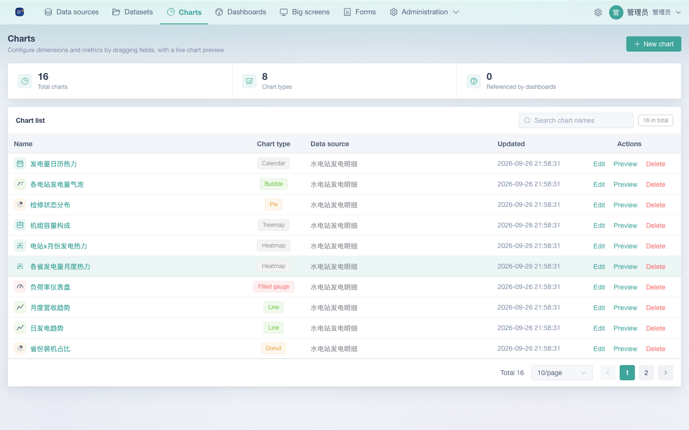

### 4.4 Chart list and management

- The list shows the name, a chart type tag, the data source (marked "Unavailable" when it is broken), and the update time
- Actions: **Edit** (opens the builder), **Preview** (opens a dialog), **Delete** (asks you to confirm)
- The search box at the top does a fuzzy match on names; the stats on the right show total charts / chart types / charts referenced by dashboards

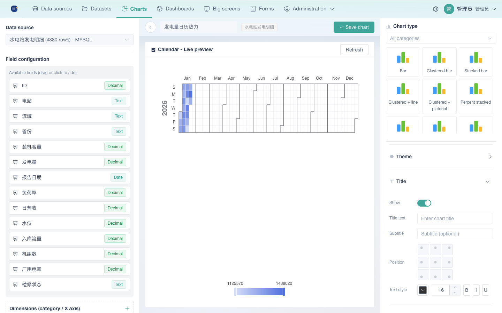

### 4.5 Metric library

The metric library is a **dataset-level** collection of named metrics. You can reference the same metric from different charts and dashboards over one dataset, so you define each aggregation only once. You reach it from the **Metric library** tab on the dataset detail page.

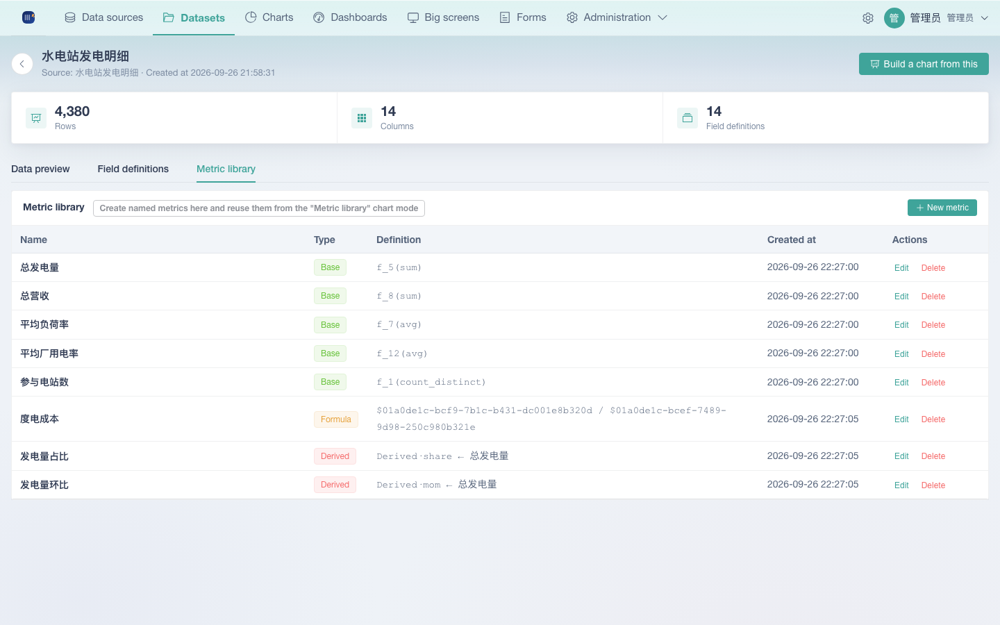

**Create a metric** (click "New metric"):

- **Atomic metric**: pick one field plus an aggregation (sum / average / count / distinct count / max / min), for example "Revenue = Sum(amount)"
- **Composite metric**: apply arithmetic across atomic metrics with a formula, for example "Average order value = $6 / $7". `$<id>` references an atomic metric from the "Referenced metrics" list below. Supports `+ - * / ( )` and `%`; integer division is promoted to a decimal automatically. Only atomic metrics can be referenced, and no letters are allowed inside a formula (this prevents injection).
- **Derived metric**: computed from atomic metrics — current-period YoY / previous-period MoM change amount / change rate

When you edit a metric its **type cannot be changed** (delete it and create a new one if you need a different type); deleting removes it from the library. You can open the formula help dialog at any time with "How do I write a formula?" to see the rules and the common examples.

**Reuse in a chart**: in the chart builder's metric area, click `+` to add a row, switch that row's metric type to **Metric library**, then pick one of the dataset's named metrics from the dropdown (for example, reuse "Average order value").

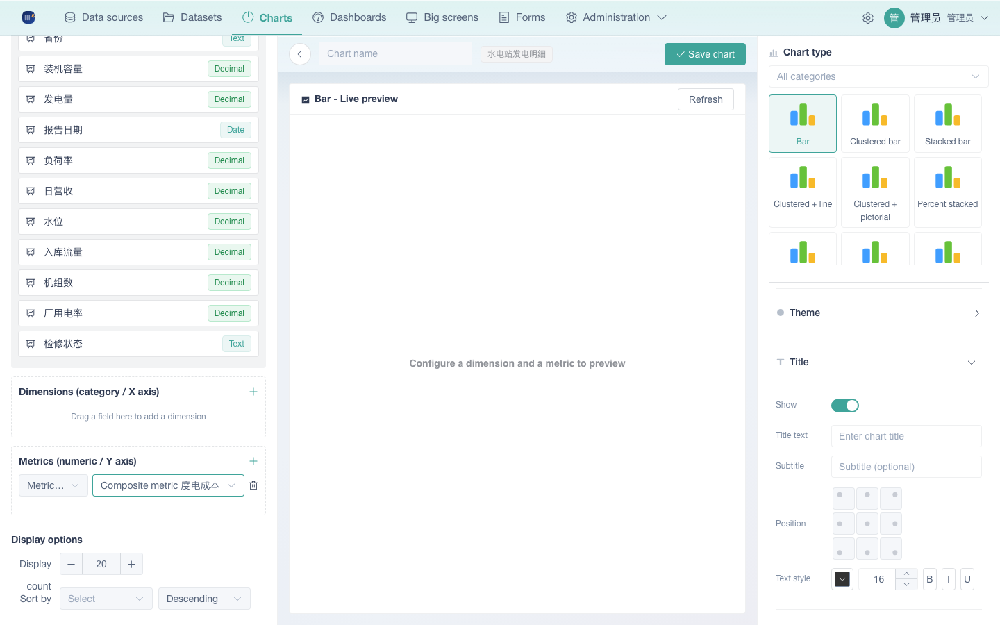

## 5. Building dashboards

### 5.1 Creating a dashboard

In Dashboards, click "New dashboard" and enter a name; or just create one and it is named "Untitled dashboard-XXXX" for you before you land in the editor.

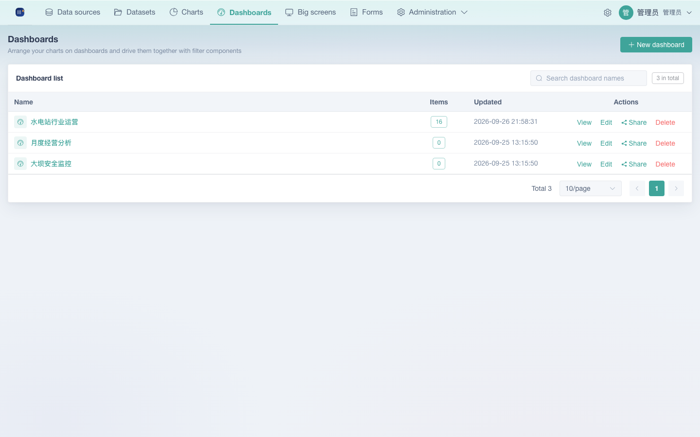

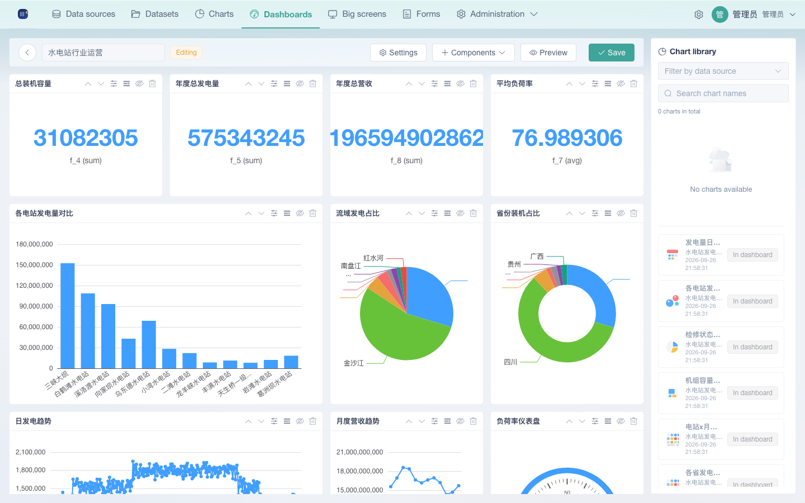

### 5.2 Editing a dashboard

- **Add charts**: drag saved charts from the library on the right onto the canvas; they are laid out automatically with flow-grid
- The components dropdown adds **Text** (Markdown and HTML are supported), **Filter** (choose a data source and the field to filter on), and **Container**
- "Settings" at the top adjusts card spacing and card style
- Saving takes you into view mode

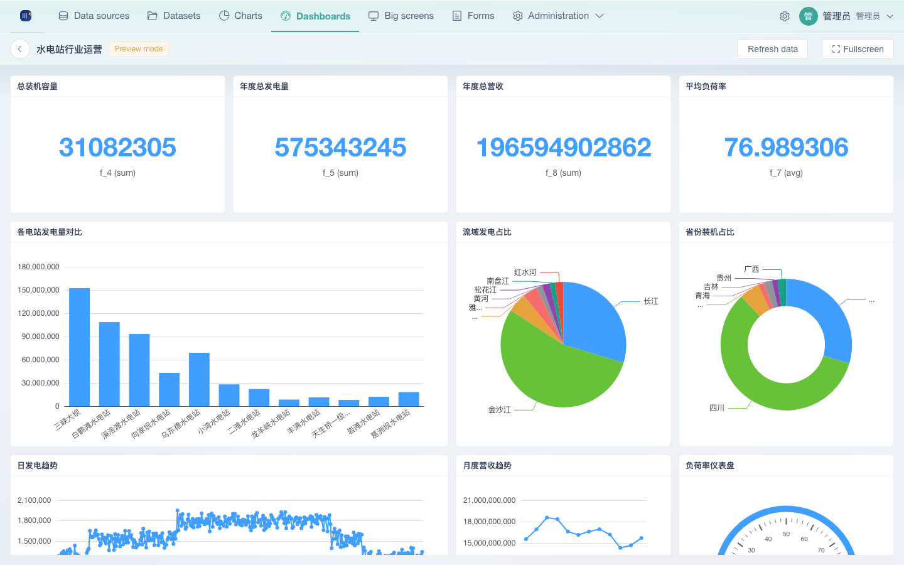

### 5.3 Viewing and previewing

- "Refresh data" at the top refreshes every chart by hand, and "Fullscreen" makes the dashboard fill the display
- When you change a filter component, **every chart on the same data source follows automatically**

## 6. Sharing and collaboration

### 6.1 Creating a share

In the dashboard list, click "Share" in the Actions column (this needs the `dashboard:share` permission). By default you set an access password (4–64 characters); you can also switch "Password" off to get a share link `/s/{token}` that anyone can read without a password.

- The share page is **read-only** and needs no sign-in: a password-protected share asks for the password first, while a public one opens straight away
- Existing shares show their access mode in the "Password / Public" column, and you can disable or delete a share at any time (re-enabling does not rotate the token, so the link keeps working the same way — see the notes in the deployment manual)

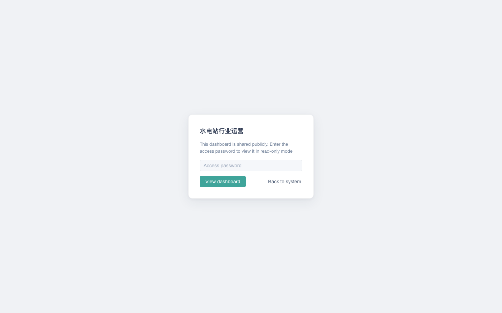

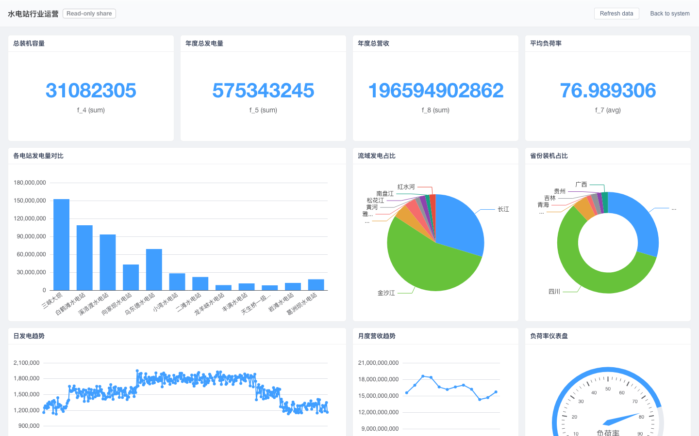

### 6.2 The share page

A signed-in user can also click "Back to system" in the top-right corner of a share page to return to the platform. Share links never expire by default (the create dialog does not support a custom expiry yet — see the known limitations).

## 7. Personal access tokens

A signed-in user can create a personal PAT (personal access token) under "Administration → Access tokens" so external systems can call the Open API (`/api/open/v1`); its permissions are exactly those of the user's own account. See the [Open API integration guide](04-open-api-integration.md) for details.

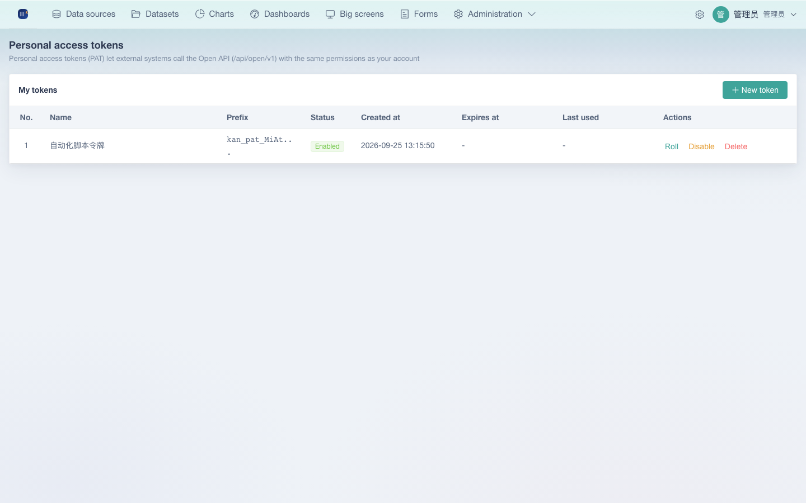

## 8. Quick reference

| I want to… | Steps |
|-------|------|
| Upload a dataset | Data sources → New data source → Upload Excel / CSV → File → Confirm fields → Create |
| Rename a field | Dataset detail → Field definitions → change the display name and press Enter to save |
| Take a quick look at a chart | Charts → Preview |
| Cross-filter several charts together | Edit dashboard → add a filter component → pick the data source and field → switch values in the preview |
| Give a dashboard to outsiders, view only | Dashboard list → Share → set a password → copy the link |
| Find out why a share link needs a password | The password needs at least 4 characters; once a share exists you control whether it works by disabling or enabling it |
| Build a big screen or cockpit | Big screens → create one from a template, or start blank and drag from the component library; see the [Big-screen designer manual](07-big-screen-designer.md) |
