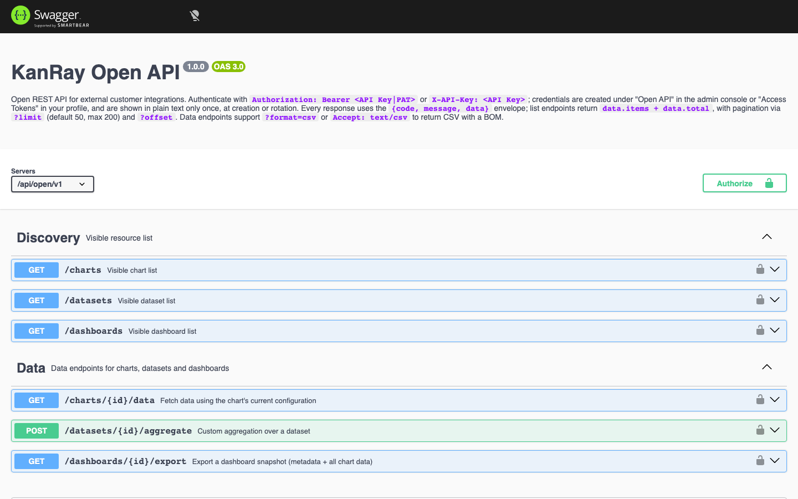

# 04 Open API Integration Guide

> 中文: [04-开放API集成指南.md](../04-开放API集成指南.md)

For developers integrating external systems. The system exposes a set of read-only data endpoints under `/api/open/v1` so that external systems can pull chart, dataset, and dashboard data programmatically.

## 1. Preparing credentials

### 1.1 Credential types

| Type | Where to create it | Permissions | Description |
|------|---------|------|------|
| **API Key** | Administration → Open API | Limited to the ticked Scopes | A static, long-lived credential, suited to system-to-system use |
| **Access token (PAT)** | Administration → Access tokens | Inherits your own permissions | Bound to an individual account |

At creation time you set: name, owning user (a PAT inherits that user), Scopes (a static key can take `chart:read / dataset:read / dashboard:read`), and expiry (leave it empty = never expires).

> **Note:** **A credential is shown in plaintext only once** and cannot be viewed again after you close the dialog. Copy and store it right away.
> **Note:** Rotating invalidates the old key immediately; deletion cannot be undone.

```bash
# 方式一：Authorization: Bearer
curl -H "Authorization: Bearer kan_live_xxxx" \
     "http://localhost:8080/api/open/v1/charts"

# 方式二：X-API-Key 头
curl -H "X-API-Key: kan_live_xxxx" \
     "http://localhost:8080/api/open/v1/dashboards"
```

### 1.2 Request examples

Two header forms are accepted — `Authorization: Bearer` (method one above) and `X-API-Key` (method two above).

Credential formats: `kan_live_*` (API Key) / `kan_pat_*` (PAT).



## 2. Endpoint overview

Swagger UI: `/api/open/docs` (open it in a browser); OpenAPI spec: `GET /api/open/v1/openapi.json`. Opened in a browser it renders as visual API documentation you can integrate against directly:

### Discovery (listing)

| Method + path | What it does | Required permission |
|------------|------|---------|
| `GET /api/open/v1/charts` | List of visible charts (search with `keyword`, paginate with `limit`/`offset`) | `chart:read` |
| `GET /api/open/v1/datasets` | List of visible datasets | `dataset:read` |
| `GET /api/open/v1/dashboards` | List of visible dashboards | `dashboard:read` |

Pagination: `limit` defaults to 50 and is capped at 200; `offset` starts at 0. The response is `{ items, total }`.

### Data consumption

| Method + path | What it does | Required permission |
|------------|------|---------|
| `GET /api/open/v1/charts/{id}/data` | Fetch data using the chart's current configuration (`columns` + `rows`) | `chart:read` |
| `POST /api/open/v1/datasets/{id}/aggregate` | Custom aggregation over a dataset | `dataset:read` |
| `GET /api/open/v1/dashboards/{id}/export` | Dashboard snapshot (metadata + data for every chart) | `dashboard:read` |

```
GET /api/open/v1/charts/{id}/data
```

### 2.1 Fetching data by chart

- Runs the aggregation defined by the chart's current configuration; the response is `columns` (dimension fields plus metric fields with their aggregation) + `rows`.

```
POST /api/open/v1/datasets/{id}/aggregate
Content-Type: application/json

{
  "metrics":   [{ "field": "销售额", "agg": "sum", "label": "销售额(sum)" }],
  "dimensions":[ { "field": "区域", "label": "区域" } ],
  "filters":   [ { "field": "区域", "op": "eq", "value": "华南" } ]
}
```

### 2.2 Custom aggregation over a dataset

- Metric aggregations: `sum / avg / count / count_distinct / max / min`
- A dimension can carry `granularity` (day/month/year); see Swagger for the additional sorting and grouping parameters
- When the result is truncated, the response carries `truncated: true`

```
GET /api/open/v1/dashboards/{id}/export
```

### 2.3 Dashboard export

Returns the dashboard metadata plus the complete data of every chart, each fetched with its own configuration.

### 2.4 CSV output

The list and data endpoints support `?format=csv` (or the request header `Accept: text/csv`):

- Data-endpoint CSV: the first row holds the display names of the fields and values are escaped automatically; it **carries a BOM**, so Excel opens it without garbled characters.
- Dashboard export CSV: each card is a separate section introduced by `# 图表名` (`# ` plus the chart name).
- In CSV mode, errors come back as plain text plus a status code (not the `{code,data}` envelope).

```json
{
  "code": 0,
  "data": {
    "columns": [ { "field": "区域", "label": "区域" },
                 { "field": "销售额", "label": "销售额", "agg": "sum" } ],
    "rows": [ { "区域": "华南", "销售额": 67300 } ],
    "truncated": false
  },
  "message": "success"
}
```

## 3. Response structure

A success response is always `{ code: 0, data, message }`:

A failure response is always `{ code, message, data: null }`, where `code` matches the HTTP status code.

### 3.1 `message` and `messageEn`

The envelope always carries two text fields with different roles:

- `message`: the **Chinese** text, always present.
- `messageEn`: an **optional** English field, present only when an English translation actually exists.

|--------|-------------------|---------------------|
| 401 | `缺少 API Key` | `Missing API Key` |
| 401 | `API Key 无效` | `Invalid API Key` |
| 403 | `该 API Key 无权执行操作: chart:read` | `This API Key is not allowed to perform: chart:read` |
| 404 | `资源不存在或无权访问` | `Resource not found or you do not have access to it` |
| 422 | `聚合包含未注册字段: 区域` | `Aggregation contains unregistered fields: 区域` |
| 429 | `请求过于频繁，请稍后再试` | `Too many requests, please try again later` |

Three hard rules about `messageEn` that integrators can rely on:

1. **When no translation is found, the field is omitted entirely** — the Chinese text is never copied into `messageEn`, and it is never an empty string. Receiving a response with only `message` is perfectly normal; do not treat it as an error.
2. The English text is resolved server-side by table lookup: the Chinese-to-English table lives in `backend/src/i18n/en-messages.js`, and the resolver is `enOf()`, exported from `backend/src/i18n/index.js` — it looks up the English text from the Chinese original, and for messages with interpolation it matches on a template and fills the actual values back in.
3. `messageEn` is therefore a **best-effort** field: a missing translation only makes an English UI fall back to the Chinese text. No information is lost and nothing fails to parse.

**Successful responses usually carry no `messageEn`**: open API successes use the default text `message: "success"`, and `"success"` has no entry in the table, so the lookup fails and the field is omitted. **Error responses, on the other hand, almost always carry `messageEn`**; the common values per status code are:

| Status code | `message` (Chinese) | `messageEn` (English) |
|--------|-------------------|---------------------|
| 401 | `缺少 API Key` | `Missing API Key` |
| 401 | `API Key 无效` | `Invalid API Key` |
| 403 | `该 API Key 无权执行操作: chart:read` | `This API Key is not allowed to perform: chart:read` |
| 404 | `资源不存在或无权访问` | `Resource not found or you do not have access to it` |
| 422 | `聚合包含未注册字段: 区域` | `Aggregation contains unregistered fields: 区域` |
| 429 | `请求过于频繁，请稍后再试` | `Too many requests, please try again later` |

Always read the text as `messageEn || message` (falling back to Chinese when `messageEn` is absent); never assume the field is there.

> **Note:** The OpenAPI `Error` schema declares only `code` / `message` / `data` and does not list `messageEn` — go by the actual response.

## 4. Security and rate limiting

|------|------|
| Mechanism | Description |
| Authentication | Only valid `kan_*` credentials are accepted; an invalid, revoked, or expired credential returns 401, and a missing permission returns 403 |
| Resource isolation | Lists return only what you can see; data endpoints validate ownership of both the chart and the dataset |
| Row limit | `OPEN_API_MAX_ROWS` (10000 by default); larger results are truncated and flagged with `truncated` |
| Audit | Data-fetching calls are written to the audit log (resource `chart`/`dataset`, action `api:chart.data`, and so on) |

## 5. Error codes

| Status code | Meaning |
|--------|------|
| 400 | Invalid parameters (with a detailed reason) |
| 401 | Missing, invalid, revoked, or expired credential |
| 403 | Valid credential but without the required permission |
| 404 | Resource not found or you do not have access to it (on list endpoints, 404 simply means not found) |
| 422 | Aggregation field is not registered |
| 429 | Rate limit triggered |

## 6. Typical integration scenarios

```bash
# 每分钟拉一次图表数据渲染大屏
curl -sH "Authorization: Bearer kan_live_xxx" \
  "http://localhost:8080/api/open/v1/charts/1/data" \
  | jq '.data.rows'
```

### Big-screen polling

Poll a chart on a timer to drive a big screen (see the command above).

```bash
curl -sH "Authorization: Bearer kan_live_xxx" \
  "http://localhost:8080/api/open/v1/charts/1/data?format=csv" \
  -o 销售.csv
```

### Scheduled CSV export into a reporting store

Fetch a chart as CSV on a schedule and write it straight to a file (see the command above).

```bash
curl -sH "Authorization: Bearer kan_pat_xxx" \
  "http://localhost:8080/api/open/v1/dashboards/2/export" \
  | jq '.data.dashboard + { cards: (.data.cards | length) }'
```

### Dashboard snapshot by email

Export a dashboard snapshot with a PAT and post-process it for an email (see the command above).

> **Note:** Treat `/api/open/v1/openapi.json` as the authority on the actual field names; the examples in this guide are based on the current version.
