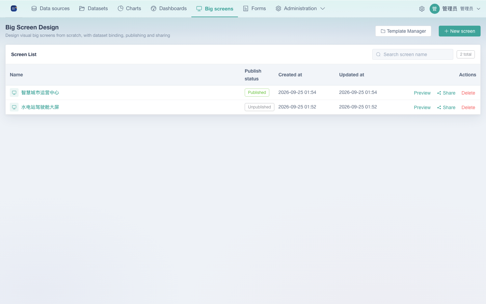
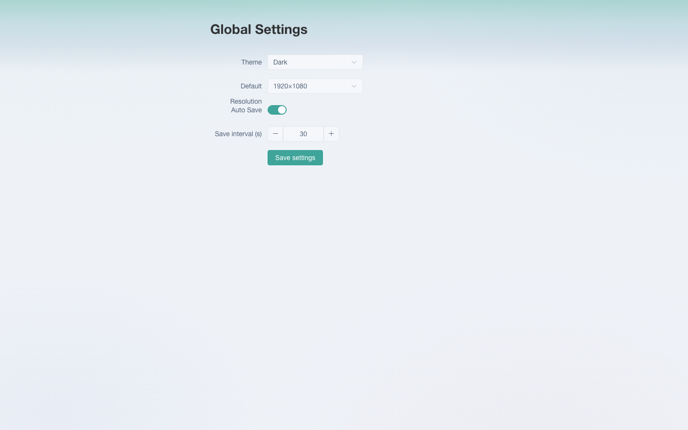
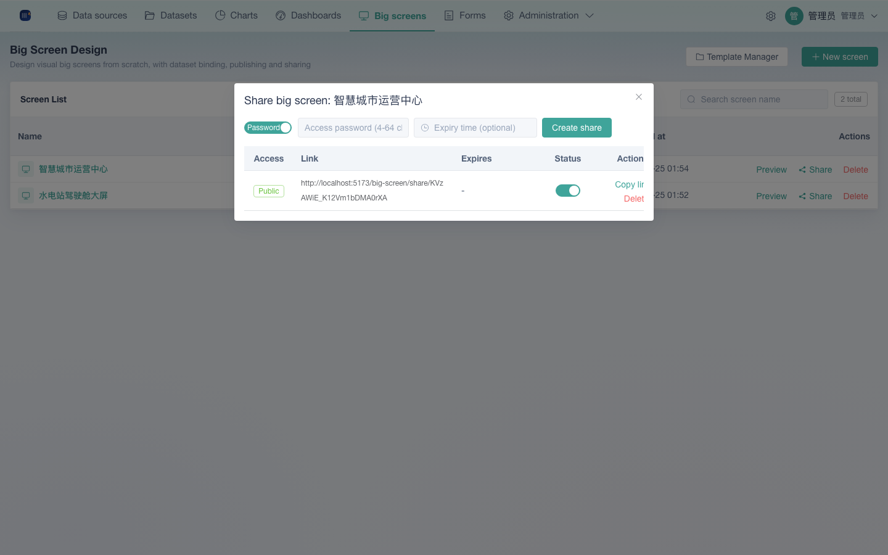

# 07 Big-screen Designer Manual

> 中文: [07-大屏设计器使用手册.md](../07-大屏设计器使用手册.md)

For users who need to build visual data big screens. The big-screen designer gives you **free-canvas** composition: drag charts, text, media and decoration components out of the component library, place and resize them anywhere, bind static data, an API or a dataset, then save, preview and share in one click. Unlike the flow-grid auto-layout of "Dashboards", a big screen is a **pixel-level free layout** — a good fit for data-visualization video walls, executive cockpits and presentation screens.

> **Prerequisite**: you need the `big_screen` permissions (built-in roles from "Dashboard Editor" (`看板编辑者`) upwards have them by default — see the permissions section at the end). Bind chart data first through "Charts", or through a component's own "Dataset" data source.

## 1. Entry and interface overview

After signing in, the **Big screens** entry in the left sidebar sits between "Dashboards" and "Forms". Click it to open the big screen list.

| UI area | Purpose |
|------|------|
| Top toolbar | New Screen / Template Manager / search |
| Screen list | Each row shows the name, creation time and update time; the Actions column offers Preview / Share / Delete |
| Designer | The editing canvas for a single big screen (see the next section) |

## 2. Creating a big screen

On the screen list page, click "**New Screen**":

- Option 1: **Start from scratch** — enter a screen name and go straight into the designer with an empty canvas
- Option 2: **Create from a template** — click "Template Manager", pick a preset template or one of "My Templates", enter a name, and enter the designer with that template as the starting point

> **Note**: creating from a template copies the template's canvas size, background and every component into the new screen, so you can start adjusting as soon as you enter the designer.

## 3. Template management

The "**Template Manager**" dialog has two tabs:

### 3.1 System preset templates

Several **1920×1080 adaptive** big-screen templates ship with the product, covering a range of business scenarios; all of them can be edited further:

| Category | Templates |
|------|------|
| Industrial parks | Smart Park Operations Platform, Smart Parking Platform, Digital Twin Visualization Platform |
| City governance | Smart City Operations Center, Smart Traffic Signal Control, Emergency Command Center, Government Services Data Screen |
| Industry cockpits | Traffic Perception Platform, E-commerce Realtime Dashboard, Industrial IoT Monitoring Platform, Smart Energy Management Platform, Smart Community Platform, Smart Logistics Dispatch Center, Smart Healthcare Data Center, Smart Campus Platform, Business Management Cockpit |
| Data visualization | Construction Maintenance Data, MEP Operations Desk, MEP Equipment Archive |

Each template is shown as a thumbnail plus its name and canvas size (e.g. 1920×1080). Click "**Use this template**", enter a name for the new big screen when prompted, and you go straight into the designer.

### 3.2 My templates

Once you have saved a big screen as a template from the designer (see §7.4), it shows up here; every template supports "Use" (to create a new big screen from it) and "Delete".

> **Note**: templates are isolated by creator — you can only see and operate your own templates; administrators can operate all of them.

## 4. Designer interface

Open a big screen at `/big-screen/design/:id` and the interface is divided, top to bottom and left to right, into:

| Area | Contents | Purpose |
|------|------|------|
| Top bar | Back / screen name / undo & redo / PC–mobile preview toggle / adaptive–fixed mode toggle / Preview / Save (with a "Save as Template" dropdown) | Global actions and saving |
| Left column | Two tabs, "Components" and "Layers" | Drag components in from the library; the layer tree manages component stacking order |
| Canvas | Centred design area, plus zoom controls and JSON import/export in the bottom-right corner | Place components freely, select, resize and align them |
| Right column | Collapsible panels: "Canvas / Mobile / Data / Properties / Code / Style" | Page-level configuration plus the detailed configuration of the selected component |
| Bottom bar | Zoom / canvas size / component count / selection count, plus a Shortcuts button | At-a-glance status |

## 5. Component library (the "Components" tab on the left)

Components are grouped by category; drag one from the panel **onto the canvas** to add it:

| Category | Components |
|------|------|
| Visual Charts | Bar Charts (Single Bar / Clustered Bar / Stacked Bar / Bar & Line Mix / Grouped Stacked Bar / Percent Stacked Bar / Waterfall), Horizontal Bar Charts (Single Horizontal Bar / Clustered Horizontal Bar / Stacked Horizontal Bar / Percent Horizontal Bar / Mixed Horizontal Bar / Positive & Negative Bar / Dynamic Ranked Bar), Line & Area Charts (Single Line / Multi Line / Stacked Area / Smooth Line, etc.), 3D Globe |
| Tables | Standard Table, Carousel List, Rank List |
| Text | Static Text, Data Text, Number Flip, Time Text, Marquee Text |
| Media | Static Image, Carousel Image, Video, Embedded Page (iframe) |
| DataV Decorations | Decorative components such as Borders and backgrounds, used to frame the big screen and set the mood |

> **Note**: there are also code-based components (custom HTML/CSS/JS, see §9.4) and other extended components — the actual component panel is the source of truth.

## 6. Canvas operations

### 6.1 Canvas and zoom

- Floating buttons in the bottom-right corner: `−` / percentage / `+` / **↺ Reset view** (back to 100%); you can also zoom with `Ctrl/Cmd +` mouse wheel (10%–500%)
- Shortcuts: `Ctrl/Cmd + 0` to reset, `Ctrl/Cmd + =`/`-` to zoom in and out
- Press and drag on empty space to pan the viewport; the effective zoom is shown live in the bottom bar

### 6.2 Selecting components

- Click a component to select it; `Shift/Ctrl`-click to multi-select; drag a box on empty space to **rubber-band select**; `Ctrl/Cmd + A` to select all
- `Tab` cycles through the selected components; `Esc` clears the selection

### 6.3 Moving and resizing

- Drag to change position (with snapping); once selected, drag any of the 8 directional handles to resize (minimum 20px)
- Finishing a move or a resize automatically pushes an undo-stack entry, so you can roll it back with `Ctrl/Cmd + Z`

### 6.4 Alignment aids

- **Snap guides**: when the gap between a component's edges or centre lines and the canvas edges falls below a threshold, guide lines appear and the component snaps to them
- **Context menu**: Copy / Cut / Paste / Duplicate Component, Bring to Front / Send to Back / Move Up One Layer / Move Down One Layer, Lock / Unlock, Show / Hide, plus an "Align" submenu (Left / Right / Top / Bottom / Center Horizontally / Center Vertically)

### 6.5 Layers (the "Layers" tab on the left)

The layer tree manages all components in one place: click to select, reorder with Move Up / Move Down / Bring to Front, show or hide (the eye icon), Lock (so the component can no longer be selected or moved) and Delete. Layer changes are reflected on the canvas immediately.

### 6.6 Full shortcut list

Click "**Shortcuts**" in the bottom bar at any time to see the complete list (Windows / Mac, bilingual). The common ones are:

|---------|---------|-----|
| Action | Windows | Mac |
| Undo / Redo | Ctrl+Z / Ctrl+Shift+Z | ⌘Z / ⌘⇧Z |
| Copy / Cut / Paste | Ctrl+C / Ctrl+X / Ctrl+V | ⌘C / ⌘X / ⌘V |
| Copy and paste | Ctrl+D | ⌘D |
| Select all | Ctrl+A | ⌘A |
| Delete selection | Delete / Backspace | ⌫ |
| Lock / unlock | Ctrl+L | ⌘L |
| Show / hide | Ctrl+H | ⌘H |
| Save | Ctrl+S | ⌘S |
| Reset canvas / zoom | Ctrl+0 / Ctrl± | ⌘0 / ⌘± |

## 7. Saving, previewing and exporting

### 7.1 Saving

The "**Save**" button in the top bar is the primary action (clicking it saves the current big screen directly; shortcut `Ctrl/Cmd + S`). The dropdown to its right offers "**Save as Template**".

### 7.2 Preview mode and layout mode

The middle of the top bar offers two quick toggles:

- **PC / Mobile**: switches the design canvas viewport (PC 1920×1080 / Mobile 375×812) so you can lay out and preview for different device form factors; the "Mobile" panel in the right column is only shown in the mobile viewport
- **Adaptive / Fixed**: the layout mode — Adaptive scales proportionally with the screen to fill it when the big screen is displayed, while Fixed renders at the canvas's native resolution

Both switches take effect immediately and can be saved.

### 7.3 Previewing and opening

- "Preview" in the designer top bar opens that big screen's preview page in a new tab (see §8)
- You can leave the designer at any time to go back to the screen list; if the big screen cannot be found, it redirects to the list automatically

### 7.4 Saving as a template

Pick "**Save as Template**" from the save dropdown → enter a template name → once saved it appears in the screen list under "Template Manager → My Templates", ready to create matching new big screens.

### 7.5 Importing / exporting JSON

Next to the zoom controls in the bottom-right corner of the canvas are "↑ Import JSON" and "↓ Export JSON". Exporting writes the big screen's complete configuration (settings + component JSON) to your machine, which is handy for backups, migration, or rebuilding it elsewhere by importing.

## 8. Preview and sharing

### 8.1 Preview page

- "Preview" in the designer top bar, or "Actions → Preview" in the screen list, opens the `/big-screen/preview/:id` preview page
- The preview page's top bar offers "**Fullscreen Preview**" (browser fullscreen) and a **PC / Mobile** viewport switch, and it applies the canvas layout mode (Adaptive / Fixed) to the scaling while showing the zoom percentage
- The preview is a **read-only** view and does not enter editing mode; to get back to the designer you return to the screen list or reload the previous page

### 8.2 Sharing a big screen

"Actions → Share" in the screen list opens the share dialog:

- **Public access / password gate**: an access password (4–64 characters) is required by default; turning the "Password" switch off produces a public link that needs no password
- **Expiry time**: optional — once it passes, the share link stops working
- **Share list management**: shows the access mode (public / password) and the expiry time, and lets you copy the link, enable or disable a share, and delete it

Once you are done you get a link of the form `/big-screen/share/{token}`. It opens **without signing in**.

### 8.3 Public share page

- Public access: the big screen appears as soon as you open the link (read-only)
- Password access: you enter the password first and the screen is shown once it verifies; verification is rate limited (10 attempts / 15 minutes)
- If the share has been disabled or has expired, the matching message is shown; signed-in users can click "Back to system" in the top-right corner of the share page to return to the platform

## 9. Configuration panel (right column)

The right column is a set of collapsible panels shared by the **page-level configuration** and the **configuration of the selected component**:

### 9.1 Canvas

- Canvas size: common presets are offered (such as 1920×1080), and you can also set a custom width and height (width range 100–7680 / height range 100–4320)
- Background: a solid color, a gradient, or an uploaded background image
- Layout mode: Adaptive (scales proportionally with the screen) / Fixed

### 9.2 Mobile (shown in mobile preview mode only)

Layout-adaptation settings for the big screen in a mobile device viewport (such as 375×812), used for mobile preview and sharing.

### 9.3 Data

The data source of the selected component — three modes:

| Mode | Description |
|------|------|
| Static Data | Edit the JSON data directly; best for fixed content |
| API Request | Configure the URL / method / request headers / request body / **Response Path** (the field to extract from the response) / field mapping; supports automatic timed refresh via "Refresh (s)" as well as manual refresh |
| Dataset | Pick a dataset you have already built and configure **dimensions + metrics** in the dialog (including the aggregation: sum / count / distinct count / max / min, the date granularity: day / month / year, sorting and the row limit) — you can pull data without writing any SQL |

> **Note**: once a chart component is bound through the "Data" panel it renders on the big screen; switching data mode refreshes the preview immediately.

### 9.4 Properties / Style / Code

- **Properties**: configuration specific to the selected component (such as a text component's content and font size, a chart's title toggle), varying with the component type
- **Style**: appearance shared by everything — background, border, shadow, and so on
- **Code**: shown only for some code-based components (custom HTML/CSS/JS, such as `custom-chart`), letting you implement fully custom content by editing code

## 10. Permissions

Big-screen features use five permission points. Here is which built-in roles have them:

| Permission | Description | admin | analyst | editor | viewer |
|--------|------|:---:|:---:|:---:|:---:|
| `big_screen:read` | View big screens | ✅ | ✅ | ✅ | ❌ |
| `big_screen:create` | Create big screens / templates | ✅ | ✅ | ✅ | ❌ |
| `big_screen:update` | Edit big screens | ✅ | ✅ | ✅ | ❌ |
| `big_screen:delete` | Delete big screens / templates | ✅ | ✅ | ✅ | ❌ |
| `big_screen:share` | Share big screens | ✅ | ✅ | ✅ | ❌ |

- **Resource isolation**: big screens, templates and shares are all isolated by owner — by default you can only see and operate your own resources (the edit and delete pages check permissions), while administrators can reach everything
- **Viewer**: holds no `big_screen` permission at all and cannot access big screens
- Custom roles can tick any of the permission points above in "Administration → Roles"

## 11. Quick reference

| I want to… | Steps |
|-------|------|
| Create an empty big screen | Big screens → New Screen → enter a name |
| Start quickly from a ready-made style | Big screens → Template Manager → System Preset Templates → Use this template |
| Put a component on the big screen | "Components" in the left column → drag it onto the canvas |
| Make a chart show real data | Select the component → "Data" in the right column → Dataset / API / Static Data |
| Align several components | Multi-select → right-click → Align → pick an alignment |
| Save the current big screen | Save in the top bar, or Ctrl/Cmd + S |
| Save a big screen as one of my templates | Save dropdown → Save as Template → enter a name |
| Send a big screen to someone for viewing only | Screen list → Actions → Share → set a password / make it public → Copy link |
| Refresh big-screen data on a schedule | Select the component → "Data" in the right column → API Request → set Refresh (s) |
| Back up a big screen's configuration | "↓ Export JSON" in the bottom-right corner of the canvas |
