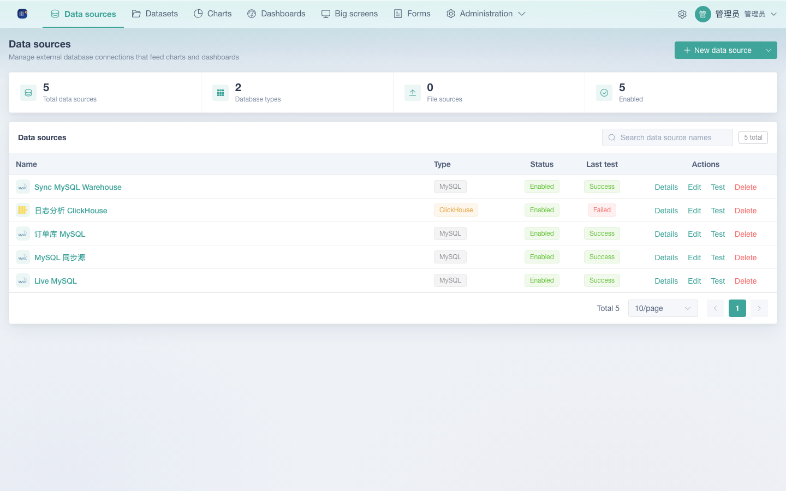

# Quick start

> 中文: [快速开始.md](../快速开始.md)

Start the system from scratch and build your first dashboard in 5 minutes. This is a **decoupled front-end/back-end** low-code dashboard platform offering two startup paths: one-click Docker deployment (recommended) or running from source.

## I. Choose a startup path

| Path | Best for | Requirements |
|------|---------|------|
| **One-click Docker deployment** (recommended) | Trying it out fast, production deployment | Docker + Docker Compose v2 |
| **Run from source** | Secondary development, debugging | Node.js ≥18, npm |

```bash
cd deploy/docker
./deploy.sh          # 首次自动生成 .env（含随机密钥），构建并启动五个容器
```

## II. One-click Docker deployment

### Prerequisites

- Docker Engine (≥ 24) + Docker Compose v2, with `docker compose version` working

### Start

The first run automatically:
1. Generates `deploy/docker/.env` from `.env.example` and injects random `JWT_SECRET` / `DATASOURCE_SECRET` / `POSTGRES_PASSWORD`
2. Builds and starts five containers: `postgres` (metadata database) + `redis` + `backend` + `worker` (sync) + `frontend` (nginx)
3. On the backend's first startup, creates the schema idempotently and seeds the initial administrator

After startup finishes, the console prints the access URL:

```
[deploy] stack=pg 编排文件=docker-compose.yml
[deploy] stack=pg 访问地址：http://localhost:8080
[deploy] Swagger 文档：http://localhost:8080/api/open/docs
[deploy] 初始管理员：admin@kanray.local / admin123（请尽快改密）
[deploy] 管理员初始密码：admin123（生产环境请修改 ADMIN_INITIAL_PASSWORD）
```

> **Note**: the console output language is chosen by `deploy.sh` itself via `APP_LANG`; the block above is the default `zh-CN` output, and running with `APP_LANG=en-US` prints the English equivalent of each line.



### Verify the startup

Open http://localhost:8080 in your browser — seeing the sign-in page means it worked.

> **Note**: To change the port, edit `KANRAY_PORT=8080` in `deploy/docker/.env`, then restart with `deploy/docker/deploy.sh down && deploy/docker/deploy.sh up`.
> For other common commands, see the [Deployment & operations manual](05-deployment-and-operations.md).

## III. Running from source (development mode)

Requires Node.js ≥ 18 (the backend uses ExpressJS 5, the front end uses Vite).

```bash
cd backend
npm install
npm run dev          # 或 npm start
```

### 1. Start the backend (port 3001)

The first startup automatically creates `backend/data/kanban.db` (the SQLite metadata database) and completes schema creation plus seed data.

```bash
cd front-end
npm install
npm run dev
```

### 2. Start the front end (port 5173)

Open http://localhost:5173 in your browser — Vite already proxies `/api` to the backend.

```
邮箱：admin@kanray.local
密码：admin123
```

## IV. First sign-in

Sign in with the seeded administrator account:

> **Note**: after a production deployment you **must** change the initial password and the secrets immediately — see the [Deployment & operations manual](05-deployment-and-operations.md).

You land on the **Datasets** page → next, create your first dashboard.

## V. Your First Dashboard in 3 Minutes
### Step 1: Upload data

1. In the left sidebar click **Data sources** to open the data source list
2. Click "**New data source**" → "Upload Excel / CSV file"
3. Pick an Excel (.xlsx/.xls) or CSV file (≤20MB, ≤200k rows); the first row is used as the column names
4. The system auto-detects field types and previews the first 50 rows; you can correct the types manually (text / integer / decimal / date / boolean)
5. Click "Create dataset" — the dataset is created

> **Note**: menu layout — the left sidebar has several top-level entries: Data sources / Datasets / Charts / Dashboards / Big screens / Administration; action buttons such as "New data source" and "New chart" sit in the top right of each page (for free-layout big-screen composition, see the [Big-screen designer manual](07-big-screen-designer.md)).

### Step 2: Create a chart

1. Go to **Charts** and click "New chart"
2. Select the dataset you just uploaded
3. Pick a chart type (bar / line / pie / table / metric card, etc.)
4. Drag fields into "Dimensions" and "Metrics" (for example `Date` → dimension, `Amount` → metric, with Sum as the aggregation)
5. The right pane previews the result live; save once you are happy with it

### Step 3: Assemble the dashboard

1. Go to **Dashboards** and create a dashboard with a name
2. Click "Edit dashboard"
3. Drag saved charts from the chart library at the top into the dashboard
4. The layout auto-flows in a grid; keep dragging in more charts as needed
5. Save and exit edit mode, then click the dashboard to preview it

### Step 4: Cross-filtering (optional)

1. In edit mode, add a **filter component** to the dashboard (pick a data source + field)
2. In preview, changing the filter value makes **all charts on the same data source refresh automatically**

## Next steps

- Learn the full day-to-day workflow → [User manual](01-user-manual.md)
- Connect an external database (MySQL / PostgreSQL, etc.) → [Data sources & builder](03-data-sources-and-builder.md)
- Integrate the system with your own application → [Open API integration guide](04-open-api-integration.md)


## VI. Support & donations

KanRay is developed and maintained by a single independent creator. Solo open source is not easy, and your support is the biggest motivation for the project to keep going. If this project helped you, feel free to buy me a coffee:

> **Note**: every bit of support goes into continued development. You are also welcome to take part by [submitting an Issue / PR](https://github.com/) — code contributions are the best encouragement for open source.

Thank you to everyone who uses and supports KanRay!
